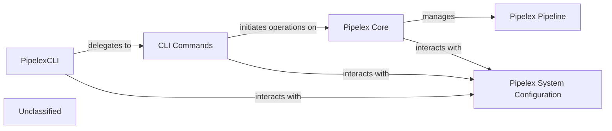

## Details

The Pipelex system's command-line interface is orchestrated by the PipelexCLI component, which acts as the central dispatcher for user commands. It delegates specific tasks to CLI Commands, such as run, build, and validate. These commands, in turn, interact with the Pipelex Core, which embodies the fundamental logic for pipeline execution, validation, and bundle management. The Pipelex Core relies on Pipelex System Configuration for managing settings and data, and directly manages Pipelex Pipeline instances. The Pipelex Builder component is responsible for generating pipelines based on user requirements, a function initiated by relevant CLI Commands. This architecture ensures a clear separation of concerns, with the CLI handling user interaction and command dispatch, while the core components manage the underlying pipeline logic and data.

### PipelexCLI
Serves as the primary entry point for the command-line interface. It initializes the CLI application, registers available commands, parses user input, and dispatches control to the appropriate command handler. It acts as the orchestrator for user interactions with the Pipelex system.

**Related Classes/Methods**:

- <a href="https://github.com/Pipelex/pipelex/blob/mainpipelex/cli/_cli.py#L14-L27" target="_blank" rel="noopener noreferrer">`pipelex.cli._cli.PipelexCLI`:14-27</a>

### CLI Commands
Each module within `pipelex.cli.commands` implements the specific business logic for a particular CLI command (e.g., run, build, validate). This includes handling command-line arguments, validating inputs, and invoking the relevant core Pipelex functionalities to perform tasks such as running, building, validating, or managing pipelines and concepts.

**Related Classes/Methods**:

- <a href="https://github.com/Pipelex/pipelex/blob/mainpipelex/cli/commands/run_cmd.py#L19-L182" target="_blank" rel="noopener noreferrer">`pipelex.cli.commands.run_cmd.run_cmd`:19-182</a>
- <a href="https://github.com/Pipelex/pipelex/blob/mainpipelex/cli/commands/build_cmd.py" target="_blank" rel="noopener noreferrer">`pipelex.cli.commands.build_cmd.build_app`</a>
- <a href="https://github.com/Pipelex/pipelex/blob/mainpipelex/cli/commands/validate_cmd.py#L33-L148" target="_blank" rel="noopener noreferrer">`pipelex.cli.commands.validate_cmd.validate_cmd`:33-148</a>

### Pipelex Core
Encapsulates the central functionalities of the Pipelex system, including pipeline execution, validation logic, and interaction with bundles. It provides the underlying mechanisms for processing and managing pipelines and their associated data.

**Related Classes/Methods**:

- <a href="https://github.com/Pipelex/pipelex/blob/mainpipelex/pipelex.py#L64-L292" target="_blank" rel="noopener noreferrer">`pipelex.core.Pipelex`:64-292</a>
- <a href="https://github.com/Pipelex/pipelex/blob/mainpipelex/core/interpreter.py#L17-L92" target="_blank" rel="noopener noreferrer">`pipelex.core.interpreter.PipelexInterpreter`:17-92</a>

### Pipelex System Configuration
Manages the configuration settings and input/output data for the Pipelex system. This includes loading and saving JSON files for inputs and outputs, and potentially other system-wide settings.

**Related Classes/Methods**:

- <a href="https://github.com/Pipelex/pipelex/blob/mainpipelex/tools/misc/json_utils.py#L106-L128" target="_blank" rel="noopener noreferrer">`pipelex.utils.io.load_json_dict_from_path`:106-128</a>
- <a href="https://github.com/Pipelex/pipelex/blob/mainpipelex/tools/misc/json_utils.py#L59-L81" target="_blank" rel="noopener noreferrer">`pipelex.utils.io.save_as_json_to_path`:59-81</a>

### Pipelex Pipeline
Represents the actual pipelines within the Pipelex system, including their definition, structure, and execution flow. This component is responsible for the logical representation and operational aspects of a pipeline.

**Related Classes/Methods**:

- <a href="https://github.com/Pipelex/pipelex/blob/mainpipelex/pipeline/execute.py#L22-L107" target="_blank" rel="noopener noreferrer">`pipelex.core.pipeline.execute_pipeline`:22-107</a>
- <a href="https://github.com/Pipelex/pipelex/blob/mainpipelex/core/pipes/pipe_abstract.py#L41-L49" target="_blank" rel="noopener noreferrer">`pipelex.core.pipeline.get_required_pipe`:41-49</a>

### Unclassified
Component for all unclassified files and utility functions (Utility functions/External Libraries/Dependencies)

**Related Classes/Methods**: _None_

### [FAQ](https://github.com/CodeBoarding/GeneratedOnBoardings/tree/main?tab=readme-ov-file#faq)
