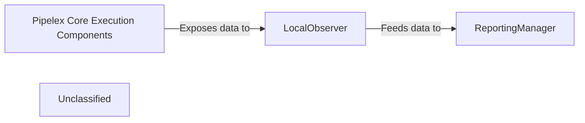

## Details

The Pipelex system's core execution is driven by the `Pipelex Core Execution Components`, which are responsible for building and running pipelines defined by `PipelexBundleSpec` objects. The `FlowFactory` constructs a high-level `Flow` representation, while `WorkingMemory` manages the runtime state. During this execution, the `LocalObserver` passively collects detailed event and metric data, storing it locally. This collected data is then consumed by the `ReportingManager`, which processes and aggregates it to generate comprehensive reports, particularly focusing on resource usage and costs associated with pipeline operations. This architecture ensures a clear separation of concerns between pipeline execution, data observation, and reporting.

### Pipelex Core Execution Components
This logical grouping represents the operational parts of the Pipelex system responsible for building, interpreting, and executing pipelines. It includes the core logic for defining pipeline flows, managing pipe specifications, and handling working memory during execution. These components are the source of all observable events, metrics, and logs.

**Related Classes/Methods**:

- <a href="https://github.com/Pipelex/pipelex/blob/mainpipelex/builder/builder.py#L53-L123" target="_blank" rel="noopener noreferrer">`pipelex.builder.builder.assemble_pipelex_bundle_spec`:53-123</a>
- <a href="https://github.com/Pipelex/pipelex/blob/mainpipelex/builder/flow.py#L31-L54" target="_blank" rel="noopener noreferrer">`pipelex.builder.flow.Flow`:31-54</a>
- <a href="https://github.com/Pipelex/pipelex/blob/mainpipelex/builder/flow_factory.py#L22-L119" target="_blank" rel="noopener noreferrer">`pipelex.builder.flow_factory.FlowFactory`:22-119</a>
- <a href="https://github.com/Pipelex/pipelex/blob/mainpipelex/core/memory/working_memory.py#L42-L385" target="_blank" rel="noopener noreferrer">`pipelex.core.memory.working_memory.WorkingMemory`:42-385</a>

### LocalObserver
The `LocalObserver` acts as the primary data collection agent within the subsystem. It actively monitors and captures specific events, performance metrics, and resource usage directly from the `Pipelex Core Execution Components` during pipeline execution. It writes these observations to local JSONL files.

**Related Classes/Methods**:

- <a href="https://github.com/Pipelex/pipelex/blob/mainpipelex/observer/local_observer.py#L10-L35" target="_blank" rel="noopener noreferrer">`pipelex.observer.local_observer.LocalObserver`:10-35</a>

### ReportingManager
The `ReportingManager` is the central hub for processing, aggregating, and presenting all collected observability data. It takes raw or preprocessed data from the `LocalObserver`, transforms it into meaningful insights, and manages the output of reports, particularly for LLM token usage and costs.

**Related Classes/Methods**:

- <a href="https://github.com/Pipelex/pipelex/blob/mainpipelex/reporting/reporting_manager.py#L29-L123" target="_blank" rel="noopener noreferrer">`pipelex.reporting.reporting_manager.ReportingManager`:29-123</a>

### Unclassified
Component for all unclassified files and utility functions (Utility functions/External Libraries/Dependencies)

**Related Classes/Methods**: _None_

### [FAQ](https://github.com/CodeBoarding/GeneratedOnBoardings/tree/main?tab=readme-ov-file#faq)
