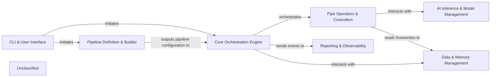

## Details

The Pipelex project is structured around a core orchestration engine that manages the execution of AI pipelines. User interaction primarily occurs through a Command-Line Interface (CLI), which initiates pipeline building and execution. Pipeline definitions, written in a declarative PLX format, are processed by a dedicated builder component to create an executable flow. During execution, the orchestration engine dispatches tasks to various pipe operators and controllers, which interact with AI inference and model management services for AI-driven tasks. Data and memory management components handle the flow and storage of information throughout the pipeline. Finally, a reporting and observability component tracks pipeline execution and generates reports.

### CLI & User Interface [[Expand]](./CLI_User_Interface.md)
Provides the command-line interface for users to interact with Pipelex, enabling them to run, build, validate, and manage pipelines.

**Related Classes/Methods**:

- <a href="https://github.com/Pipelex/pipelex/blob/mainpipelex/cli/_cli.py" target="_blank" rel="noopener noreferrer">`pipelex.cli.PipelexCLI`</a>
- <a href="https://github.com/Pipelex/pipelex/blob/mainpipelex/cli/commands/run_cmd.py#L19-L182" target="_blank" rel="noopener noreferrer">`pipelex.cli.commands.run_cmd.run_cmd`:19-182</a>

### Pipeline Definition & Builder
Responsible for defining, parsing, and validating pipeline configurations (PLX files). It translates the declarative pipeline definitions into an executable flow graph.

**Related Classes/Methods**:

- <a href="https://github.com/Pipelex/pipelex/blob/mainpipelex/builder/flow_factory.py#L22-L119" target="_blank" rel="noopener noreferrer">`pipelex.builder.flow_factory.FlowFactory`:22-119</a>
- <a href="https://github.com/Pipelex/pipelex/blob/mainpipelex/language/plx_factory.py#L28-L336" target="_blank" rel="noopener noreferrer">`pipelex.language.plx_factory.PlxFactory`:28-336</a>

### Core Orchestration Engine
The central component that manages the entire lifecycle of a pipeline, from loading and execution to tracking and error handling. It orchestrates the flow of data and control between different pipe operators.

**Related Classes/Methods**:

- <a href="https://github.com/Pipelex/pipelex/blob/mainpipelex/pipelex.py#L64-L370" target="_blank" rel="noopener noreferrer">`pipelex.Pipelex`:64-370</a>
- <a href="https://github.com/Pipelex/pipelex/blob/mainpipelex/pipeline/pipeline_manager.py#L12-L43" target="_blank" rel="noopener noreferrer">`pipelex.pipeline.pipeline_manager.PipelineManager`:12-43</a>

### Pipe Operators & Controllers
This component group encompasses the individual processing units (operators) and control flow mechanisms (controllers) within a pipeline. Operators perform specific AI-driven tasks, while controllers manage the execution logic.

**Related Classes/Methods**:

- <a href="https://github.com/Pipelex/pipelex/blob/mainpipelex/pipe_operators/pipe_operator.py#L17-L94" target="_blank" rel="noopener noreferrer">`pipelex.pipe_operators.pipe_operator.PipeOperator`:17-94</a>
- <a href="https://github.com/Pipelex/pipelex/blob/mainpipelex/pipe_controllers/pipe_controller.py#L14-L86" target="_blank" rel="noopener noreferrer">`pipelex.pipe_controllers.pipe_controller.PipeController`:14-86</a>

### AI Inference & Model Management
Provides a standardized interface for interacting with various external AI models and inference services. It abstracts away the complexities of different AI provider APIs and manages model configurations.

**Related Classes/Methods**:

- <a href="https://github.com/Pipelex/pipelex/blob/mainpipelex/cogt/inference/inference_manager.py#L18-L150" target="_blank" rel="noopener noreferrer">`pipelex.cogt.inference.inference_manager.InferenceManager`:18-150</a>
- <a href="https://github.com/Pipelex/pipelex/blob/mainpipelex/cogt/models/model_manager.py#L20-L148" target="_blank" rel="noopener noreferrer">`pipelex.cogt.models.model_manager.ModelManager`:20-148</a>

### Data & Memory Management
Manages the flow, storage, and retrieval of data ("stuffs" and "concepts") within a running pipeline. This includes inputs, intermediate results, and final outputs.

**Related Classes/Methods**:

- <a href="https://github.com/Pipelex/pipelex/blob/mainpipelex/core/memory/working_memory.py#L42-L385" target="_blank" rel="noopener noreferrer">`pipelex.core.memory.working_memory.WorkingMemory`:42-385</a>
- <a href="https://github.com/Pipelex/pipelex/blob/mainpipelex/core/stuffs/stuff_factory.py#L38-L487" target="_blank" rel="noopener noreferrer">`pipelex.core.stuffs.stuff_factory.StuffFactory`:38-487</a>

### Reporting & Observability [[Expand]](./Reporting_Observability.md)
Gathers and presents metrics and logs related to pipeline execution, offering insights into performance, resource usage, and potential issues.

**Related Classes/Methods**:

- <a href="https://github.com/Pipelex/pipelex/blob/mainpipelex/reporting/reporting_manager.py#L29-L123" target="_blank" rel="noopener noreferrer">`pipelex.reporting.reporting_manager.ReportingManager`:29-123</a>
- <a href="https://github.com/Pipelex/pipelex/blob/mainpipelex/observer/local_observer.py#L10-L35" target="_blank" rel="noopener noreferrer">`pipelex.observer.local_observer.LocalObserver`:10-35</a>

### Unclassified
Component for all unclassified files and utility functions (Utility functions/External Libraries/Dependencies)

**Related Classes/Methods**: _None_

### [FAQ](https://github.com/CodeBoarding/GeneratedOnBoardings/tree/main?tab=readme-ov-file#faq)
