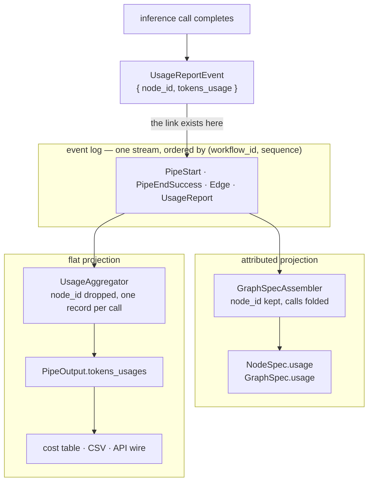

# Per-node Usage Attribution

A run produces two artifacts that describe the same thing from different angles: `pipe_output.graph_spec` (the shape of the run) and `pipe_output.tokens_usages` (what it cost). Both are built from **one** trace-event stream, and every usage event in that stream already names the graph node it belongs to. This page is about the projection that keeps that link — `GraphSpec.usage` and `NodeSpec.usage` — and about the three states a usage number can be in, which is the part consumers get wrong.

## Two projections of one event stream

Every inference call emits a `UsageReportEvent` carrying `node_id` (from `trace_context.parent_node_id`) and the full internal `AnyTokensUsage`. That single stream is read twice:

- **`UsageAggregator`** (`pipelex/tracing/usage_aggregator.py`) projects it into a flat list — one record per call, `node_id` dropped. That list becomes `pipe_output.tokens_usages`, trimmed to [`TokensUsageRecord`](tokens-usage-wire-records.md) at the client boundary, and feeds the console cost table and the CSV.
- **`usage_attribution`** (`pipelex/tracing/usage_attribution.py`) projects it into per-node totals — `node_id` kept, calls folded together. Those totals become `NodeSpec.usage` and `GraphSpec.usage`, assembled by `GraphSpecAssembler`.

The two projections are deliberately separate — `tokens_usages` is a shipped, `extra="forbid"` client contract, and a graph is not the place to re-litigate its record shape. What they are *not* allowed to do is disagree on arithmetic, so both compute every dollar through the same `compute_tokens_usage_cost` (`pipelex/cogt/usage/cost_registry.py`) and define a token total the same way `AggregatedCosts.total_nb_tokens` does.



## When attribution happens, and why it waits

`GraphSpecAssembler` folds usage events during pass 1, keyed by the `node_id` the event *named* — with no node lookup. Resolution against the real node set happens in pass 2. This is not an optimisation: a `UsageReportEvent` can legitimately be read **before** the `PipeStartEvent` of the node it names, because the two can come from different workers and the stream is ordered by `(workflow_id, sequence)`. "Is this node real?" is only answerable once every event has been seen.

Pass 2 then does three things: resolves each accumulated total onto its node (or into the unattributed bucket), rolls subtrees up the `parent_node_id` chain, and computes the run total.

## The three states of a usage number

This is the part that matters for anything rendering a graph. A missing number means one of three things, and they must not be conflated — `$0.00` on an unrated node is a lie, and a controller that reports nothing because it was read through the wrong half looks like a bug.

| State | How it is encoded | What a consumer may claim |
|---|---|---|
| **Not collected** | `usage is None` | nothing — no measurement was taken |
| **Ran no inference** | `usage` present, `inference_calls == 0` | nothing (a controller may still report its subtree) |
| **Unrated** | `cost is None` with `inference_calls > 0` | that calls were made; **no price** |
| **Partial** | `inference_calls > rated_inference_calls > 0` | a price marked as a lower bound: `≥ $0.0043` |
| **Rated** | `rated_inference_calls == inference_calls > 0` | the price: `$0.0043` |

Unrated is not an edge case: `compute_tokens_usage_cost` returns `None` whenever the model carries no rate table, and dry/mock runs hardcode an empty rate table — so **every dry-run graph is unrated**.

**A note on token counts, for anyone rendering them.** The counts are faithful to what the run reported, which is not the same as being meaningful to a reader. Two cases to handle before putting a number on screen: a dry run reports one synthetic call per would-be inference with zero tokens (or, under `--mock-usage`, with *invented* non-zero tokens — never display those, they measure nothing), and a `PipeSearch` reports its provider's billing unit in the token field, so a single search shows ~2,000,000 "tokens" for a correct price of $0.005. The `cost` is the number that survives both; `mthds-ui` accordingly displays cost only, and only for a real run.

## The invariants

`NodeUsageSpec` (`pipelex/graph/graphspec.py`) states four invariants in its docstring. They are the contract; each has a named test in `tests/unit/pipelex/tracing/test_usage_attribution.py`.

1. **`usage is None` is all-or-nothing across a graph.** It means no usage was reported anywhere in the run — collection was off, or the run made zero inference calls. As soon as one usage event was seen, **every** node carries a spec, zeroed where nothing ran. A controller, a lifted pipe and a `PipeFunc` all get `inference_calls=0`, never `usage=None`. So the field never distinguishes "this node was not measured" from "that node was".
2. **`cost is None` ⟺ `rated_inference_calls == 0`.** Nothing else. "Made no call" and "made only unrated calls" both land here, and `inference_calls` tells them apart.
3. **`inference_calls > rated_inference_calls > 0` means `cost` is a lower bound**, not a total — some of this node's calls carried no rate table. A UI that renders it as a complete figure is silently wrong about money.
4. **`total_tokens` is input_joined + output**, the same definition as `AggregatedCosts.total_nb_tokens`. It is **not** the sum of `nb_tokens_by_category`: `input_cached` is a *subset* of `input`, not additive, so summing the dict double-counts. Never sum the dict; read `total_tokens`.

## The model that ran, vs the model that was asked for

A GraphSpec names a model in three places, and only one of them is the outcome:

| Rung | Where | Example |
|---|---|---|
| Authored choice | pipe blueprint `llm_choices.for_text` | `$writing-factual` (a preset) |
| Requested handle | `execution_data.resolved_model` | `@default-premium` (still an alias) |
| **What actually ran** | `NodeUsageSpec.by_model[].inference_model_name` | `claude-4.6-sonnet` |

`execution_data.resolved_model` is captured from `LLMSetting.model` (`pipe_llm.py`), which is a *handle*: alias resolution happens later, at inference time. The name overstates what it holds — roughly a third of the nodes in a typical corpus carry an unresolved `@alias` there. Only `by_model` survives alias resolution, deck defaults, and any fallback or retry that landed somewhere other than what was requested.

**`by_model` is a list because one node routinely uses more than one model.** A `PipeLLM`'s text pass and its object-structuring pass resolve separately (that is what `resolved_model_for_object` is about), and a retry can land elsewhere again. Collapsing them into "the model" would be wrong in exactly the way a single `cost` across mixed rated and unrated calls is wrong. Entries are ordered most-used first, ties broken by name, so a consumer can take `by_model[0]` as the dominant model without sorting. Per-model `cost` follows invariant 2: `None` iff no call to that model was priced.

The same breakdown rolls up: `subtree_by_model` tells you every model a controller's whole branch used.

## Own and subtree

Every node carries both halves: its own inference, and its own plus every descendant's (`subtree_*`). A controller (`PipeSequence`, `PipeBatch`, `PipeParallel`) runs no inference itself, so its own numbers are always zero and only the subtree half says anything — read a controller through its own half and it reports nothing at all. Both tokens and cost roll up, so a consumer that shows either one has the branch figure available without walking the graph.

The rollup is computed once, in the assembler, for the same reason `AggregatedCosts` computes its totals once: several consumers read the same GraphSpec, and they must not each re-derive it and disagree.

```text
  seq_node       calls 0 (0 rated)   subtree 3 calls (2 rated)  subtree_cost 0.0071  subtree_tokens 4210
    ├── llm_a    calls 1 (1 rated)   cost 0.0043   tokens 2130
    ├── llm_b    calls 1 (1 rated)   cost 0.0028   tokens 2080
    └── func_c   calls 0 (0 rated)   cost None     tokens 0      ← ran, made no inference
```

`func_c` has a spec present with `cost=None` and `inference_calls=0` — invariants 1 and 2 together say "collected, ran nothing", never "unknown".

`roll_up` tolerates two malformed-parentage cases rather than blowing up, because a partial cross-worker event read can produce either: a `parent_node_id` naming an absent node makes the child a root (never a `KeyError`), and a cycle in the parentage chain is broken by an in-progress guard and logged (never an infinite walk). The walk is memoized and uses an explicit stack, so it is O(nodes) and independent of the interpreter's recursion limit.

## The run total and the unattributed bucket

`GraphSpec.usage` is a `GraphUsageSpec` with two `NodeUsageSpec` fields:

- **`total`** — every usage the run reported, attributed or not. This is the graph's comparand for the cost report's own total.
- **`unattributed`** — the part that named no live node: the `UNATTRIBUTED_NODE_ID` (`"unknown"`) fallback stamped when an inference runs outside any pipe context, or a `node_id` whose `PipeStartEvent` never made it into the stream. Surfaced as its own bucket rather than dropped, so the graph's total can never silently disagree with the cost report's.

On a healthy run `unattributed` is zero. A non-zero one is a real signal worth looking at.

### Cross-checking against the cost report

The two are computed from the same events but encode "unrated" differently: `CostRegistry.aggregate_costs` treats an unrated usage as zero-cost, while `NodeUsageSpec.cost` is `None`. Comparing them naively manufactures a disagreement. The correct check is:

- `graph.usage.total.cost` equals the cost report's total **when `total.rated_inference_calls == total.inference_calls`**;
- when they differ, the graph total is a lower bound and the report's total is the wrong comparand — compare `rated_inference_calls` against the report's row count instead.

## The in-process tracer does not carry usage

There are two GraphSpec builders. `GraphSpecAssembler` produces every consumed spec. The in-process `GraphTracer.teardown()` output is discarded at all three of its call sites (`runner.py`, `pipe_run.py`, `dry_run_in_process.py` — each reads `pipe_output.graph_spec`, i.e. the assembler's), and `GraphTracerProtocol` has no method to receive usage at all.

So usage is deliberately assembler-only. That gap is *asserted* rather than normalized away: `tests/unit/pipelex/tracing/test_assembler_equivalence.py` runs a usage-bearing scenario through both builders, asserts they stay structurally equivalent, and asserts the divergence explicitly (assembler populated, tracer `None`). If someone later plumbs usage into the tracer, that test fails and tells them to delete the assertion — which is what a test documenting an intentional gap should do.

## Files reference

| File | Purpose |
|------|---------|
| `pipelex/graph/graphspec.py` | `NodeUsageSpec`, `GraphUsageSpec` and the four invariants |
| `pipelex/tracing/usage_attribution.py` | `UsageAccumulator`, `roll_up`, `attribute_usage` |
| `pipelex/tracing/graphspec_assembler.py` | Folds `UsageReportEvent`, attributes in pass 2 |
| `pipelex/tracing/usage_aggregator.py` | The other projection — the flat `tokens_usages` list |
| `pipelex/cogt/usage/cost_registry.py` | `compute_tokens_usage_cost` — the one cost engine |

## Related pages

- [Execution Graph Tracing](execution-graph-tracing.md) — the GraphSpec model and the trace event streams.
- [TokensUsage Wire Records](tokens-usage-wire-records.md) — the client-facing shape of the other projection.
- [Cost Tracking & Reporting](../features/cost-tracking.md) — the console table and CSV export.
