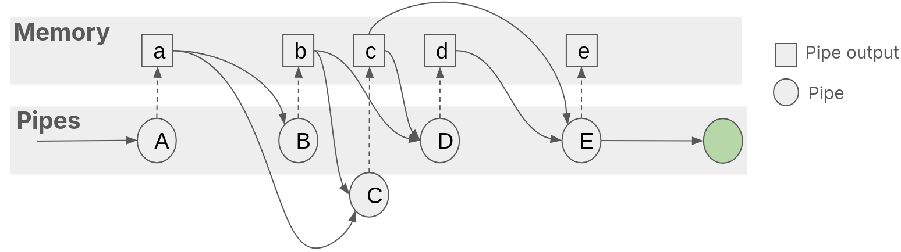
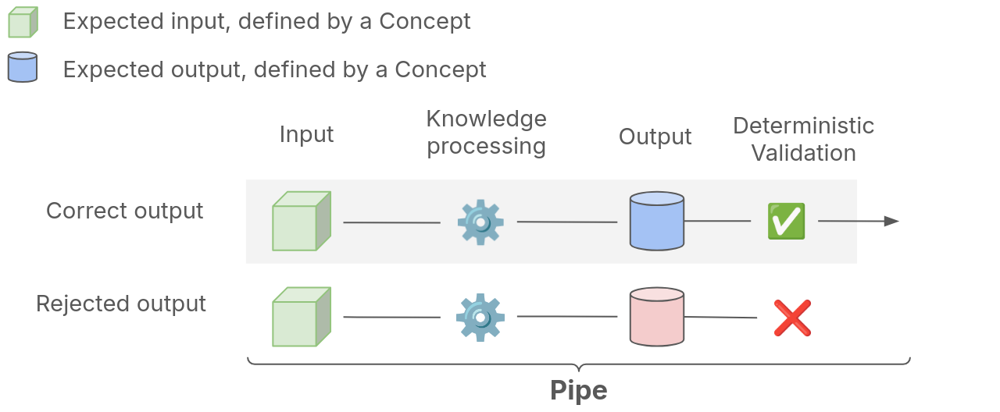

# Building Knowledge Pipelines with Pipelex

## Core Components

### Pipe

A pipe is an elementary step of knowledge processing. Each pipe:

- Takes knowledge as input
- Transforms it using LLMs or software
- Produces structured output
- Validates results against defined concepts

### Pipeline

A pipeline is a workflow composed of one or more pipes working together.

To enable maximum modularity and composability, Pipelex enables you to run any pipe, and any pipe can be based on other pipes. So the pipeline itself is not a *super*-pipe. The pipeline materializes when you decide to consider a partuclar pipe as something useful and run it.

### Working Memory

All pipes in a pipeline share access to a **Working Memory** that contains:
- Initial inputs
- Outputs from previous pipes

This creates a network of understanding where any pipe can access relevant knowledge from earlier steps.

### Concepts

Concepts define the structure and meaning of knowledge flowing through pipes. Each concept is defined:

- **In natural language** - so humans and LLMs understand the intent
- Optionaly **in code** - as Pydantic models for structuring and deterministic validation

Pipes validate their outputs against concepts, ensuring reliable, predictable results.

## Composition Patterns

Pipes compose like building blocks:

- **Sequential**: Chain sub-pipes for step-by-step transformations
- **Parallel**: Run multiple sub-pipes simultaneously
- **Conditional**: Route based on a value or a test expression
