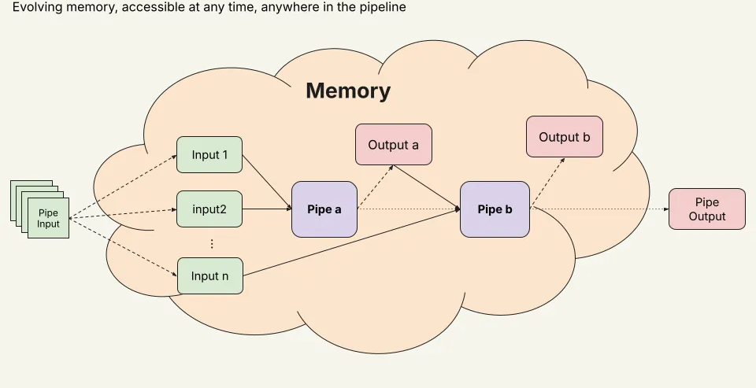

# Pipes

A pipe is a **Pipeline step**.
It can integrate both **AI-based** or software-based knowledge processing.

## Define pipes

Like concepts, Pipes are defined using a **`toml` syntax.**

- This part is meant to be **written in a library `toml` file, in the same one as concepts** (see [Libraries](../how-to-build-pipelex-pipelines/libraries.md)).

### General Structure

This is how to define a Pipe using the Pipelex `toml` syntax:

```toml
[pipe]
[pipe.<pipe_name>]
Pipe<Type> = "<Pipe definition>"
inputs = { <input_name> = "<InputConcept>" }
output = "<OutputConcept>"
... then come the Pipe specific fields
```

The `Pipe<Type>` determines the kind of pipe. For a complete list of available pipe types and their specific configurations, see our [Pipe Operators Guide](./pipe-operators/index.md).

## Working Memory



In a pipeline, processed Stuff are stored in the **Working Memory.** The working memory is accessible from any Pipe in the pipeline.

Basically, the Working Memory is a wrapper on a Dict of Stuff objects.

```python
StuffDict = Dict[str, Stuff]

class WorkingMemory(BaseModel):
    root: StuffDict = Field(default_factory=dict)
```

### Using Working Memory

**You can easily preload the memory with the dedicated Factory**

```python
from pipelex.core.stuff_factory import StuffFactory
from pipelex.core.working_memory_factory import WorkingMemoryFactory

# Here is a Stuff object
table_screenshot_stuff = StuffFactory.make_from_str(
    name="table_screenshot",
    concept_code="TableScreenshot",
    str_value=table_screenshot,
)

# And we load it in the memory
working_memory = WorkingMemoryFactory.make_from_single_stuff(
    table_screenshot_stuff,
)
```

### Access memory in prompts

You can access working memory stuffs directly in prompts using the jinja2 syntax.
You just need to call them by their name.

```toml
[pipe.retrieve_excerpts]
PipeLLM = "Find the most relevant excerpt in a text that answers a specific question"
inputs = { text = "native.Text", question = "questions.Question" }
output = "RetrievedExcerpt"
llm = "llm_to_retrieve"
multiple_output = true
prompt_template = """
Your task is to find all relevant excerpts from a text that contribute to answering a question.
It might not contain the exact answer, but it should be relevant to the question.

@text

@question

Justify why you chose those excerpts. Do not modify the original text.
"""
```

