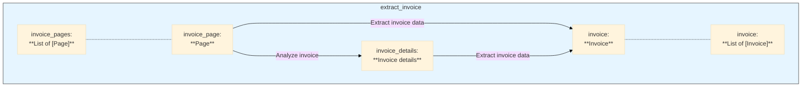

# Example: Invoice Extractor

This example provides a comprehensive pipeline for processing invoices. It takes a PDF invoice, extracts key information, and returns a structured `Invoice` object. It also demonstrates how to generate reports and track pipeline execution.

## Get the code

[**➡️ View on GitHub: examples/b_basics/document_extract/extract_invoice/extract_invoice.py**](https://github.com/Pipelex/pipelex-cookbook/blob/main/examples/b_basics/document_extract/extract_invoice/extract_invoice.py)

## The Pipeline Explained

The `process_invoice` pipeline is a complete method for invoice processing.

```python
async def process_invoice(pdf_url: str) -> ListContent[Invoice]:
    pipe_output = await execute_pipeline(
        pipe_code="process_invoice",
        inputs={
            "document": DocumentContent(url=pdf_url),
        },
    )

    return pipe_output.main_stuff_as_list(item_type=Invoice)
```

This example also showcases some of the powerful observer features of Pipelex. After the pipeline runs, it generates a cost report.

```python
# Print the cost reporting
get_report_delegate().generate_report()
```

This is invaluable for understanding the cost of your pipelines.

## The Data Structure: `Invoice` Model

The pipeline's output is a structured `Invoice` object. This is defined using Pydantic's `BaseModel`, which allows for clear, typed, and validated data.

```python
class Invoice(StructuredContent):
    """Invoice information extracted from text, supporting both formal bills and receipts"""

    invoice_id: Optional[str] = Field(None, description="Unique identifier for the invoice")
    invoice_number: Optional[str] = Field(None, description="Invoice number as shown on the document")
    date: Optional[datetime] = Field(None, description="Date when the invoice was issued")
    
    amount_incl_tax: Optional[float] = Field(None, description="Total amount including taxes")
    
    vendor: Optional[str] = Field(None, description="Name of the vendor/seller")
    
    # ... other fields
```

## The Pipeline Definition: `invoice.mthds`

The entire method is defined in a MTHDS file. This declarative approach makes the pipeline easy to understand and modify. Here's a snippet from `invoice.mthds`:

```toml
[pipe.process_invoice]
type = "PipeSequence"
description = "Process relevant information from an invoice"
inputs = { document = "Document" }
output = "Invoice"
steps = [
    { pipe = "extract_text_from_image", result = "invoice_pages" },
    { pipe = "extract_invoice", batch_over = "invoice_pages", batch_as = "invoice_page", result = "invoice" },
]

[pipe.extract_text_from_image]
type = "PipeExtract"
description = "Extract page contents from an image"
inputs = { document = "Document" }
output = "Page"
page_views = true
model = "base_extract_mistral"

[pipe.extract_invoice_data]
type = "PipeLLM"
description = "Extract invoice information from an invoice text transcript"
inputs = { "invoice_page.page_view" = "Image", invoice_details = "InvoiceDetails", invoice_page = "Page" }
output = "Invoice"
model = "$engineering-structured"
prompt = """
Extract invoice information from this invoice: $invoice_page.page_view

The category of this invoice is: $invoice_details.category.

@invoice_page.text_and_images.text.text
"""
```

This shows how a complex method, including text extraction with `PipeExtract` and LLM calls, can be defined in a simple, readable format. The `model = "$engineering-structured"` line is particularly powerful, as it tells the LLM to structure its output according to the `Invoice` model. 

## The Pipeline Flowchart



## Related Documentation

- [PipeExtract Operator](../building-methods/pipes/pipe-operators/PipeExtract.md) - Extract text and images from documents
- [PipeLLM Operator](../building-methods/pipes/pipe-operators/PipeLLM.md) - The core operator for LLM interactions
- [PipeSequence Controller](../building-methods/pipes/pipe-controllers/PipeSequence.md) - Chain pipes into sequential workflows
- [Cost Tracking](../features/cost-tracking.md) - Track and monitor AI usage costs