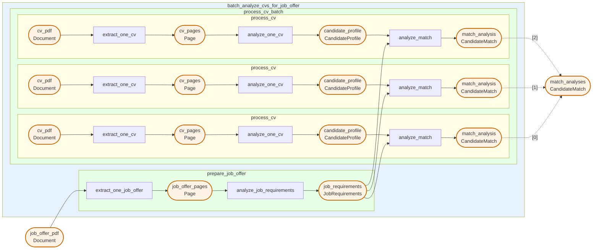

# CV Batch Screening, Step by Step

A production method that takes a stack of CVs and a job offer PDF, extracts and analyzes each, then scores how well each candidate matches the role. This page reads it part by part and runs it on your own machine with the Pipelex runtime, from the CLI and from Python, once you have followed [Run It Yourself](./run-it-yourself.md).

## What it demonstrates

- Typed concepts with inline structures (`CandidateProfile`, `JobRequirements`, `CandidateMatch`)
- Nested `PipeSequence` controllers, one preparing the job offer and one processing each CV
- Batching over a list of documents (`batch_over` / `batch_as`)
- Document extraction with `PipeExtract`, followed by structured analysis with `PipeLLM`

## The method: `cv_batch_screening.mthds`

### The main pipe

```toml
domain    = "cv_batch_screening"
main_pipe = "batch_analyze_cvs_for_job_offer"

[pipe.batch_analyze_cvs_for_job_offer]
type = "PipeSequence"
description = """
Main orchestrator pipe that takes a bunch of CVs and a job offer in PDF format, and analyzes how they match.
"""
inputs = { cvs = "Document[]", job_offer_pdf = "Document" }
output = "CandidateMatch[]"
steps = [
  { pipe = "prepare_job_offer", result = "job_requirements" },
  { pipe = "process_cv", batch_over = "cvs", batch_as = "cv_pdf", result = "match_analyses" },
]
```

### Concepts

```toml
[concept.CandidateProfile]
description = "A structured summary of a job candidate's professional background extracted from their CV."

[concept.CandidateProfile.structure]
skills       = { type = "text", description = "Technical and soft skills possessed by the candidate", required = true }
experience   = { type = "text", description = "Work history and professional experience", required = true }
education    = { type = "text", description = "Educational background and qualifications", required = true }
achievements = { type = "text", description = "Notable accomplishments and certifications" }

[concept.JobRequirements]
description = "A structured summary of what a job position requires from candidates."

[concept.JobRequirements.structure]
required_skills  = { type = "text", description = "Skills that are mandatory for the position", required = true }
responsibilities = { type = "text", description = "Main duties and tasks of the role", required = true }
qualifications   = { type = "text", description = "Required education, certifications, or experience levels", required = true }
nice_to_haves    = { type = "text", description = "Preferred but not mandatory qualifications" }

[concept.CandidateMatch]
description = "An evaluation of how well a candidate fits a job position."

[concept.CandidateMatch.structure]
match_score        = { type = "number", description = "Numerical score representing overall fit percentage between 0 and 100", required = true }
strengths          = { type = "text", description = "Areas where the candidate meets or exceeds requirements", required = true }
gaps               = { type = "text", description = "Areas where the candidate falls short of requirements", required = true }
overall_assessment = { type = "text", description = "Summary evaluation of the candidate's suitability", required = true }
```

### Supporting pipes

```toml
[pipe.prepare_job_offer]
type = "PipeSequence"
description = """
Extracts and analyzes the job offer PDF to produce structured job requirements.
"""
inputs = { job_offer_pdf = "Document" }
output = "JobRequirements"
steps = [
  { pipe = "extract_one_job_offer", result = "job_offer_pages" },
  { pipe = "analyze_job_requirements", result = "job_requirements" },
]

[pipe.extract_one_job_offer]
type        = "PipeExtract"
description = "Extracts text content from the job offer PDF document"
inputs      = { job_offer_pdf = "Document" }
output      = "Page[]"
model       = "@default-text-from-pdf"

[pipe.analyze_job_requirements]
type = "PipeLLM"
description = """
Parses and summarizes the job requirements from the extracted job offer content, identifying required skills, responsibilities, qualifications, and nice-to-haves
"""
inputs = { job_offer_pages = "Page" }
output = "JobRequirements"
model = "$writing-factual"
system_prompt = """
You are an expert HR analyst specializing in parsing job descriptions. Your task is to extract and summarize job requirements into a structured format.
"""
prompt = """
Analyze the following job offer content and extract the key requirements for the position.

@job_offer_pages
"""

[pipe.process_cv]
type = "PipeSequence"
description = "Processes one application"
inputs = { cv_pdf = "Document", job_requirements = "JobRequirements" }
output = "CandidateMatch"
steps = [
  { pipe = "extract_one_cv", result = "cv_pages" },
  { pipe = "analyze_one_cv", result = "candidate_profile" },
  { pipe = "analyze_match", result = "match_analysis" },
]

[pipe.extract_one_cv]
type        = "PipeExtract"
description = "Extracts text content from the CV PDF document"
inputs      = { cv_pdf = "Document" }
output      = "Page[]"
model       = "@default-text-from-pdf"

[pipe.analyze_one_cv]
type = "PipeLLM"
description = """
Parses and summarizes the candidate's professional profile from the extracted CV content, identifying skills, experience, education, and achievements
"""
inputs = { cv_pages = "Page" }
output = "CandidateProfile"
model = "$writing-factual"
system_prompt = """
You are an expert HR analyst specializing in parsing and summarizing candidate CVs. Your task is to extract and structure the candidate's professional profile into a structured format.
"""
prompt = """
Analyze the following CV content and extract the candidate's professional profile.

@cv_pages
"""

[pipe.analyze_match]
type = "PipeLLM"
description = """
Evaluates how well the candidate matches the job requirements, calculating a match score and identifying strengths and gaps
"""
inputs = { candidate_profile = "CandidateProfile", job_requirements = "JobRequirements" }
output = "CandidateMatch"
model = "$writing-factual"
system_prompt = """
You are an expert HR analyst specializing in candidate-job fit evaluation. Your task is to produce a structured match analysis comparing a candidate's profile against job requirements.
"""
prompt = """
Analyze how well the candidate matches the job requirements. Evaluate their fit by comparing their skills, experience, and qualifications against what the position demands.

@candidate_profile

@job_requirements

Provide a comprehensive match analysis including a numerical score, identified strengths, gaps, and an overall assessment.
"""
```

### Flowchart



## Run the method

### From the CLI

```bash
pipelex run bundle cv_batch_screening.mthds --inputs inputs.json
```

Create an `inputs.json` file with your PDF URLs:

```json
{
  "cvs": {
    "concept": "native.Document",
    "content": [
      { "url": "https://pipelex-web.s3.amazonaws.com/demo/John-Doe-CV.pdf" },
      { "url": "inputs/Jane-Smith-CV.pdf" }
    ]
  },
  "job_offer_pdf": {
    "concept": "native.Document",
    "content": {
      "url": "https://pipelex-web.s3.amazonaws.com/demo/Job-Offer.pdf"
    }
  }
}
```

### From Python

```python
import asyncio
from pathlib import Path

from pipelex.core.stuffs.document_content import DocumentContent
from pipelex.pipelex import Pipelex
from pipelex.pipeline.runner import PipelexMTHDSProtocol

# Generated by: `pipelex build structures cv_batch_screening.mthds`
from structures.structures import CandidateMatch


async def run_pipeline() -> list[CandidateMatch]:
    runner = PipelexMTHDSProtocol()
    response = await runner.execute(
        mthds_contents=[Path("cv_batch_screening.mthds").read_text(encoding="utf-8")],
        inputs={
            "cvs": {
                "concept": "Document",
                "content": [
                    DocumentContent(url="https://pipelex-web.s3.amazonaws.com/demo/John-Doe-CV.pdf"),
                    DocumentContent(url="inputs/Jane-Smith-CV.pdf"),
                ],
            },
            "job_offer_pdf": {
                "concept": "native.Document",
                "content": DocumentContent(url="https://pipelex-web.s3.amazonaws.com/demo/Job-Offer.pdf"),
            },
        },
    )
    pipe_output = response.pipe_output
    print(pipe_output)
    return pipe_output.main_stuff_as_items(item_type=CandidateMatch)


Pipelex.make()
asyncio.run(run_pipeline())
```
