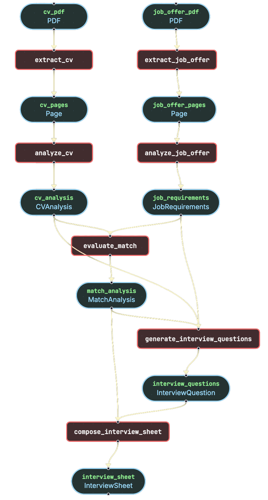

# Execution Graph Visualization

Full transparency into pipeline execution with interactive visualizations.

## Overview

<!-- TODO: Expand with visualization philosophy -->

Every pipeline execution can be visualized as an interactive graph, giving developers full transparency into what happened, in what order, and with what data at each step.

## Interactive HTML Visualization

<!-- TODO: Describe the ReactFlow-based interface -->

Inspect any pipeline execution with a local ReactFlow-based interface. Nodes represent pipes, edges show data flow, and clicking any node reveals the data at that stage.

## Mermaid Chart Export

<!-- TODO: Describe Mermaid diagram generation -->

Render pipeline diagrams anywhere that supports Mermaid: VS Code, GitHub, web applications, and documentation.

## Step-by-Step Data Inspection

<!-- TODO: Describe the data inspection capabilities -->

View the actual data at each execution stage:

- **JSON** — Raw structured data
- **HTML preview** — Rendered content
- **Images** — Generated or extracted images
- **Embedded PDFs** — Document content

## CLI Flags

<!-- TODO: Document the graph generation CLI flags -->

- `--graph` — Generate an execution graph after running a pipeline
- `--graph-full-data` — Include full data payloads in the graph
- `--graph-no-data` — Generate a structural graph without data

{ width="400" }
