# Architecture Overview

Pipelex is a Python framework for building and running **executable AI methods** using a declarative language (`.mthds` files).

---

## Two-Layer Architecture

Pipelex separates concerns into two distinct layers:

1. **High-Level**: Business logic and orchestration
2. **Low-Level**: Cognitive tools (COGT) and AI inference

This separation allows pipeline authors to focus on *what* should happen, while the framework handles *how* to interact with AI providers.

---

## High-Level: Business Logic & Orchestration

### PipeControllers (Orchestrators)

Located in [`pipelex/pipe_controllers/`](https://github.com/Pipelex/pipelex/tree/main/pipelex/pipe_controllers)

Controllers manage execution flow without performing work themselves:

- **PipeSequence** - Execute pipes one after another
- **PipeParallel** - Execute pipes concurrently
- **PipeBatch** - Process collections of items
- **PipeCondition** - Branch based on conditions

### PipeOperators (Workers)

Located in [`pipelex/pipe_operators/`](https://github.com/Pipelex/pipelex/tree/main/pipelex/pipe_operators)

Operators perform concrete actions:

- **PipeLLM** - Generate text or structured data via LLMs
- **PipeExtract** - Extract content from documents (OCR, parsing)
- **PipeImgGen** - Generate images
- **PipeFunc** - Execute custom Python functions
- **PipeCompose** - Compose content from templates or construct structured objects
- **PipeSearch** - Search the web for information

### Core Domain

Located in [`pipelex/core/`](https://github.com/Pipelex/pipelex/tree/main/pipelex/core)

- **Concepts** - Semantic types with meaning (not just data types)
- **Stuffs** - Knowledge objects combining a concept type with content
- **Working Memory** - Runtime storage for data flowing through pipes
- **Bundles** - Complete pipeline definitions loaded from `.mthds` files

---

## Low-Level: Cognitive Tools (COGT) & Inference

### COGT Layer

Located in [`pipelex/cogt/`](https://github.com/Pipelex/pipelex/tree/main/pipelex/cogt)

The COGT layer abstracts AI provider details from business logic:

- **LLM Workers** - Prompt construction, structured output, templating
- **Extract Workers** - Document processing and OCR
- **Image Generation Workers** - Image creation
- **Search Workers** - Web search and information retrieval
- **Model Catalog & Model Deck** - Manages available models, aliases, and presets
- **Content Generation** - Unified generation interface

!!! note "Why COGT?"
    COGT stands for "Cognitive Tools". This layer lets you swap AI providers without touching your pipeline definitions.

### Plugin System

Located in [`pipelex/plugins/`](https://github.com/Pipelex/pipelex/tree/main/pipelex/plugins)

Provider-specific integrations handle API specifics:

- OpenAI
- Anthropic
- Google (Gemini)
- Mistral
- AWS Bedrock
- And more...

Each plugin translates Pipelex's unified interface into provider-specific API calls.

---

## What Keeps The Layers Apart: The Two Hubs

The two layers above would be a diagram rather than an architecture if nothing enforced the split. What enforces it is the **hub** — the mechanism every component uses to reach a shared dependency (the config, a model deck, the pipe library) without importing the module that owns it.

There are two hubs, and the boundary between them *is* the boundary between the layers:

- [**`pipelex/service_hub.py`**](https://github.com/Pipelex/pipelex/tree/main/pipelex/service_hub.py) — process-scoped infrastructure. Config, console, secrets, storage, telemetry, the model deck, the inference workers, the content generator, the plugin registries. Configured once at boot; identical for every method the process runs.
- [**`pipelex/method_hub.py`**](https://github.com/Pipelex/pipelex/tree/main/pipelex/method_hub.py) — library-scoped method machinery. The library manager and the concept/domain/pipe libraries, the current-library binding, the pipe router, the pipeline manager, the PipeFunc executor. Tied to the method that is loaded.

One rule governs them:

!!! note "The one arrow"
    `method_hub` imports `service_hub`. **`service_hub` never imports `method_hub`.**

The practical consequence is that the low-level COGT layer cannot reach the high-level interpreter. Importing the inference stack loads no `libraries`, `pipe_operators`, `pipe_controllers`, or `codegen` module at all — so anything that just wants a secret, the console, or the model deck (a health check, `pipelex --version`, a plugin's registration module) does not pay for the method interpreter, and a change to a pipe blueprint structurally cannot perturb the import graph of `cogt`.

That is not a convention held up by review: `make check-hub-layering` fails the build if a low-layer module imports — or merely names in a string — the high hub, and an import-closure test pins the property itself in a subprocess.

`pipelex/core/` sits on both sides of the line, deliberately. Its data model — concepts, domains, stuffs, working memory, the input/output specs — is low: it describes what a method's values *are*, needs no loaded method, and takes the concept or pipe it needs as an injected argument. Everything in `core/` that names a **`Pipe`** is high, because a pipe is the interpreter's own object.

Contributors: the full specification — what lives on each hub, how to place a new symbol, and how the boundary is enforced — is in [Hub Layering](../contribute/hub-layering.md).

---

## How It All Fits Together

```mermaid
flowchart TB
    subgraph MTHDS[".mthds Pipeline Files"]
        direction LR
        D1["Declarative method definitions"]
    end

    subgraph HL["HIGH-LEVEL: Business Logic"]
        direction TB
        subgraph Controllers["PipeControllers"]
            C1["Sequence"]
            C2["Parallel"]
            C3["Batch"]
            C4["Condition"]
        end
        subgraph Operators["PipeOperators"]
            O1["PipeLLM"]
            O2["PipeExtract"]
            O3["PipeFunc"]
            O4["PipeImgGen"]
            O5["PipeCompose"]
            O6["PipeSearch"]
        end
        subgraph Core["Core Domain"]
            CR1["Concepts"]
            CR2["Stuffs"]
            CR3["Working Memory"]
            CR4["Bundles"]
        end
        Controllers --> Operators
        Operators --> Core
    end

    subgraph LL["LOW-LEVEL: COGT & Inference"]
        direction TB
        subgraph COGT["COGT Layer"]
            CG1["LLM Workers"]
            CG2["Extract Workers"]
            CG3["Search Workers"]
            CG4["Model Catalog"]
            CG5["Content Gen"]
        end
        subgraph Plugins["Plugins"]
            P1["OpenAI"]
            P2["Anthropic"]
            P3["Google"]
            P4["Mistral"]
            P5["Bedrock"]
        end
        COGT --> Plugins
    end

    subgraph API["AI Provider APIs"]
        A1["External Services"]
    end

    MTHDS --> HL
    HL --> LL
    LL --> API
```

---

## Next Steps

- [:material-cog: Explore Configuration Internals](../contribute/configuration-defaults-and-overrides.md){ .md-button }
