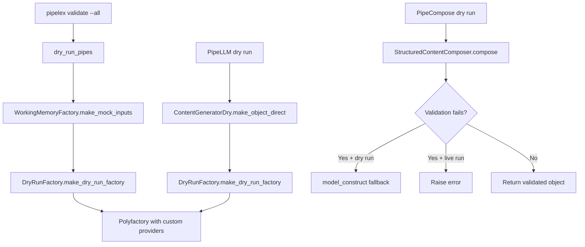

# Dry Run Mock Generation

Dry runs validate pipeline structure without executing inference. This requires generating mock `StuffContent` objects that satisfy Pydantic field constraints. The `DryRunFactory` system produces format-compliant mock values for fields with validation rules (e.g., snake_case identifiers, PascalCase concept codes).

---

## Why Mock Generation Matters

Pydantic models in Pipelex often enforce format constraints via `field_validator` or `model_validator`:

```python
class BundleHeaderSpec(StructuredContent):
    domain_code: str  # Must be snake_case
    main_pipe: str    # Must be snake_case, must exist in pipe dict

class ConceptSpec(StructuredContent):
    the_concept_code: str  # Must be PascalCase
```

Standard mock generators (like Polyfactory) produce random strings like `"uygNjiAuDMOtZEyibgHw"` which fail validation. The dry run system addresses this at two levels:

1. **Field-level**: Generate values matching expected formats (snake_case, PascalCase)
2. **Model-level**: Gracefully handle cross-field validators that mock data cannot satisfy

---

## When Dry Run Mock Generation Is Used



| Trigger | Entry Point | Mock Generation |
|---------|-------------|-----------------|
| `pipelex validate` | `dry_run_pipe()` | `WorkingMemoryFactory.make_mock_inputs()` |
| `PipeLLM` output in dry mode | `ContentGeneratorDry.make_object_direct()` | `DryRunFactory` (no field constraints) |
| `PipeFunc` output in dry mode | `WorkingMemoryFactory.make_mock_content()` | `DryRunFactory` (with field constraints) |
| `PipeCompose` validation failure in dry mode | `StructuredContentComposer.compose()` | Falls back to `model_construct` |

---

## Architecture

### DryRunFactory

Located at `pipelex/cogt/content_generation/dry_run_factory.py`:

```python
class DryRunFactory:
    @classmethod
    def generate_snake_case_code(cls) -> str:
        suffix = "".join(random.choices(string.ascii_lowercase, k=4))
        return f"mock_{suffix}"  # e.g., "mock_abcd"

    @classmethod
    def generate_pascal_case_code(cls) -> str:
        suffix = "".join(random.choices(string.ascii_lowercase, k=4))
        return f"Mock{suffix.capitalize()}"  # e.g., "MockAbcd"

    @classmethod
    def make_dry_run_factory(
        cls,
        object_class: type[BaseModelTypeVar],
        snake_case_field_names: set[str] | None = None,
        pascal_case_field_names: set[str] | None = None,
    ) -> type[ModelFactory[BaseModelTypeVar]]:
        ...
```

The factory dynamically creates a Polyfactory `ModelFactory` subclass with field-specific providers using the `Use` directive.

### Field Constraint Configuration

Field name sets are defined in `WorkingMemoryFactory` (not in `DryRunFactory`) because they are domain-specific to Pipelex bundle/concept specs:

```python
# pipelex/core/memory/working_memory_factory.py

SNAKE_CASE_FIELD_NAMES = {"domain", "domain_code", "pipe_code", "main_pipe"}
PASCAL_CASE_FIELD_NAMES = {"the_concept_code"}
```

!!! info "Why constraints live in WorkingMemoryFactory"
    The `DryRunFactory` is a generic utility at the `cogt` (cognitive) layer. Field format constraints like `domain_code` are specific to Pipelex bundle definitions. Keeping them separate maintains layer boundaries.

---

## Implementation Details

### Mock Input Generation

When `WorkingMemoryFactory.make_mock_inputs()` creates mock working memory:

```python
@classmethod
def make_mock_content(cls, typed_named_stuff_spec: TypedNamedStuffSpec) -> StuffContent:
    mock_factory = DryRunFactory.make_dry_run_factory(
        object_class=typed_named_stuff_spec.structure_class,
        snake_case_field_names=SNAKE_CASE_FIELD_NAMES,
        pascal_case_field_names=PASCAL_CASE_FIELD_NAMES,
    )
    return mock_factory.build(factory_use_construct=True)
```

The `factory_use_construct=True` flag bypasses `field_validator` and `model_validator` during object creation, preventing validation errors from random nested values.

### LLM Output Generation

When `ContentGeneratorDry.make_object_direct()` generates mock LLM outputs:

```python
object_factory = DryRunFactory.make_dry_run_factory(object_class)
return object_factory.build(factory_use_construct=True)
```

No field constraints are passed here—LLM output classes may have arbitrary schemas not matching bundle spec patterns.

### PipeCompose Validation Fallback

`StructuredContentComposer` handles cross-field validation failures in dry run mode:

```python
async def compose(self) -> StuffContent:
    field_values = await self._resolve_all_fields()
    try:
        return self.output_class.model_validate(field_values)
    except ValidationError as exc:
        if self.pipe_run_params and self.pipe_run_params.run_mode.is_dry:
            log.verbose(f"Dry run validation failed, using model_construct: {exc}")
            return self.output_class.model_construct(**field_values)
        raise StructuredContentComposerValidationError(...) from exc
```

This handles cases like `PipelexBundleSpec` where `main_pipe` must reference an existing key in the `pipe` dict—impossible to guarantee with independently generated mock values.

---

## Behavior Matrix

| Scenario | Field Constraints Applied | Validators Bypassed | Fallback on Error |
|----------|--------------------------|---------------------|-------------------|
| `WorkingMemoryFactory.make_mock_content()` | Yes (snake_case, PascalCase) | Yes (`factory_use_construct`) | N/A |
| `ContentGeneratorDry.make_object_direct()` | No | Yes (`factory_use_construct`) | N/A |
| `StructuredContentComposer.compose()` (dry) | N/A (uses resolved values) | No (tries validation first) | Yes (`model_construct`) |
| `StructuredContentComposer.compose()` (live) | N/A | No | No (raises error) |

---

## Generated Mock Value Formats

| Format | Generator | Example Output | Used For |
|--------|-----------|----------------|----------|
| snake_case | `generate_snake_case_code()` | `mock_abcd` | `domain`, `domain_code`, `pipe_code`, `main_pipe` |
| PascalCase | `generate_pascal_case_code()` | `MockAbcd` | `the_concept_code` |
| Random string | Polyfactory default | `uygNjiAuDMOtZEyibgHw` | All other string fields |

---

## Extending Field Constraints

To add new constrained fields:

1. **Add to field name sets** in `working_memory_factory.py`:

    ```python
    SNAKE_CASE_FIELD_NAMES = {"domain", "domain_code", "pipe_code", "main_pipe", "new_field"}
    ```

2. **For new format types**, add a generator to `DryRunFactory`:

    ```python
    @classmethod
    def generate_kebab_case_code(cls) -> str:
        suffix = "".join(random.choices(string.ascii_lowercase, k=4))
        return f"mock-{suffix}"
    ```

3. **Add a new parameter** to `make_dry_run_factory()`:

    ```python
    def make_dry_run_factory(
        cls,
        object_class: type[BaseModelTypeVar],
        snake_case_field_names: set[str] | None = None,
        pascal_case_field_names: set[str] | None = None,
        kebab_case_field_names: set[str] | None = None,  # New
    ) -> type[ModelFactory[BaseModelTypeVar]]:
    ```

!!! warning "Field name matching is exact"
    The field name must exactly match a key in `object_class.model_fields`. No glob patterns or inheritance traversal.

---

## File Reference

| File | Purpose |
|------|---------|
| `pipelex/cogt/content_generation/dry_run_factory.py` | `DryRunFactory` class with format generators |
| `pipelex/cogt/content_generation/content_generator_dry.py` | `ContentGeneratorDry` for mock LLM/image outputs |
| `pipelex/core/memory/working_memory_factory.py` | `WorkingMemoryFactory.make_mock_content()` with field constraints |
| `pipelex/pipe_operators/compose/structured_content_composer.py` | Validation fallback for `PipeCompose` |
| `pipelex/pipe_run/dry_run.py` | `dry_run_pipe()` orchestration |

---

## Next Steps

- [Architecture Overview](./architecture-overview.md) — Understand the two-layer design
- [Test Profile Configuration](./test-profile-configuration.md) — Configure model sets for testing
