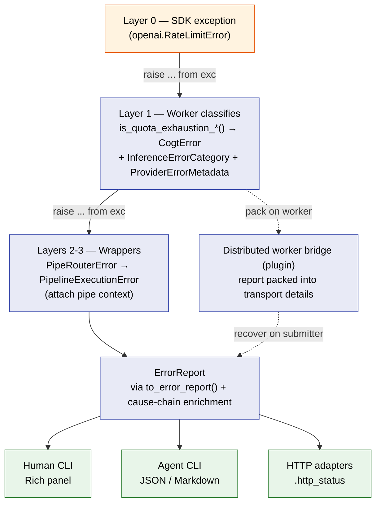

# Error Model

In Pipelex, an error is **data**, not a control-flow accident. Every failure is classified once — at the layer that knows the most about it — and that classification travels intact to every consumer: the human reading a Rich panel, the agent parsing JSON, a distributed worker's retry engine, and the HTTP adapter picking a status code.

This page covers the contract that makes that possible: the `ErrorReport` schema, the classification enums, how inference workers classify SDK exceptions, how classification survives every wrapping layer, and how it survives serialization across a distributed worker boundary.

---

## Design Principle

Three rules hold across the codebase, and everything else builds on them.

**Single-rooted hierarchy.** Every custom exception inherits from `PipelexError` (`pipelex/base_exceptions.py`). There is one root, so one `to_error_report()` contract covers the whole tree.

**Classify at the source, never lose it.** The layer that catches a third-party exception knows the most about it. It classifies there. Every layer above is a *wrapper* — it adds context (pipe code, stack) but inherits the classification rather than re-deriving or discarding it.

**No broad catches in business logic.** `except Exception` is allowed only at CLI entry points and async task roots. Ruff rule `BLE001` enforces this — an unexpected exception crashes loudly instead of being silently swallowed.

!!! info "Why classify, instead of just propagating the exception?"
    A raw `openai.RateLimitError` tells a Python `except` clause what to catch, but it does not tell a distributed worker's retry engine whether to retry, the HTTP adapter which status to emit, or an agent whether the failure is the user's fault. Classification turns an exception into a decision input that every consumer can act on uniformly.

---

## The Layer Model

An error rises through a series of layers. Each layer has exactly one job.

| Layer | Role | What it does with errors |
|-------|------|--------------------------|
| **5 — CLI entry points** | `pipelex` / `pipelex-agent` commands | Catch, format for human (Rich) / agent (JSON·MD) / HTTP |
| **4 — CLI factories** | `cli_factory.py`, `agent_cli_factory.py` | Catch setup errors, route to handlers |
| **3 — Pipeline runner** | `PipelexMTHDSProtocol.execute()` | Catch + wrap as `PipelineExecutionError` |
| **2 — Pipe router / operators** | `PipeRouter`, pipe operators | Catch + wrap with pipe context (`pipe_code`, `pipe_stack`) |
| **1 — Workers / SDK calls** | `pipelex/providers/*/` | **Catch the SDK exception → classify → raise `CogtError`** |
| **0 — Third-party SDKs** | OpenAI, Anthropic, Google, … | Raise raw, untyped provider exceptions |

Classification happens once, at **Layer 1**. Layers 2–5 are wrappers: they attach context as they catch and re-raise, but the `error_category`, `error_domain`, `model`, and `provider` set at Layer 1 reach Layer 5 unchanged (see [Cause-Chain Enrichment](#cause-chain-enrichment)). The worker states only the `error_category`; the matching `error_domain` is [derived from it](#the-cogterror-family-derives-its-domain-from-its-category), so a single Layer-1 decision settles both the retry question and the HTTP status.

---

## ErrorReport — the Serialization Schema

`ErrorReport` (`pipelex/base_exceptions.py`) is the single source of truth for error serialization. It is a frozen Pydantic model with `extra="forbid"`.

| Field | Type | Meaning |
|-------|------|---------|
| `error_type` | `str` | The exception class name |
| `message` | `str` | Human-readable message |
| `title` | `str` | Stable human-readable summary — the RFC 7807 `title` |
| `type_uri` | `str` | Per-class documentation URI — the RFC 7807 `type` |
| `error_category` | `str \| None` | `InferenceErrorCategory` value (inference errors only) |
| `error_domain` | `str \| None` | `ErrorDomain` value — `input` / `config` / `runtime`. Declared per class, except on the `CogtError` family where it is [derived from `error_category`](#the-cogterror-family-derives-its-domain-from-its-category) |
| `retryable` | `bool \| None` | Whether a retry could succeed |
| `user_action` | `UserAction \| None` | Typed advice — `kind` + free-form `detail` |
| `model` | `str \| None` | Model handle, when the failure is attributable to one |
| `provider` | `str \| None` | Backend name, when attributable |
| `provider_metadata` | `ProviderErrorMetadata \| None` | SDK metadata — status code, request id, `retry_after` |
| `validation_errors` | `list[ValidationErrorItem] \| None` | Structured per-error diagnostics on a bundle-validation failure (`ValidateBundleError` only) |

`PipelexError.to_error_report()` is the entry point. `to_dict()` serializes, dropping `None` fields; `from_dict()` is its strict inverse.

### The identity triple, and why renaming an error class is a wire break

`error_type`, `title` and `type_uri` are the three identity fields on every report. `title` and `type_uri` are *presentation*, and each has a declaration hatch — set `_declared_title` or `_declared_type_uri` directly in a subclass body and that value is used verbatim instead of the auto-derived one (inheritance is deliberately bypassed via `cls.__dict__`, so a parent's curated title never captures its subclasses).

`error_type` has no such hatch: it is `type(self).__name__`, the Python class name with no indirection. That makes it the **machine contract** — consumers outside this repo `switch` on that string. Renaming an error class therefore breaks them *silently*: their build stays green and the branch simply stops matching, falling through to a generic error path.

The guard against that is a committed snapshot of the full `(error_type, title, type_uri)` set at `tests/data/errors/error_identity.txt`, regenerated with `make generate-error-identity` (alias `make gei`) and gated by `tests/unit/pipelex/errors/test_error_identity_snapshot.py`. A rename cannot land without producing a reviewable one-line-pair diff on that file at the moment it is made — which is also the moment to plan the matching consumer updates.

### `validation_errors` — structured bundle-validation diagnostics

A bundle-validation failure (`ValidateBundleError`) aggregates per-error data across stages and projects it onto `validation_errors` as a list of typed `ValidationErrorItem`s, so the structured error report an HTTP API surfaces carries machine-mappable diagnostics (not just a single `detail` string). Each item's `category` is one of the **closed** `ValidationErrorCategory` set:

- `blueprint_validation` — interpreter / blueprint-validation faults. A blueprint-stage `PipeValidationError` raised *inside* a pydantic model validator (e.g. the PipeBatch `input_item_name` == `input_list_name` collision, or the SubPipe `batch_over` == `batch_as` collision — both `batch_item_name_collision`) is wrapped by pydantic as a `value_error`; the blueprint categorizer unwraps it (`ctx["error"]`) so the item keeps its structured `error_type` and `pipe_code` / `domain_code` locators instead of degrading to the no-`error_type` residual. The item stays in `blueprint_validation` (not `pipe_validation`) because the fault genuinely surfaced at the parse boundary, before any pipe was instantiated — only the `error_type` is recovered, not the stage. This category also serves as the **last-resort residual**: a parse-level failure (a TOML-syntax error, an empty blueprint, a bundle-elaborator failure) is raised with only a message and no categorized data, so when *nothing else* produced an item the builder projects that message as one `blueprint_validation` item (no `error_type`, no `source` — the bundle could not become a blueprint at all).
- `pipe_factory` — pipe-factory failures (e.g. a missing concept).
- `pipe_validation` — pipe/concept validation (missing input variable, type mismatch).
- `dry_run` — the **residual** dry-run failure (`DryRunError` / `PipeRunError`) with no structured locator. It is projected as one message-only item **only when no categorized error has data**. It is graph-level, so it typically carries **no `source`**.

Together the two residuals make the **structured-info invariant total**: every invalid verdict carries a non-empty `validation_errors[]`, never a bare message. The builder tries the channels in order — categorized data, then the `dry_run` residual (the more specific channel), then the `blueprint_validation` fallback — and emits exactly one residual only when no earlier channel produced an item.

Besides `category` and `message`, each item carries whatever identity fields its stage produced — `error_type`, `pipe_code`, `concept_code`, `domain_code`, `field_path`, `field_name`, `variable_names`, `missing_concept_code`, `declared_concepts`, and a `source` (the declaring file path, or the per-content source the in-memory load path was given) that hands a consumer the owning file for cross-file diagnostic placement. When the error has a deterministic remedy, the item also carries a [`suggested_fix`](#suggested_fix-structured-deterministic-fixes).

**Signatures are never an error.** An unimplemented `PipeSignature` reached during validation is a *runnability fact*, not a validation failure: the validator no longer raises on it. The assembled library's outstanding signatures ride the validation report's `pending_signatures`, and `is_runnable = not pending_signatures`. `allow_signatures` is a sweep-mechanics flag only (whether signature pipes are mock-run and listed in `validated_pipes`) — it does not change the verdict, so strict ≡ lenient in the report body. The "is this a failure?" decision moves to the consumer: the CLI exits non-zero on `not is_runnable` unless `--allow-signatures`; the HTTP caller reads `is_runnable`. (The **execute/run** path is different: running a stub still raises `PipeSignatureNotExecutableError`.)

**Host-wiring guards are programmer errors, not content verdicts.** `validate_bundle`'s "provide exactly one of `mthds_contents` / `mthds_file_path`" guard and `resolve_crate_from_contents`'s `mthds_sources`-length-mismatch guard raise `PipelexUnexpectedError` (→ 500, redacted under STRICT), not `ValidateBundleError` — a caller wiring bug must not be reported as if the submitted bundle were invalid. The empty-`mthds_contents` guard stays caller-facing (it can legitimately reflect an end user submitting no bundles).

`ValidationErrorItem` and the builder are the single source of truth across surfaces: `build_validation_error_items()` (`pipelex/pipeline/validation_errors.py`) is called by both `ValidateBundleError.to_error_report()` (the API path) and the agent CLI's `extract_validation_errors()` (the CLI JSON envelope), so the two structured shapes cannot drift. The item lives in `pipelex/base_exceptions.py` alongside `ErrorReport` — not next to the source error-data models — because `ErrorReport` references it as a typed field and the root exceptions module must not import the `pipelex.core` error modules.

#### The `error_type` registry — the closed vocabulary of faults

An item's `error_type` names the fault it reports, and that vocabulary is closed: `pipelex/validation_error_types.py` holds it in full, enumerated as `VALIDATION_ERROR_TYPES`. A consumer that needs to know which faults the language surface can report — a coverage gate, a test corpus, a client mapping errors onto its own UI — reads that registry instead of collecting strings from whichever diagnostics it happens to have seen.

The registry is the union of the enums validation already reports through, never a second list beside them — "reports through", not "raises", because the advisory members ride `warnings` and are never raised as an exception at all: `PipeValidationErrorType` and `PipeFactoryErrorType` are the two stage vocabularies, `ValidationResidualErrorType` names the one residual channel with no stage enum of its own, and `HintLintErrorType` carries the intent-hint lints (which attach to concepts and structure fields too, so the pipe enum is the wrong home for them). A member added to any of them is in the registry the moment it is declared. `ValidationErrorItem.error_type` is typed against their union, so an unregistered string cannot be constructed or parsed onto an item — which is what makes the enumeration *closed* rather than merely documented, and what publishes the vocabulary into the OpenAPI schema `pipelex-api` serves for `/validate`.

Two spellings live in that one vocabulary, deliberately. The stage enums are snake_case codes (`missing_input_variable`); the dry-run residual is `DryRunError`, the name of the exception that produced it, because that residual is raised as an error object rather than classified into a code. Normalizing it would be a wire break across every consumer that pins the string, and it would buy nothing — the enumeration is closed either way.

Membership means a value is *reachable on the wire*, not that it is a useful thing to exercise. Several members are advisory-only — `optional_force_redundant`, `input_presence_vacuous`, and the three `hint_*` lints — riding `warnings` and never an invalid verdict, and the two `unknown_*` fallbacks fire on states no author can ask for. A consumer building coverage over the registry excludes those on its own side with a stated reason, rather than pruning them from the runtime truth here — which is what the [MTHDS Test Corpus](../contribute/mthds-test-corpus.md) vocabulary generator already does, excluding each with its reason as it generates the `error.*` namespace from this registry.

`validation_errors` is one of the fields kept under STRICT disclosure (it is in `_STRICT_KEPT_FIELDS`): the items describe the caller's *own* submitted bundle, not server internals, so redacting them would gut the hosted path's diagnostics.

```python
report = exc.to_error_report()
report.to_dict()  # {"error_type": "LLMCompletionError", "message": "...", ...}
ErrorReport.from_dict(d)  # strict inverse — raises ValidationError on a malformed dict
report.http_status  # 422 / 429 / 500 — for HTTP adapters
```

!!! warning "`ErrorReport` is `extra="forbid"`"
    `from_dict()` rejects unknown keys, so it is the strict inverse of `to_dict()`. A report dict that crosses a serialization boundary and fails validation on the way back is an internal contract bug — the writer and the reader share the schema within one deploy. A cross-boundary recovery helper that rebuilds a report (e.g. a distributed-worker bridge) is expected to catch that `ValidationError` and synthesize a fallback report so failure-webhook delivery stays intact while keeping the contract bug visible; any other caller of `from_dict()` should treat the validation failure as a bug to fix.

### `suggested_fix` — structured deterministic fixes

When a validation error has a deterministic remedy, its `ValidationErrorItem` carries a `suggested_fix` — a `SuggestedFix` (`pipelex/suggested_fix.py`, deliberately stdlib+pydantic-only so `pipelex.base_exceptions` can import it without a cycle; naming is brand-neutral, fixes are a language-level concept):

- `fix_code` — the kebab-case rule id (e.g. `match-sequence-output`). The planner's `KNOWN_FIX_CODES` set is the validation set for user-facing rule filters (`--select` / `--ignore`); an unknown code is rejected loudly, never lenient-ignored, because a typo'd filter selects *behavior*.
- `description` — human-readable statement of the change.
- `safety` — `safe` fixes may be auto-applied; `unsafe` ones require explicit opt-in.
- `source` — the file the ops target, when known (multi-file libraries). An applier must only apply ops to the file they target.
- `ops[]` — the fix itself, as **semantic TOML patch ops** addressed by table path (`FixOpKind`: `set_key`, `ensure_table`, `delete_key`, `delete_table`, `rename_table_key`, `move_key`, `remap_value`; each op's `table_path` follows the same conventions as the items' `field_path`). The ops are the machine contract; any rendered diff or `💡 Suggested fix:` line is presentation.

    The op vocabulary is a **discriminated union on `kind`**: one model per kind, each declaring exactly the fields its own semantics need and forbidding the rest, so `{"kind": "delete_key", …, "new_key": "x"}` is a parse error rather than a stray field the applier silently ignores. Two aliases are published from the same union — `FixOp`, every kind, which is what `ops[]` is typed as, and `MigrationOp`, the structural kinds only (`delete_key`, `delete_table`, `rename_table_key`, `move_key`, `remap_value`), which is what a configuration [migration ledger](../migration-ledger.md) is parsed against. The narrow alias is what keeps a materializing op — one that writes a value the file did not have — out of a ledger that is replayed over every user file on every run.

The **fix planner** (`pipelex/pipeline/fixes/planner.py`) translates enriched typed error data into `SuggestedFix` payloads — pure functions keyed strictly on `error_type` + structured fields, never on message strings. Each rule fires only when its enrichment is present (set only at the raise sites that know the correct value), so the same error type raised elsewhere without enrichment is structurally suppressed. The planner runs inside `build_validation_error_items()`, so every consumer of the validation report — CLI, API, MCP — sees fixes with zero extra plumbing.

Applying fixes is the runtime's job too: the **applier** (`pipelex/pipeline/fixes/applier.py`) mutates a tomlkit DOM in place per op (guarded — an op whose target table is absent is skipped and reported, never raised) and then reflows the whole file to canonical MTHDS style, and the **convergence loop** (`pipelex/pipeline/fixes/fix_loop.py`) runs validate → apply SAFE fixes → re-validate to a fixed point, reporting non-convergence loudly. The user-facing surface is [`pipelex fix bundle`](../tools/cli/fix.md).

On the hosted API the same payload rides the wire verbatim as `validation_errors[].suggested_fix`; how it appears in HTTP error responses is documented on the API side, in `pipelex-api`'s `docs/error-responses.md` → "Suggested fixes".

---

## Classification Enums

Two `StrEnum`s drive every downstream decision.

### InferenceErrorCategory

Defined in `pipelex/cogt/exceptions.py`. It carries two derived properties: `is_retryable` drives retry decisions and is `True` only for `TRANSIENT`; `error_domain` drives the HTTP status the whole `CogtError` family answers with.

| Category | Meaning | Retryable | Domain | Typical cause |
|----------|---------|-----------|--------|---------------|
| `TRANSIENT` | A brief, self-correcting failure | ✅ | `RUNTIME` | Rate limit, 5xx, connection blip |
| `CONFIGURATION` | The setup is wrong | ❌ | `CONFIG` | Bad API key, missing backend |
| `CONTENT` | The input or prompt is wrong | ❌ | **`INPUT`** | Content-policy violation, bad prompt |
| `CAPACITY` | Account quota / billing exhausted | ❌ | `RUNTIME` | `insufficient_quota`, HTTP 402 |
| `AMBIGUOUS` | Outcome unknown — may have committed | ❌ | `RUNTIME` | Connection dropped mid-request |
| `UNKNOWN` | Could not classify | ❌ | *none* | Unrecognized inner exception |

```python
class InferenceErrorCategory(StrEnum):
    TRANSIENT = "transient"
    # ... CONFIGURATION, CONTENT, CAPACITY, AMBIGUOUS ...
    UNKNOWN = "unknown"

    @property
    def is_retryable(self) -> bool:
        match self:
            case InferenceErrorCategory.TRANSIENT:
                return True
            case _:  # all other categories
                return False

    @property
    def error_domain(self) -> ErrorDomain | None:
        match self:
            case InferenceErrorCategory.CONTENT:
                return ErrorDomain.INPUT
            case InferenceErrorCategory.CONFIGURATION:
                return ErrorDomain.CONFIG
            # ... TRANSIENT / CAPACITY / AMBIGUOUS -> RUNTIME, UNKNOWN -> None ...
```

!!! info "`AMBIGUOUS` vs `UNKNOWN`"
    `AMBIGUOUS` means the *error type is known* but the operation may or may not have committed — a blind retry is unsafe for a non-idempotent call. `UNKNOWN` means classification itself failed. Both are non-retryable, for different reasons.

!!! info "`UNKNOWN` maps to no domain at all"
    `UNKNOWN` means the classification step itself failed, so claiming `RUNTIME` would assert something the code cannot support. An absent `error_domain` already renders 500 (see below), so the honest answer costs nothing at the HTTP boundary and keeps "could not classify" distinguishable from "classified as a server-side fault".

### ErrorDomain

Defined in `pipelex/base_exceptions.py`. Set as a class-level attribute on the exception, drives HTTP status.

| Domain | Meaning | HTTP status | Who can fix it |
|--------|---------|-------------|----------------|
| `INPUT` | Caller sent something it can fix | **422** | The caller |
| `CONFIG` | Environment / configuration change needed | **500** | The operator |
| `RUNTIME` | A failure during execution | **500** | Depends on the cause |

`error_domain_to_http_status()` is the pure mapping table — it maps an unset or unrecognized domain to 500 as well. `ErrorReport.http_status` layers one rule on top: a provider 429 (`provider_metadata.status_code == 429`) takes precedence over the domain, so the API can emit a `Retry-After` header. That precedence is why `CAPACITY -> RUNTIME` does not swallow a rate-limit passthrough.

```python
class PipelexConfigError(PipelexError):
    error_domain = ErrorDomain.CONFIG  # class-level — every instance carries it
```

#### The `CogtError` family derives its domain from its category

The inference branch is the one place where `error_domain` is **not** declared per class. A worker has already decided whose fault the failure is when it assigns an `InferenceErrorCategory`, so `CogtError.to_error_report()` derives the domain from that category rather than asking several dozen leaf classes to state the same fact twice — which is also what keeps `error_domain` and `error_category` from ever contradicting each other on the wire.

Precedence on the derived field mirrors every other field on that method: an `error_domain` declared explicitly on the leaf class wins, then the category derivation, then whatever the `__cause__` chain surfaced.

```python
own_domain = self.error_category.error_domain if self.error_category is not None else None
"error_domain": self.error_domain or own_domain or base_report.error_domain,
```

The consequence worth knowing at the HTTP boundary: a **content-classified inference failure answers 422, not 500** — a content-policy refusal, a malformed prompt image, a bad prompt parameter are all properties of material the caller submitted. Everything else keeps the status it already had; only the report became truthful about why.

---

## Worker Classification

Layer 0 → Layer 1. Every inference worker under `pipelex/providers/*/` catches its SDK's typed exceptions and re-raises a categorized `CogtError`.

### The Uniform Shape — Extract / Classify / Render

Every inference worker's SDK-exception handler collapses to a three-step pipeline: **Extract** turns the SDK exception into a provider-blind `ProviderErrorMetadata`, **Classify** maps that metadata to a category + user-action, and **Render** picks the `CogtError` subclass to raise.

```python
except (APIError, APIConnectionError, APITimeoutError) as exc:
    metadata = extract_openai_metadata(exc)
    classification = classify_inference_error(metadata)
    raise render_inference_error(
        metadata=metadata,
        classification=classification,
        family=InferenceErrorFamily.LLM,
        model_desc=self.inference_model.desc,
        model_handle=self.inference_model.name,
    ) from exc
```

The three steps live in three modules. Only the per-provider Extract functions stay plugin-local; Classify and Render are single shared functions.

| Module | Step | What it owns |
|--------|------|--------------|
| `pipelex/cogt/inference/error_classification.py` | Extract | `ProviderErrorMetadata`, `SDKErrorEnvelope`, `UserAction`, `UserActionKind`, `GatewayRequestLimit`, `GatewayUnresolvedReference`, the `extract_*_metadata` functions, plus pure discriminators (`is_quota_exhaustion`, `is_content_policy_violation`, `is_network_error`, `gateway_request_limit`, `gateway_unresolved_reference`) exposed as `@property` on the metadata |
| `pipelex/cogt/inference/error_classify.py` | Classify | `classify_inference_error()` — provider-blind mapping from `ProviderErrorMetadata` → `ClassificationResult(category, user_action_kind, is_model_not_found, gateway_request_limit, gateway_unresolved_reference)` |
| `pipelex/cogt/inference/error_render.py` | Render | `render_inference_error()` — picks the `CogtError` subclass from `InferenceErrorFamily` plus `is_model_not_found` (e.g. `LLMModelNotFoundError` vs `LLMCompletionError`) |

Provider-specific nuance is normalized away in Extract (e.g. Google's `code` becomes `status_code`; AWS Bedrock error codes are mapped to HTTP statuses), so Classify has no provider branching. HTTP status drives classification; status-less errors dispatch on the SDK exception type name. The `tests/unit/pipelex/cogt/inference/test_provider_classification_parity.py` meta-test walks every `ProviderName` against the extract-fn registry so adding a new provider without wiring it fails fast.

### ProviderErrorMetadata and UserAction

Every raised inference error carries structured SDK metadata and typed advice.

```python
class ProviderErrorMetadata(BaseModel):
    provider: str
    sdk_exception_type: str
    status_code: int | None = None
    request_id: str | None = None
    retry_after_seconds: float | None = None
    provider_error_code: str | None = None
    body: Any | None = Field(default=None, exclude=True)  # may carry secrets
```

!!! warning "`body` is excluded from serialization"
    The raw provider response `body` can carry account ids, billing details, or credential fragments. It is held in-process but `exclude`d from every serialized form — CLI JSON, agent output, and any serialized worker payload.

`UserAction` pairs a discrete `UserActionKind` (`WAIT_AND_RETRY`, `CHECK_BILLING`, `CHECK_CREDENTIALS`, `CHANGE_INPUT`, `CHANGE_MODEL`, `CONTACT_SUPPORT`, `UNKNOWN`) with a free-form `detail` string — so the CLI can render consistent guidance while keeping provider-specific text.

### The Gateway's Own Refusals

Not every failure on an inference call comes from a provider. The Pipelex inference gateway refuses some requests itself, before a model ever sees them, and it does so for two different reasons: the request is outside what it will carry, or a reference the request depends on cannot be turned into content. Both arrive with the gateway's own error codes, and each has a runtime enum naming its outcomes — `GatewayRequestLimit` and `GatewayUnresolvedReference`.

#### What the request may weigh

The gateway bounds what a request may weigh and how deeply it may nest, and refuses anything over those bounds itself — the body cap runs ahead of authentication, on the request headers alone, so the request never reaches a model at all.

| Gateway code | HTTP | `GatewayRequestLimit` | Category / action | What the caller is told |
|---|---|---|---|---|
| `pig-07` | 413 | `BODY_TOO_LARGE` | `CONTENT` / `CHANGE_INPUT` | the request was too large — send less in one call |
| `pig-08` | 411 | `BODY_LENGTH_REQUIRED` | `CONFIGURATION` / `CONTACT_SUPPORT` | the gateway could not read the request's declared size |
| `pig-10` | 413 | `OBJECT_TOO_LARGE` | `CONTENT` / `CHANGE_INPUT` | a file the request refers to is over the per-file limit |
| `pipelex_storage_object_too_large` | 413 | `OBJECT_TOO_LARGE` | `CONTENT` / `CHANGE_INPUT` | the same limit, as the native routes name it |
| `pipelex_document_too_large` | 413 | `OBJECT_TOO_LARGE` | `CONTENT` / `CHANGE_INPUT` | a document the gateway fetched by URL is over that limit |
| `pig-11` | 400 | `BODY_TOO_DEEP` | `CONTENT` / `CHANGE_INPUT` | the request nests too deeply — flatten the inputs or the output structure |

Three of the four are the caller's to fix and none of the four is ever retried: the gateway refused the request before a provider saw it, so an identical retry earns an identical refusal. `pig-08` is the exception in kind rather than in retryability — an HTTP client framed the request in a way the gateway will not bound (a chunked body, or an unreadable `Content-Length`), which no client the runtime ships produces, so it points at the transport stack rather than at the inputs.

A few details are worth knowing before touching this:

- **The code is the discriminator, not the provider.** A request reaches the gateway through whichever SDK its dialect calls for — the Portkey substrate, plain `httpx` on the native extract and search routes, and the shared Anthropic driver that Claude travels on — so the same refusal arrives under more than one `ProviderName`. `pig-` is the gateway's own code namespace, so matching on the code alone is both necessary and sufficient. Every Extract hop that can carry one of these recovers the code into `provider_error_code` — including the Portkey substrate, where it has to be read back off the response: Portkey's own exception factory replaces the payload with the message string, so `exc.body` there is never the document the code lives in.
- **The check runs before the status ladder.** An explicit code from a service we operate is a more specific verdict than any status bucket, and 413 / 411 / 400 would otherwise be read as a provider rejecting the prompt. It cannot collide with the quota rules, which only fire on 402 and 429.
- **The advice names no numbers.** The caps belong to the deployment, they differ between deployments, and the gateway already states its own figures in the message the advice sits beside. `_render_gateway_limit_detail` in the Render step is also where a per-plan message belongs once the hosted product's tier limits are wired through — the gateway knows nothing of users, organizations or plans, so only the runtime can say "your plan allows files up to N MB".
- **One failure can wear two codes, and reading `type` first loses one of them.** The gateway renders a refusal in the vocabulary of the route it arrived on: its own `pig-0N` family on the LLM routes, where the client is speaking a provider's protocol, and its frozen `pipelex_*` contract codes on the native `/v1/pipelex/extract` and `/v1/pipelex/search` routes. So "this file is over its cap" is `pig-10` on one and `pipelex_storage_object_too_large` on the other, and a caller cannot tell which route their extract took. The native-route envelope also puts a generic `invalid_request_error` in `error.type` beside the real code in `error.code`, so the two Pipelex-service Extract hops read `code` before `type` — the inverse of the vendor-facing precedence, which stays as it is because Anthropic's error section carries a `type` and no `code` at all. Reading `type` first there replaces the whole `pipelex_*` vocabulary with one bucket.

#### When a reference cannot be resolved

The other half of the gateway's own refusals. A request may *name* a file rather than carry it — a `pipelex-storage://` key the gateway resolves for the caller, or a document URL it fetches on their behalf — and when it cannot turn that reference into bytes it refuses the request itself, again before a provider sees it. So one family bounds what the request may weigh; this one says a reference the request depends on could not be turned into content. `GatewayUnresolvedReference` is the runtime's name for each outcome.

| Gateway code | HTTP | `GatewayUnresolvedReference` | Category / action | What the caller is told |
|---|---|---|---|---|
| `pig-09` | 400 | `REFERENCE_UNRESOLVED` | `CONTENT` / `CHANGE_INPUT` | a file reference could not be resolved — the message names the cause |
| `pipelex_storage_uri_invalid` | 400 | `STORAGE_REFERENCE_INVALID` | `CONTENT` / `CHANGE_INPUT` | the storage reference is malformed — check it against the key the upload returned |
| `pipelex_storage_unreadable` | 400 | `STORAGE_OBJECT_UNREADABLE` | `CONTENT` / `CHANGE_INPUT` | the object is not there, or cannot be read |
| `pipelex_storage_uri_unsupported` | 400 | `STORAGE_NOT_SERVED` | `CONFIGURATION` / `CONTACT_SUPPORT` | this deployment serves no storage references at all |
| `pipelex_unsupported_uri_scheme` | 400 | `DOCUMENT_URL_REFUSED` | `CONTENT` / `CHANGE_INPUT` | send an `https://` URL, a `data:` URL, or a `pipelex-storage://` reference |
| `pipelex_document_scheme_refused` | 400 | `DOCUMENT_URL_REFUSED` | `CONTENT` / `CHANGE_INPUT` | the same remedy — the fetch's own scheme check |
| `pipelex_document_address_refused` | 400 | `DOCUMENT_URL_REFUSED` | `CONTENT` / `CHANGE_INPUT` | the same remedy — the resolved address is not publicly routable |
| `pipelex_document_redirect_refused` | 400 | `DOCUMENT_URL_REFUSED` | `CONTENT` / `CHANGE_INPUT` | the same remedy — the gateway does not follow redirects |
| `pipelex_document_host_refused` | 400 | `DOCUMENT_HOST_REFUSED` | `CONTENT` / `CHANGE_INPUT` | documents are not fetched from that host, as a matter of security policy |
| `pipelex_document_unreachable` | 400 | `DOCUMENT_UNREACHABLE` | `CONTENT` / `CHANGE_INPUT` | check the document is live and publicly reachable |
| `pipelex_document_empty` | 400 | `DOCUMENT_CONTENT_UNUSABLE` | `CONTENT` / `CHANGE_INPUT` | the document was fetched and cannot be used |
| `pipelex_document_unsupported_type` | 400 | `DOCUMENT_CONTENT_UNUSABLE` | `CONTENT` / `CHANGE_INPUT` | the same — a media type the pipeline does not accept |
| `pipelex_document_bad_data_url` | 400 | `DOCUMENT_CONTENT_UNUSABLE` | `CONTENT` / `CHANGE_INPUT` | the same — a `data:` URL that could not be decoded |

Everything said above about the request limits holds here too — the code is the discriminator rather than the provider, the check runs ahead of the status ladder, and the advice defers every specific to the gateway's own message, which already names the key, the host, the status or the media type. Three things are particular to this family:

- **The members group by remedy, not by wire code.** Two codes share a member only when the caller's next move is the same, which is why the URL-shape refusals are one member. Two of them are scheme checks in different places and both belong there: `classifyExtractInput` runs before any fetch and admits only `https:`, `data:` and `pipelex-storage://`, so an `http://` URL is refused as `pipelex_unsupported_uri_scheme`, and `pipelex_document_scheme_refused` is the fetch's own check on what by then can only be an `https://` URL. `pipelex_document_host_refused` is deliberately *not* folded in with them: the caller can act on all four, but only that one has to be stated as the deliberate security refusal it is. Advice that reads as a fault to work around — revise the prompt, use a smaller file — sends someone hunting for a problem in a document that is perfectly fine.
- **One member is not the caller's problem at all.** `pipelex_storage_uri_unsupported` means no bucket is configured, so the deployment does not serve the scheme: no input avoids it, and telling the caller to fix theirs is wrong in kind. It is the family's one `CONFIGURATION` / `CONTACT_SUPPORT` arm, the same call `BODY_LENGTH_REQUIRED` gets among the request limits.
- **`pig-09` is one code for every storage failure but "over its cap", and the advice says so.** On the LLM routes the client is speaking a provider's protocol, so the gateway's `pig-0N` family is the only vocabulary available and it has a single fail-closed slot for "cannot resolve" — no bucket configured, not a storage reference, no such object, an object it cannot read, a type no provider takes, or no way to hand a file to the provider the model resolves to. The message carries the difference; the code does not, so `REFERENCE_UNRESOLVED` defers to the message rather than guessing which it was. The native `/v1/pipelex/*` routes name each cause with its own frozen contract code, which is why the rest of the table is `pipelex_*`.

`pig-09` also folds in causes that are not the caller's to repair — no bucket configured, and no way to hand a file to the provider the model resolves to — because the LLM routes have one slot for all of them. The native routes name the first of those separately (`pipelex_storage_uri_unsupported`, `CONTACT_SUPPORT`), so the same storage-less deployment reads differently by route. Splitting `pig-09` is a gateway-side change, filed on `pipelex-manifold` as `L-260901-f2b554`.

Nothing in either family is ever retried, and the two never overlap: a code names either a bound the request exceeded or a reference that could not be resolved. `pig-09` and `pig-10` are the clearest illustration — the same middleware raises both, one when the object cannot be resolved and one when it is over its cap.

The gateway's remaining codes — its routing refusals, and the storage deadline outcomes (`pig_storage_timeout` at 504, `pig_storage_client_disconnected` at 499) — belong to neither family and classify on their status like anything else, which is the right reading for a timeout.

### The `instructor` Unwrap

On structured-generation paths, `instructor` wraps the real SDK exception in an `InstructorRetryException`. `extract_underlying_sdk_exception()` recovers it, so it routes through the same per-provider categorization as the plain-text path. A genuinely unrecognized inner exception (e.g. a `pydantic.ValidationError` from a schema mismatch) lands in `UNKNOWN` rather than being mis-labelled as a `CONTENT`-policy violation.

### Model and Provider Attribution

Inference-failure leaf errors (`LLMCompletionError`, `ImgGenGenerationError`, …) are raised deep inside a plugin and do not know which model handle invoked them. Each worker family fills that in at its public-method chokepoint:

```python
def fill_model_and_provider(self, model_handle: str | None, *, backend_name: str | None) -> None:
    """Fill model_handle / backend_name from the worker, only when still unset."""
```

---

## Cause-Chain Enrichment

A wrapper exception — `PipeRunError` → `PipeRouterError` → `PipelineExecutionError` — carries no `error_category` of its own. `to_error_report()` enriches the report from the `__cause__` chain, so the inference classification survives every wrapping layer.

```python
def _enrich_error_report_from_cause(self, report: ErrorReport) -> ErrorReport:
    cause = self.__cause__
    if not isinstance(cause, PipelexError):
        return report
    cause_report = cause.to_error_report()
    return ErrorReport(
        error_type=report.error_type,  # keep own identity
        message=report.message,
        error_category=report.error_category or cause_report.error_category,
        error_domain=report.error_domain or cause_report.error_domain,
        # ... retryable, user_action, model, provider, provider_metadata ...
    )
```

A wrapper keeps its own `error_type` and `message` but inherits every classification field it does not set itself.

!!! warning "Overrides must call the enrichment helper"
    A `to_error_report()` override on a subclass **must** end with `self._enrich_error_report_from_cause(report)`. Otherwise that subclass becomes a black hole that drops the cause's classification. A cyclic-`__cause__` guard ensures a malformed chain can never turn error reporting into a `RecursionError`.

---

## Crossing a Distributed Worker Boundary

The error model is built to survive serialization. Because `ErrorReport` round-trips through `to_dict()` / `from_dict()`, a failure that happens on a remote worker can reach the submitting process with its full classification intact — not just a message string.

The runtime itself stays transport-agnostic: the machinery that carries an error across a worker boundary ships in the **host-runtime plugin** for each distributed backend, not in core. A backend plugin is responsible for three things.

**Packing.** Convert a `PipelexError` into the transport's failure type and stash `to_error_report().to_dict()` in its details payload, so worker and submitter code keep the full classification rather than a bare message. The same step derives the transport's retry decision from `InferenceErrorCategory.is_retryable`.

**Recovering.** On the submitter side, walk the returned failure, pull the packed dict, and rebuild the `ErrorReport`. Recovery is **total**: when no report dict is found — a non-Pipelex exception, a worker crash, a timeout — the plugin synthesizes a fallback report so the recovery path always has structured classification to surface.

**A fail-safe floor.** Ensure a domain error that escapes the conversion path fails the unit of work *terminally* rather than hanging. In a durable-execution system the default for an unconverted exception might be to retry forever, so "convert all the errors we know about" is not enough — the floor must hold for the errors, and the code paths, that nobody enumerated.

**Net effect:** a pipe failing on a remote worker reaches the CLI and HTTP adapters with the *same* `error_category` / `retryable` / `model` / `provider` / `user_action` as the identical failure run locally — and a failure that escapes conversion fails loud and bounded instead of hanging.

See [Runtime Bridge & Transport](./runtime-bridge-and-transport.md) for the boundary these converters span; the per-backend converters themselves live in the host-runtime plugins.

---

## Interfaces

### CLI

The agent CLI (`pipelex-agent`) emits a structured error to **stderr**, markdown by default and JSON with `--error-format json`. When `--error-format` is omitted it **inherits the value of `--format`** (the success-output flag) — so `--format json` still flips both as it did before the split. Both exit with code 1.

| Command | Error output |
|---------|--------------|
| `run`, `validate`, `init`, `models`, `check-model`, `doctor` | Markdown (default) or JSON via `--error-format` (or via `--format`, which `--error-format` inherits) |
| `inputs`, `concept`, `pipe`, `accept-gateway-terms` | JSON only |
| `fmt`, `lint` | Native `plxt` output (subprocess passthrough); falls back to JSON only when the `plxt` binary itself is missing |

The human CLI (`pipelex`) renders a Rich error panel — red banner, structured fields, the `user_action` tip, doc/Discord links — through the shared `display_error_panel()` helper in `pipelex/cli/error_handlers.py`.

#### Validate exit-code policy (0 / 1 / 2)

The `validate` surface — both the bare `pipelex validate {bundle,method,pipe}` group and the agent CLI's `pipelex-agent validate` — exits with **three** codes that mirror the hosted `/validate` 200-verdict-vs-non-2xx-no-verdict split:

| Exit | Class | Condition |
|------|-------|-----------|
| `0` | valid | `is_valid` — including valid-but-not-runnable **with** `--allow-signatures` |
| `1` | negative verdict | a produced "no": an invalid bundle (`ValidateBundleError`), or valid-but-not-runnable **without** `--allow-signatures` (a strict signature breach) |
| `2` | no verdict | the CLI could not produce a verdict — bad args, an unresolvable target (no `.mthds` in a directory, a missing file, an unknown/ambiguous pipe code), or a setup/internal error during validate |

**The verdict lives in the structured `is_valid` field, not the exit code.** The exit code is a convenience signal for naive shell/CI/Makefile use (`set -e`, `cmd && next`, `if cmd; then`); machine consumers (hooks, the Codex hook, runners) MUST read `is_valid` (and `error_domain`) from the JSON for their block/warn decisions rather than branching on the exit code. Decoupling the verdict from the exit code is what keeps any future exit-code change non-breaking. The 1-vs-2 split is also additive for flat consumers: both stay non-zero, so anything that only tests zero-vs-non-zero is unaffected.

Implementation: the agent CLI threads `exit_code` through `agent_error(...)` (`agent_output.py`, default 1); the validate commands pass `exit_code=2` at every no-verdict site and keep the default 1 on the `ValidateBundleError` arm and the signature gate. The bare CLI sets the code directly via `typer.Exit(...)` in `cli/commands/validate/*` and via the `exit_code` parameter on `handle_model_choice_error` / `handle_model_availability_error` in `cli/error_handlers.py`. Shared boot handlers (`make_pipelex_for_cli`'s gateway/inference/telemetry/model-deck-preset paths) stay exit 1 — they are shared across `run`/`build`/`validate` and out of the validate-policy scope.

### API

`pipelex` is a library — there is no API server in the package. Downstream HTTP repos consume the `ErrorReport`:

- `error_domain_to_http_status(error_domain)` — pure domain → status table.
- `ErrorReport.http_status` — full property, layering the provider-429 passthrough on top.

A downstream FastAPI exception handler calls `ErrorReport.http_status` and is a trivial adapter — it must not redefine the mapping.

### Inputs and Outputs

**Inputs.** `to_error_report()` takes a live `PipelexError`. `ErrorReport.from_dict()` takes a `to_dict()` payload — strictly, raising `ValidationError` on drift. (A distributed-worker bridge adds a cross-boundary recovery helper that walks a returned failure's `__cause__` chain and rebuilds the report; it lives in the host-runtime plugin, not core.)

**Outputs.** `to_error_report()` returns an `ErrorReport`; `to_dict()` returns a `None`-free `dict`. Side effects: telemetry events emitted on pipeline failure at Layer 3; the agent CLI writes to stderr and raises `typer.Exit(...)` — code 1 by default, or the validate surface's 0/1/2 policy (see [Validate exit-code policy](#validate-exit-code-policy-0-1-2)).

---

## Architecture



---

## Implementation

### Class Hierarchy

`PipelexError` is the single root. `CogtError` is the inference branch — it overrides `to_error_report()` to add `error_category`, `retryable`, `user_action`, `provider_metadata`, and reads `model_handle` / `backend_name` from the instance. It is also where `error_domain` is *derived* rather than declared: the whole subtree gets its domain from its category.

```
Exception
└── PipelexError                  base_exceptions.py — error_domain, user_action, to_error_report()
    ├── PipelexConfigError         → error_domain = CONFIG
    ├── PipelexSetupError          → error_domain = CONFIG
    ├── CogtError                  cogt/exceptions.py — error_category, provider_metadata
    │   │                          → error_domain derived from error_category (no per-class declaration)
    │   ├── LLMCompletionError      ← per-instance category from the worker → per-instance domain
    │   ├── ImgGenGenerationError   ← per-instance category
    │   ├── LLMPromptSpecError      ← class-level CONTENT → INPUT → HTTP 422
    │   ├── LLMConfigError          ← class-level CONFIGURATION → CONFIG
    │   ├── ModelNotFoundError      ← sibling family raised on provider HTTP 404
    │   │   ├── LLMModelNotFoundError / ImgGenModelNotFoundError
    │   │   └── ExtractModelNotFoundError / SearchModelNotFoundError
    │   └── ... (see worker classification) ...
    ├── PipelineExecutionError      pipeline/exceptions.py — error_domain = RUNTIME, but only as a floor
    └── ... (one exceptions.py per package) ...
```

`PipelineExecutionError`'s `RUNTIME` is deliberately a *floor*, applied only when the cause chain surfaced no domain — so a `CONTENT`-categorized inference failure now reaches the HTTP boundary as `INPUT` / 422 through every wrapping layer instead of being flattened to the wrapper's generic 500.

### Factory-time vs Runtime

| When | What carries metadata | How |
|------|----------------------|-----|
| **Class definition** | `error_domain`, `error_category` defaults, `user_action` defaults | Class-level attributes — one source of truth per exception type |
| **Raise time** | Per-instance `error_category`, `user_action`, `provider_metadata` | Constructor args — set by the worker that classified the failure |
| **Report time** | `model`, `provider`, cause-chain fields; `error_domain` on the `CogtError` family | `fill_model_and_provider()` at the worker chokepoint; `InferenceErrorCategory.error_domain` derivation and `_enrich_error_report_from_cause()` on `to_error_report()` |

The "outcome" exceptions (`LLMCompletionError`, `ImgGenGenerationError`, `ExtractJobFailureError`, `SearchJobFailureError`) intentionally carry **no** class-level `error_category` — their category is genuinely per-instance, decided by the worker.

---

## Reference

### Quick-Ref

```python
# Produce a report from any PipelexError
report = exc.to_error_report()  # enriched from the __cause__ chain
payload = report.to_dict()  # None-free dict for serialization

# Consume a report
report.http_status  # 422 / 429 / 500
report.user_action_detail()  # free-form advice text, or None
report.error_category  # "transient" / "capacity" / ...

# Round-trip across a boundary
ErrorReport.from_dict(payload)  # strict inverse of to_dict()

# Retry decision
InferenceErrorCategory.TRANSIENT.is_retryable  # True — only TRANSIENT
```

### File → Purpose

| File | Purpose |
|------|---------|
| `pipelex/base_exceptions.py` | `PipelexError`, `ErrorReport`, `ErrorDomain`, `ValidationErrorItem`, `error_domain_to_http_status()` |
| `pipelex/pipeline/validation_errors.py` | `build_validation_error_items()` — shared CLI/API structured bundle-validation builder |
| `pipelex/validation_error_types.py` | The closed `error_type` registry — `VALIDATION_ERROR_TYPES`, `PipeValidationErrorType`, `PipeFactoryErrorType`, `ValidationResidualErrorType`, `HintLintErrorType` |
| `pipelex/cogt/exceptions.py` | `CogtError`, `InferenceErrorCategory` |
| `pipelex/cogt/inference/error_classification.py` | Extract — `ProviderErrorMetadata`, `SDKErrorEnvelope`, `UserAction`, `UserActionKind`, per-provider `extract_*_metadata` functions, pure discriminators |
| `pipelex/cogt/inference/error_classify.py` | Classify — `classify_inference_error()`, `ClassificationResult` |
| `pipelex/cogt/inference/error_render.py` | Render — `render_inference_error()`, `InferenceErrorFamily` |
| `pipelex/cogt/inference/provider_name.py` | `ProviderName` enum keying the extract-fn registry |
| `pipelex/providers/*/` | Per-provider inference workers — Layer 0 → 1 classification |
| `pipelex/pipeline/exceptions.py` | `PipelineExecutionError`, `PipeExecutionError` |
| `pipelex/cli/error_handlers.py` | Human CLI Rich panels — `display_error_panel()` |
| `pipelex/cli/agent_cli/commands/agent_output.py` | Agent CLI JSON / markdown delivery |

### Behavior Summary

| Scenario | Behavior |
|----------|----------|
| Rate limit hit | `TRANSIENT` → retryable; `error_domain = RUNTIME`; transport retry honors `Retry-After` (a provider 429 answers 429 regardless of domain) |
| Quota / billing exhausted | `CAPACITY` → non-retryable; `UserAction(CHECK_BILLING)`; `error_domain = RUNTIME` → HTTP 500 |
| Bad API key | `CONFIGURATION` → non-retryable; `error_domain = CONFIG` → HTTP 500 |
| Model or deployment not found (provider HTTP 404) | Raises a dedicated `*ModelNotFoundError` sibling (`LLMModelNotFoundError`, `ImgGenModelNotFoundError`, `ExtractModelNotFoundError`, `SearchModelNotFoundError`); operator re-raises `PipeOperatorModelAvailabilityError` |
| Content-policy violation | `CONTENT` → non-retryable; `UserAction(CHANGE_INPUT)`; `error_domain = INPUT` → **HTTP 422** |
| Malformed prompt image / bad prompt parameter | `CONTENT` class-level (`PromptImageFormatError`, `LLMPromptParameterError`, …) → `error_domain = INPUT` → **HTTP 422** |
| Any other provider **HTTP 400** | `CONTENT` → `error_domain = INPUT` → **HTTP 422**. This is the widest reach of the derivation: a 400 covers a context-length overflow and a parameter the model rejects alike, and an engine-side request-construction fault lands here too — reported as the caller's to fix, and absent from the 5xx rate |
| Local file extractor raises a builtin (docling, pypdfium2) | `ValueError` / `RuntimeError` / `FileNotFoundError` → `CONTENT` → `error_domain = INPUT` → **HTTP 422**; `OSError` → `TRANSIENT` (see `_LOCAL_EXTRACT_BY_TYPE_NAME`) |
| LLM returns schema-mismatched JSON | `instructor` re-asks; if exhausted → `UNKNOWN` → no `error_domain` asserted → HTTP 500 |
| Connection dropped mid-request | `AMBIGUOUS` → non-retryable (outcome unknown); `error_domain = RUNTIME` |
| Unknown or ambiguous entry `pipe_code` (a CLI argument, a run request's field, the `--pipe` / `pipe_ref` slice selector of bundle validation) | `EntryPipeNotFoundError` / `EntryPipeAmbiguousError` → `UserAction(CHANGE_INPUT)`; `error_domain = INPUT` → **HTTP 422**, and caller-facing under STRICT. The in-body lookups (`get_optional_pipe` / `get_required_pipe`) keep raising the undomained `PipeNotFoundError` / `PipeLibraryError`: a ref written inside a bundle is not the caller's input |
| Wrapper exception (no own category) | Inherits cause's classification via enrichment — including the domain the cause derived |
| Failure on a distributed worker | `ErrorReport` recovered from the transport's serialized details — same classification as local |
| Worker exception with no `ErrorReport` | Synthesized fallback report — `error_domain = RUNTIME` |

---

## Next Steps

- [Pipe Routing & Execution](./pipe-routing-and-execution.md) — the layer model errors rise through
- [Runtime Bridge & Transport](./runtime-bridge-and-transport.md) — the process boundary the error bridge spans (the per-backend error converters live in the host-runtime plugins)
- [Inference Configuration](../configuration/config-technical/inference-config.md) — `transport_max_retries` and the Tier 1 retry policy
- [Agent CLI](../tools/cli/agent-cli.md) — the JSON / markdown error contract
