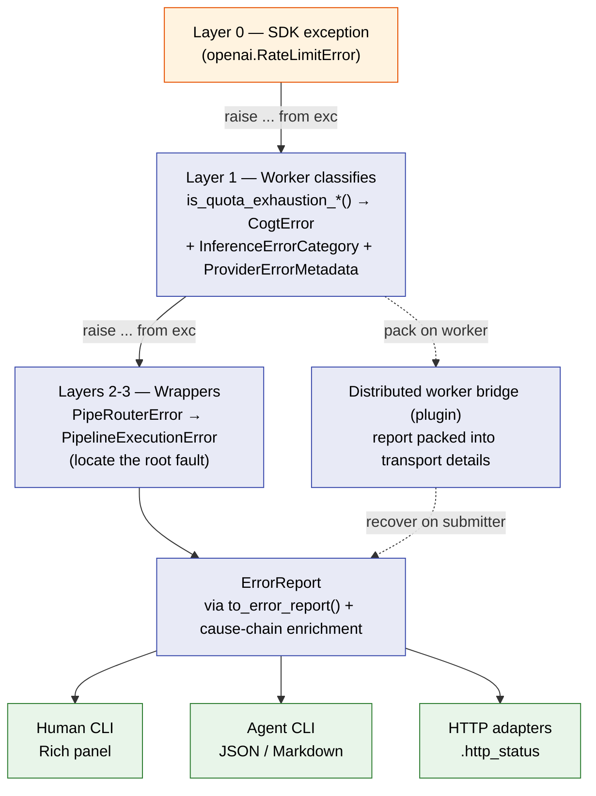

# Error Model

In Pipelex, an error is **data**, not a control-flow accident. Every failure is classified once — at the layer that knows the most about it — and that classification travels intact to every consumer: the human reading a Rich panel, the agent parsing JSON, a distributed worker's retry engine, and the HTTP adapter picking a status code.

This page covers the contract that makes that possible: the `ErrorReport` schema, the classification enums, how inference workers classify SDK exceptions, how classification survives every wrapping layer, and how it survives serialization across a distributed worker boundary.

---

## Design Principle

Three rules hold across the codebase, and everything else builds on them.

**Single-rooted hierarchy.** Every custom exception inherits from `PipelexError` (`pipelex/base_exceptions.py`). There is one root, so one `to_error_report()` contract covers the whole tree.

**Classify at the source, never lose it.** The layer that catches a third-party exception knows the most about it. It classifies there. Every layer above is a *wrapper* — it adds context (pipe code, stack) but inherits the classification rather than re-deriving or discarding it.

**No broad catches in business logic.** `except Exception` is allowed only at CLI entry points and async task roots. Ruff rule `BLE001` enforces this — an unexpected exception crashes loudly instead of being silently swallowed.

!!! info "Why classify, instead of just propagating the exception?"
    A raw `openai.RateLimitError` tells a Python `except` clause what to catch, but it does not tell a distributed worker's retry engine whether to retry, the HTTP adapter which status to emit, or an agent whether the failure is the user's fault. Classification turns an exception into a decision input that every consumer can act on uniformly.

---

## The Layer Model

An error rises through a series of layers. Each layer has exactly one job.

| Layer | Role | What it does with errors |
|-------|------|--------------------------|
| **5 — CLI entry points** | `pipelex` / `pipelex-agent` commands | Catch, format for human (Rich) / agent (JSON·MD) / HTTP |
| **4 — CLI factories** | `cli_factory.py`, `agent_cli_factory.py` | Catch setup errors, route to handlers |
| **3 — Pipeline runner** | `PipelexMTHDSProtocol.execute()` | Catch + wrap as `PipelineExecutionError`, which reports the located root fault |
| **2 — Pipe router / operators** | `PipeRouter`, pipe operators | Catch + locate every failure as a `PipeRouterError` (`pipe_code`, `pipe_stack`); a foreign exception first becomes a `PipelexUnexpectedError` |
| **1 — Workers / SDK calls** | `pipelex/providers/*/` | **Catch the SDK exception → classify → raise `CogtError`** |
| **0 — Third-party SDKs** | OpenAI, Anthropic, Google, … | Raise raw, untyped provider exceptions |

Classification happens once, at **Layer 1**. Layers 2–5 are wrappers: they attach context as they catch and re-raise, but the `error_category`, `error_domain`, `model`, and `provider` set at Layer 1 reach Layer 5 unchanged (see [Cause-Chain Enrichment](#cause-chain-enrichment)). The worker states only the `error_category`; the matching `error_domain` is [derived from it](#the-cogterror-family-derives-its-domain-from-its-category), so a single Layer-1 decision settles both the retry question and the HTTP status.

---

## ErrorReport — the Serialization Schema

`ErrorReport` (`pipelex/base_exceptions.py`) is the single source of truth for error serialization. It is a frozen Pydantic model with `extra="forbid"`.

| Field | Type | Meaning |
|-------|------|---------|
| `error_type` | `str` | The exception class name |
| `message` | `str` | Human-readable message |
| `title` | `str` | Stable human-readable summary — the RFC 7807 `title` |
| `type_uri` | `str` | Per-class documentation URI — the RFC 7807 `type` |
| `error_category` | `str \| None` | `InferenceErrorCategory` value (inference errors only) |
| `error_domain` | `str \| None` | `ErrorDomain` value — `input` / `config` / `runtime`. Declared per class, except on the `CogtError` family where it is [derived from `error_category`](#the-cogterror-family-derives-its-domain-from-its-category) |
| `retryable` | `bool \| None` | Whether a retry could succeed |
| `user_action` | `UserAction \| None` | Typed advice — `kind` + free-form `detail` |
| `model` | `str \| None` | Model handle, when the failure is attributable to one |
| `provider` | `str \| None` | Backend name, when attributable |
| `provider_metadata` | `ProviderErrorMetadata \| None` | SDK metadata — status code, request id, `retry_after` |
| `validation_errors` | `list[ValidationErrorItem] \| None` | Structured per-error diagnostics on a bundle-validation failure (`ValidateBundleError` only) |

`PipelexError.to_error_report()` is the entry point. `to_dict()` serializes, dropping `None` fields; `from_dict()` is its strict inverse.

### The identity triple, and why renaming an error class is a wire break

`error_type`, `title` and `type_uri` are the three identity fields on every report. `title` and `type_uri` are *presentation*, and each has a declaration hatch — set `_declared_title` or `_declared_type_uri` directly in a subclass body and that value is used verbatim instead of the auto-derived one (inheritance is deliberately bypassed via `cls.__dict__`, so a parent's curated title never captures its subclasses).

`error_type` has no such hatch: it is `type(self).__name__`, the Python class name with no indirection. That makes it the **machine contract** — consumers outside this repo `switch` on that string. Renaming an error class therefore breaks them *silently*: their build stays green and the branch simply stops matching, falling through to a generic error path.

The guard against that is a committed snapshot of the full `(error_type, title, type_uri)` set at `tests/data/errors/error_identity.txt`, regenerated with `make generate-error-identity` (alias `make gei`) and gated by `tests/unit/pipelex/errors/test_error_identity_snapshot.py`. A rename cannot land without producing a reviewable one-line-pair diff on that file at the moment it is made — which is also the moment to plan the matching consumer updates.

### `validation_errors` — structured bundle-validation diagnostics

A bundle-validation failure (`ValidateBundleError`) aggregates per-error data across stages and projects it onto `validation_errors` as a list of typed `ValidationErrorItem`s, so the structured error report an HTTP API surfaces carries machine-mappable diagnostics (not just a single `detail` string). Each item's `category` is one of the **closed** `ValidationErrorCategory` set:

- `blueprint_validation` — interpreter / blueprint-validation faults. A blueprint-stage `PipeValidationError` raised *inside* a pydantic model validator (e.g. the PipeBatch `input_item_name` == `input_list_name` collision, or the SubPipe `batch_over` == `batch_as` collision — both `batch_item_name_collision`) is wrapped by pydantic as a `value_error`; the blueprint categorizer unwraps it (`ctx["error"]`) so the item keeps its structured `error_type` and `pipe_code` / `domain_code` locators. The item stays in `blueprint_validation` (not `pipe_validation`) because the fault genuinely surfaced at the parse boundary, before any pipe was instantiated — only the `error_type` is recovered, not the stage. This category also serves as the **last-resort residual**: a parse-level failure (an empty blueprint, a bundle-elaborator failure) is raised with only a message and no categorized data, so when *nothing else* produced an item the builder projects that message as one `blueprint_validation` item (no `error_type`, no `source` — the bundle could not become a blueprint at all). A TOML syntax error is its own item of this category, with no `error_type`, carrying the `source` and the 1-based `line` and `column` the parser stopped at.
- `pipe_factory` — pipe-factory failures (e.g. a missing concept).
- `pipe_validation` — pipe/concept validation (missing input variable, type mismatch).
- `dry_run` — one item per pipe whose dry run failed, with the `error_type` `DryRunError`, the pipe's bare `pipe_code`, its `domain_code` and, when the library knows it, its `source`.

**Every error is an item, and none hides another.** Every pydantic error the parser meets becomes its own item: categorized when the blueprint categorizer knows it, and otherwise an uncategorized `blueprint_validation` item with no `error_type`, carrying its `source`, the `pipe_code` its location names and its `field_path`, the bundle-root path of the failing field with pydantic's own elements left out (`pipe.summarize.promtp`, not `pipe.summarize.PipeLLM.promtp`). A misspelled field beside an undeclared prompt variable therefore gives two items, where the typo used to vanish until the variable was fixed. The only error left out is the union-branch noise of a concept declared as `ConceptBlueprint | str`, whose table branch already reports the fault. The same holds inside every message `format_pydantic_validation_error` builds: the kinds it lists get their own heading, and every other kind is rendered under "Other validation errors", whatever else is present.

**A dry-run failure is one located item per failing pipe.** The dry-run sweep (`BundleValidator` in `pipelex/pipeline/bundle_validator.py`) runs each pipe through its own in-process router, which notes the first pipe each failure leaves: the innermost pipe that failed. A controller that failed because a pipe it runs failed is therefore reported at that pipe, and once, even when both were swept; validating the controller alone still reports the inner pipe. A pipe listed in `allowed_to_fail_pipes` is never where a failure is reported: a failure met there is reported at the innermost pipe around it that is not allowed to fail, the one whose failure is unexpected. When the bundle is validated from submitted content beside a host's library directories, as the hosted validator does, the item carries that pipe's `source` only when the pipe belongs to that content: a pipe loaded from the host's own library directories is named by its code and domain, never by its file on the host. A bundle validated from a file on the caller's own disk names every pipe's file, a sibling file of the same method included, and so does submitted content validated beside directories that are the caller's own (`library_dirs_are_callers`). The sweep raises one `DryRunError` whose `failures` hold one `DryRunFailureErrorData` per failing pipe, and the cascade turns each into its own `dry_run` item. The item's message names the pipe and carries the failure's own text only when the failure's root fault, the one a run failure reports (the innermost `PipelexError` on its cause chain, the walk stopping at the first exception that is not one, and of two errors of the same class the outer one, which restates the inner with a remedy), authored that text as caller-facing copy, and otherwise the fault's title, because the verdict is kept verbatim under STRICT disclosure and would otherwise carry a configuration or storage failure's internals to a hosted caller. A failure the runtime has not classified as the caller's therefore reads `Pipe '<code>' failed its dry run: <title>`, the fault's title in place of its message. The sweep reports every failing pipe this way, whatever raised the failure.

The **structured-info invariant is total**: every invalid verdict carries a non-empty `validation_errors[]`, never a bare message. The builder emits the categorized items and the `dry_run` items, then the `blueprint_validation` fallback only when nothing else produced an item.

Besides `category` and `message`, each item carries whatever identity fields its stage produced — `error_type`, `pipe_code`, `concept_code`, `domain_code`, `field_path`, `field_name`, `variable_names`, `missing_concept_code`, `declared_concepts` (on an `unresolved_concept` item, the bare codes of the concepts the validated bundle declares in the domain the reference was looked up in, native concepts excluded, and never those a library loaded before it, which may be a host's own), the TOML position `line` and `column`, the unknown-model locators `model_reference`, `model_type` and `suggestions`, and a `source` (the declaring file path, or the per-content source the in-memory load path was given) that hands a consumer the owning file for cross-file diagnostic placement. When the error has a deterministic remedy, the item also carries a [`suggested_fix`](#suggested_fix-structured-deterministic-fixes).

**A verdict names no path on the host.** An item and the verdict's message are kept verbatim under STRICT disclosure, so neither names where the host keeps a file. A bundle of a package the method depends on by address is named by the package's address and the bundle's path inside the package, such as `github.com/acme/harbour-methods/tides/notices/tide_notices.mthds`, never by the directory the host installed the package in: that is the `source` of an item located inside the dependency and the file a duplicate declaration inside it names, on every surface, a local one included. When submitted content is validated or run, the library directories loaded beside it are the host's (installed libraries, the defaults, `PIPELEXPATH`) unless the caller says they are its own, so the verdict names none of their files: an item located in one carries no `source`, nor a `field_path` naming it, and is found by its `pipe_code` and `domain_code`, and a message that named one, or named the module a Python file of theirs was imported as (two `@pipe_func` functions of the same name, for instance), reads `<host library file>` in its place (`withholding_host_library_files` in `pipelex/pipeline/validate_bundle_translation.py`). A name only counts standing on its own, never inside a longer one, and a source the caller submitted is never withheld. A bundle validated from a file on the caller's own disk, and content validated or run against library directories that are the caller's (`library_dirs_are_callers`, an option of `validate_bundle`, of the in-process validator and of the local runtime `PipelexMTHDSProtocol`, whose `validate` and `execute` both read it), keep the full path of every file, since there the directories are the caller's own. `pipelex fix bundle --diff` leaves a dependency's address-named source as it is.

**Every refusal of the bundle is a verdict.** A validator answers either a verdict — valid, or invalid with located items — or *no verdict could be produced*, which is reserved for a failure of the tool or its environment. So a refusal raised while loading or validating a bundle becomes an item, never a no-verdict fault. After its class-specific arms, the shared cascade (`translate_to_validate_bundle_error` in `pipelex/pipeline/validate_bundle_translation.py`) turns any other `PipelexError` whose report is `input`-domained into a verdict with one item: `pipe_validation`, with the `pipe_code`, `domain_code` and `source`, when the library load located it on the pipe it was building, and `blueprint_validation` otherwise. That item carries no `error_type`, since a refusal with a closed code has an arm of its own. It keeps the refusal's message only when the refusal authored that message as caller-facing copy, and otherwise names the refusal's title, because the verdict as a whole is kept verbatim under STRICT disclosure. The location comes from the load loop in `LibraryManager.load_from_crate`, the one place that holds a pipe's code, domain and file when building it fails: it raises such a refusal again as a `PipeLoadRefusalError` naming the pipe and the file, `from` the original. A `config` or `runtime` fault, an unclassified one, a `SecurityError`, a `PipeNotFoundError` (which has its own not-found handler) and anything that is not a `PipelexError` still propagate as no verdict. The rule therefore reaches exactly the refusals whose class declares the `input` domain. The pipe factories' refusals do: `PipeLLMFactoryError`, `PipeComposeFactoryError`, `PipeExtractFactoryError`, `PipeConditionFactoryError` and `PipeParallelFactoryError` are raised only while a pipe is built, about its own blueprint, so each is `input`-domained and caller-facing, and a `PipeExtract` whose input is neither an image nor a document validates to one item on that pipe, saying which input to redeclare. `PipeImgGenFactoryError` is not among them: it is raised while an image-generation pipe runs, not while it is built.

**The unknown model is the worked example.** A pipe whose model field names a handle, an alias, a preset or a waterfall the model deck does not define is refused when the pipe is built: the operator's deck check raises `ModelChoiceNotFoundError`, and the operator raises it again as a `PipeOperatorModelChoiceError` located on the pipe and on the field, to which the load adds the file. Every pipe type that names a model (`PipeLLM`, `PipeStructure`, `PipeImgGen`, `PipeExtract`, `PipeSearch`) does this through the same `PipeOperator.locating_model_choice` wrapper, so each gives the same item: `category: pipe_validation`, `error_type: unknown_model`, the `pipe_code`, `domain_code` and `source`, the `field_name` and a `field_path` of `pipe.<code>.model` (`pipe.<code>.model_to_structure` for a `PipeLLM`'s structuring model), the `model_reference` exactly as written, the `model_type` (`llm`, `text_extractor`, `img_gen` or `search`), and the deck's `suggestions` of the same kind, each spelled as a reference the field accepts. The suggestions stay in the item's `message` too, for consumers that keep only the message. When the deck offers exactly one suggestion, the item carries an `unsafe` `rename-model` fix, a `remap_value` of the field from the reference as written to that suggestion. It is unsafe because the suggestion is a fuzzy match over the deck's names, which can be a different model altogether, so `pipelex fix bundle` never applies it on its own; an author or an agent applies it deliberately. An inline setting table (`model = { model = "…", temperature = 0.2 }`) is not looked up in the deck, so it is not refused here. On a run the same refusal stops the bundle before any pipe runs, as the same `unknown_model` item (see the next paragraph).

**A run refuses an invalid bundle with the same verdict.** A run loads its bundle before any pipe runs, and the run path's `acquire_library` performs that load inside the same `translate_to_validate_bundle_error`, so a bundle the load refuses raises the `ValidateBundleError` with exactly the items validating it gives, before any inference is spent. `ValidateBundleError` is `input`-domained and caller-facing, so a hosted run route answers it as a 422 whose `validation_errors` STRICT disclosure keeps, where each refusal used to reach the host in its raw class: a misspelled concept as a `ConceptLibraryError` answered 500, a wiring mismatch as a `PipeValidationError` answered by the catch-all 500, a TOML fault as a 422 with no items, and a check firing inside a pipe's pydantic validator as a `runtime` `PipeExecutionError` reading "Input validation failed". The translation's own exceptions hold on this path too: an unknown entry pipe still raises its `PipeNotFoundError`, and a fault of the tool or its environment still propagates as itself. Two things differ from the validate path, both about whose files are loaded. The run path threads no source of its own onto its contents, so their items carry no `source`, even on a local run of a bundle file. A package the bundle depends on by address is loaded from the host's install directory within the same translation, as it is on the in-memory validate path, and a refusal inside it names the package by its address, never that directory. And the library directories load translated only when they are the caller's own, as on a local CLI run (`library_dirs_are_callers`); a host's directories (installed libraries, a temporary directory of shipped Python) load untranslated, because a fault there is not the caller's to fix. The local `pipelex run` renders the verdict with the grouped panel `pipelex validate` prints, and `pipelex-agent run` copies its `validation_errors` into the error envelope.

**Signatures are never an error.** An unimplemented `PipeSignature` reached during validation is a *runnability fact*, not a validation failure: the validator no longer raises on it. The assembled library's outstanding signatures ride the validation report's `pending_signatures`, and `is_runnable = not pending_signatures`. `allow_signatures` is a sweep-mechanics flag only (whether signature pipes are mock-run and listed in `validated_pipes`) — it does not change the verdict, so strict ≡ lenient in the report body. The "is this a failure?" decision moves to the consumer: the CLI exits non-zero on `not is_runnable` unless `--allow-signatures`; the HTTP caller reads `is_runnable`. (The **execute/run** path is different: running a stub still raises `PipeSignatureNotExecutableError`.)

**Host-wiring guards are programmer errors, not content verdicts.** `validate_bundle`'s "provide exactly one of `mthds_contents` / `mthds_file_path`" guard and `resolve_crate_from_contents`'s `mthds_sources`-length-mismatch guard raise `PipelexUnexpectedError` (→ 500, redacted under STRICT), not `ValidateBundleError` — a caller wiring bug must not be reported as if the submitted bundle were invalid. The empty-`mthds_contents` guard stays caller-facing (it can legitimately reflect an end user submitting no bundles).

`ValidationErrorItem` and the builder are the single source of truth across surfaces: `build_validation_error_items()` (`pipelex/pipeline/validation_errors.py`) is reached through `ValidateBundleError.validation_error_items()`, which `ValidateBundleError.to_error_report()` (the API path), the agent CLI's `extract_validation_errors()` (the CLI JSON envelope) and `pipelex fix` all call, so the structured shapes cannot drift. `pipelex-agent validate pipe` and `validate --all` dry-run through the same cascade, so a failing dry run there is the same invalid verdict with the same items as on `validate bundle`. The item lives in `pipelex/base_exceptions.py` alongside `ErrorReport` — not next to the source error-data models — because `ErrorReport` references it as a typed field and the root exceptions module must not import the `pipelex.core` error modules.

#### The `error_type` registry — the closed vocabulary of faults

An item's `error_type` names the fault it reports, and that vocabulary is closed: `pipelex/validation_error_types.py` holds it in full, enumerated as `VALIDATION_ERROR_TYPES`. A consumer that needs to know which faults the language surface can report — a coverage gate, a test corpus, a client mapping errors onto its own UI — reads that registry instead of collecting strings from whichever diagnostics it happens to have seen.

The registry is the union of the enums validation already reports through, never a second list beside them — "reports through", not "raises", because the advisory members ride `warnings` and are never raised as an exception at all: `PipeValidationErrorType` and `PipeFactoryErrorType` are the two stage vocabularies, `ValidationResidualErrorType` names the one residual channel with no stage enum of its own, and `HintLintErrorType` carries the intent-hint lints (which attach to concepts and structure fields too, so the pipe enum is the wrong home for them). A member added to any of them is in the registry the moment it is declared. `ValidationErrorItem.error_type` is typed against their union, so an unregistered string cannot be constructed or parsed onto an item — which is what makes the enumeration *closed* rather than merely documented, and what publishes the vocabulary into the OpenAPI schema `pipelex-api` serves for `/validate`.

Two spellings live in that one vocabulary, deliberately. The stage enums are snake_case codes (`missing_input_variable`); the dry-run items' code is `DryRunError`, the name of the exception that produced them, because a dry-run failure is raised as an error object rather than classified into a code. Normalizing it would be a wire break across every consumer that pins the string, and it would buy nothing — the enumeration is closed either way.

Membership means a value is *reachable on the wire*, not that it is a useful thing to exercise. Several members are advisory-only — `optional_force_redundant`, `input_presence_vacuous`, and the three `hint_*` lints — riding `warnings` and never an invalid verdict, and the two `unknown_*` fallbacks fire on states no author can ask for. A consumer building coverage over the registry excludes those on its own side with a stated reason, rather than pruning them from the runtime truth here — which is what the [MTHDS Test Corpus](../contribute/mthds-test-corpus.md) vocabulary generator already does, excluding each with its reason as it generates the `error.*` namespace from this registry.

`validation_errors` is one of the fields kept under STRICT disclosure (it is in `_STRICT_KEPT_FIELDS`): the items describe the caller's *own* submitted bundle, not server internals, so redacting them would gut the hosted path's diagnostics.

```python
report = exc.to_error_report()
report.to_dict()  # {"error_type": "LLMCompletionError", "message": "...", ...}
ErrorReport.from_dict(d)  # strict inverse — raises ValidationError on a malformed dict
report.http_status  # 422 / 429 / 500 — for HTTP adapters
```

!!! warning "`ErrorReport` is `extra="forbid"`"
    `from_dict()` rejects unknown keys, so it is the strict inverse of `to_dict()`. A report dict that crosses a serialization boundary and fails validation on the way back is an internal contract bug — the writer and the reader share the schema within one deploy. A cross-boundary recovery helper that rebuilds a report (e.g. a distributed-worker bridge) is expected to catch that `ValidationError` and synthesize a fallback report so failure-webhook delivery stays intact while keeping the contract bug visible; any other caller of `from_dict()` should treat the validation failure as a bug to fix.

### `suggested_fix` — structured deterministic fixes

When a validation error has a deterministic remedy, its `ValidationErrorItem` carries a `suggested_fix` — a `SuggestedFix` (`pipelex/suggested_fix.py`, deliberately stdlib+pydantic-only so `pipelex.base_exceptions` can import it without a cycle; naming is brand-neutral, fixes are a language-level concept):

- `fix_code` — the kebab-case rule id (e.g. `match-sequence-output`). The planner's `KNOWN_FIX_CODES` set is the validation set for user-facing rule filters (`--select` / `--ignore`); an unknown code is rejected loudly, never lenient-ignored, because a typo'd filter selects *behavior*.
- `description` — human-readable statement of the change.
- `safety` — `safe` fixes may be auto-applied; `unsafe` ones need a person's or an agent's confirmation, and `pipelex fix bundle` never applies them. Every prose rendering labels an unsafe fix `💡 Suggested fix (unsafe, confirm before applying):` where a safe one reads `💡 Suggested fix:`, through the one `suggested_fix_label` in `pipelex/pipeline/validation_render.py`.
- `source` — the file the ops target, when known (multi-file libraries). An applier must only apply ops to the file they target.
- `ops[]` — the fix itself, as **semantic TOML patch ops** addressed by table path (`FixOpKind`: `set_key`, `ensure_table`, `delete_key`, `delete_table`, `rename_table_key`, `move_key`, `remap_value`; each op's `table_path` follows the same conventions as the items' `field_path`). The ops are the machine contract; any rendered diff or `💡 Suggested fix:` line is presentation.

    The op vocabulary is a **discriminated union on `kind`**: one model per kind, each declaring exactly the fields its own semantics need and forbidding the rest, so `{"kind": "delete_key", …, "new_key": "x"}` is a parse error rather than a stray field the applier silently ignores. Two aliases are published from the same union — `FixOp`, every kind, which is what `ops[]` is typed as, and `MigrationOp`, the structural kinds only (`delete_key`, `delete_table`, `rename_table_key`, `move_key`, `remap_value`), which is what a configuration [migration ledger](../migration-ledger.md) is parsed against. The narrow alias is what keeps a materializing op — one that writes a value the file did not have — out of a ledger that is replayed over every user file on every run.

The **fix planner** (`pipelex/pipeline/fixes/planner.py`) translates enriched typed error data into `SuggestedFix` payloads — pure functions keyed strictly on `error_type` + structured fields, never on message strings. Each rule fires only when its enrichment is present (set only at the raise sites that know the correct value), so the same error type raised elsewhere without enrichment is structurally suppressed. The planner runs inside `build_validation_error_items()`, so every consumer of the validation report — CLI, API, MCP — sees fixes with zero extra plumbing.

Applying fixes is the runtime's job too: the **applier** (`pipelex/fix_ops/applier.py`) mutates a tomlkit DOM in place per op (guarded — an op whose target table is absent is skipped and reported, never raised) and then reflows the whole file to canonical MTHDS style, and the **convergence loop** (`pipelex/pipeline/fixes/fix_loop.py`) runs validate → apply SAFE fixes → re-validate to a fixed point, reporting non-convergence loudly. The user-facing surface is [`pipelex fix bundle`](../tools/cli/fix.md).

On the hosted API the same payload rides the wire verbatim as `validation_errors[].suggested_fix`; how it appears in HTTP error responses is documented on the API side, in the API server's [Error Responses](../api-server/error-responses.md#suggested-fixes) page.

---

## Classification Enums

Two `StrEnum`s drive every downstream decision.

### InferenceErrorCategory

Defined in `pipelex/cogt/exceptions.py`. It carries two derived properties: `is_retryable` drives retry decisions and is `True` only for `TRANSIENT`; `error_domain` drives the HTTP status the whole `CogtError` family answers with.

| Category | Meaning | Retryable | Domain | Typical cause |
|----------|---------|-----------|--------|---------------|
| `TRANSIENT` | A brief, self-correcting failure | ✅ | `RUNTIME` | Rate limit, 5xx, connection blip |
| `CONFIGURATION` | The setup is wrong | ❌ | `CONFIG` | Bad API key, missing backend |
| `CONTENT` | The input or prompt is wrong | ❌ | **`INPUT`** | Content-policy violation, bad prompt |
| `CAPACITY` | Account quota / billing exhausted | ❌ | `RUNTIME` | `insufficient_quota`, HTTP 402 |
| `AMBIGUOUS` | Outcome unknown — may have committed | ❌ | `RUNTIME` | Connection dropped mid-request |
| `UNKNOWN` | Could not classify | ❌ | *none* | Unrecognized inner exception |

```python
class InferenceErrorCategory(StrEnum):
    TRANSIENT = "transient"
    # ... CONFIGURATION, CONTENT, CAPACITY, AMBIGUOUS ...
    UNKNOWN = "unknown"

    @property
    def is_retryable(self) -> bool:
        match self:
            case InferenceErrorCategory.TRANSIENT:
                return True
            case _:  # all other categories
                return False

    @property
    def error_domain(self) -> ErrorDomain | None:
        match self:
            case InferenceErrorCategory.CONTENT:
                return ErrorDomain.INPUT
            case InferenceErrorCategory.CONFIGURATION:
                return ErrorDomain.CONFIG
            # ... TRANSIENT / CAPACITY / AMBIGUOUS -> RUNTIME, UNKNOWN -> None ...
```

!!! info "`AMBIGUOUS` vs `UNKNOWN`"
    `AMBIGUOUS` means the *error type is known* but the operation may or may not have committed — a blind retry is unsafe for a non-idempotent call. `UNKNOWN` means classification itself failed. Both are non-retryable, for different reasons.

!!! info "`UNKNOWN` maps to no domain at all"
    `UNKNOWN` means the classification step itself failed, so claiming `RUNTIME` would assert something the code cannot support. An absent `error_domain` already renders 500 (see below), so the honest answer costs nothing at the HTTP boundary and keeps "could not classify" distinguishable from "classified as a server-side fault".

### ErrorDomain

Defined in `pipelex/base_exceptions.py`. Set as a class-level attribute on the exception, or on one error by the site that raises it (see [Classified where it is raised](#classified-where-it-is-raised)), drives HTTP status.

| Domain | Meaning | HTTP status | Who can fix it |
|--------|---------|-------------|----------------|
| `INPUT` | Caller sent something it can fix | **422** | The caller |
| `CONFIG` | Environment / configuration change needed | **500** | The operator |
| `RUNTIME` | A failure during execution | **500** | Depends on the cause |

`error_domain_to_http_status()` is the pure mapping table — it maps an unset or unrecognized domain to 500 as well. `ErrorReport.http_status` layers one rule on top: a provider 429 (`provider_metadata.status_code == 429`) takes precedence over the domain, so the API can emit a `Retry-After` header. That precedence is why `CAPACITY -> RUNTIME` does not swallow a rate-limit passthrough.

```python
class PipelexConfigError(PipelexError):
    error_domain = ErrorDomain.CONFIG  # class-level — every instance carries it
```

#### The `CogtError` family derives its domain from its category

The inference branch is the one place where `error_domain` is **not** declared per class. A worker has already decided whose fault the failure is when it assigns an `InferenceErrorCategory`, so `CogtError.to_error_report()` derives the domain from that category rather than asking several dozen leaf classes to state the same fact twice — which is also what keeps `error_domain` and `error_category` from ever contradicting each other on the wire.

Precedence on the derived field mirrors every other field on that method: an `error_domain` declared explicitly on the leaf class wins, then the category derivation, then whatever the `__cause__` chain surfaced.

```python
own_domain = self.error_category.error_domain if self.error_category is not None else None
"error_domain": self.error_domain or own_domain or base_report.error_domain,
```

The consequence worth knowing at the HTTP boundary: a **content-classified inference failure answers 422, not 500** — a content-policy refusal, a malformed prompt image, a bad prompt parameter are all properties of material the caller submitted. Everything else keeps the status it already had; only the report became truthful about why.

The category a class declares is its default, and a raise site that knows better passes its own through the `error_category` argument. `ImgGenParameterError` is `CONTENT`, because an aspect ratio or a size the model's grid refuses is a property of the caller's request. A model spec its worker cannot use is not: no `rules`, a rule value this release does not know, a missing `model_choice` or `endpoint_path`, or, where a worker reads the Gemini geometry, a missing `aspect_ratio` taxonomy or one of another family. Those sites raise it with `error_category=InferenceErrorCategory.CONFIGURATION`, so the failure answers 500 and lands in server-error alerting like any other configuration fault, rather than a 422 telling the caller to change what they sent.

#### Classified where it is raised

Most classes state whose fault they are in their body: an `error_domain`, and `_authors_caller_facing_message = True` when their message is copy written for the caller, which STRICT disclosure then keeps instead of replacing it with `An internal error occurred.`. Every instance of such a class is the same kind of fault. A few classes are raised both for faults in the caller's own method or inputs and for faults that are not the caller's, so they cannot state it. For those, the site that raises the error and knows calls `as_caller_fault()` on it: the report then carries the `input` domain, so an HTTP surface answers 422, a caller-facing message, and the next step the raise site passes, if any.

```python
raise PipeRunInputsError(message=msg, run_mode=run_mode, pipe_code=pipe_code).as_caller_fault(
    user_action=UserAction(kind=UserActionKind.CHANGE_INPUT, detail="Provide the missing required inputs of 'flow': topic."),
)
```

The raise site vouches for the message: it names only the caller's own method and data (pipe codes, concept codes, variable names, the values the caller sent), never a path on the host, a secret or the text of a foreign exception. As with the class-level flag, a plain wrapper raised from the error inherits its domain but not its caller-facing flag, since the wrapper's message is its own; the located wrappers of a run failure report their root fault, so they carry both.

| Raise site | Error | Why it is the caller's fault |
|------------|-------|------------------------------|
| A `PipeParallel` combining its branch results into its output | `StuffFactoryError` | The method sets which branch feeds which field, what each branch produces and whether it produces a list. A branch whose multiplicity differs from its field's is restated by a second `StuffFactoryError` raised from the combine's, whose next step names the multiplicity to change, and which the run reports as its root fault |
| A pipe checking that its required inputs are present | `PipeRunInputsError` | The request, or an earlier step of the method, left the input out |
| A `PipeCondition` whose expression renders nothing, whose outcome is `fail`, whose chosen pipe misses inputs, or, in a dry run, whose expression does not parse, whose outcomes name no pipe or whose every outcome is `fail` | `PipeRunError` | The method writes the expression and the outcomes, and the run's data it renders is the caller's; the messages name only the pipes and the input names, never the expression's text or the value it rendered, either of which may be a host library's |
| A model lookup for a reference the deck neither defines nor names in any of its own entries | `ModelNotFoundError` | Only an inline model setting of the method can have named it, so the next step is a `CHANGE_MODEL` action naming the reference as the method wrote it and the type of model the lookup needs; a reference the deck names but cannot serve stays `config` and redacted, with no next step of its own |

Some failures stay unclassified on purpose, each with a sentence at its raise site saying why: a model output that does not fit its structure, which depends on what the model produced; a `PipeFunc` crash, whose exception text can carry anything the process holds; an input resource the pipe cannot use, whose message names the path as resolved on the host; a template that fails to render, where the same failure can come from the template or from the data; and a working-memory miss, since a step naming a variable nothing produces is refused when the bundle loads.

---

## Worker Classification

Layer 0 → Layer 1. Every inference worker under `pipelex/providers/*/` catches its SDK's typed exceptions and re-raises a categorized `CogtError`.

### The Uniform Shape — Extract / Classify / Render

Every inference worker's SDK-exception handler collapses to a three-step pipeline: **Extract** turns the SDK exception into a provider-blind `ProviderErrorMetadata`, **Classify** maps that metadata to a category + user-action, and **Render** picks the `CogtError` subclass to raise.

```python
except (APIError, APIConnectionError, APITimeoutError) as exc:
    metadata = extract_openai_metadata(exc)
    classification = classify_inference_error(metadata)
    raise render_inference_error(
        metadata=metadata,
        classification=classification,
        family=InferenceErrorFamily.LLM,
        model_desc=self.inference_model.desc,
        model_handle=self.inference_model.name,
    ) from exc
```

The three steps live in three modules. Only the per-provider Extract functions stay plugin-local; Classify and Render are single shared functions.

| Module | Step | What it owns |
|--------|------|--------------|
| `pipelex/cogt/inference/error_classification.py` | Extract | `ProviderErrorMetadata`, `SDKErrorEnvelope`, `UserAction`, `UserActionKind`, the `extract_*_metadata` functions and the parsers they share (`parse_retry_after_seconds`, `error_code_from_body_code_first`), plus pure discriminators (`is_quota_exhaustion`, `is_content_policy_violation`, `is_network_error`, `is_model_not_allowed`) exposed as `@property` on the metadata |
| `pipelex/cogt/inference/error_classify.py` | Classify | `classify_inference_error()` — provider-blind mapping from `ProviderErrorMetadata` → `ClassificationResult(category, user_action_kind, is_model_not_found, service_error_code, is_model_not_allowed)`, consulting the booted plugins' service error vocabulary ahead of the status ladder |
| `pipelex/cogt/inference/error_render.py` | Render | `render_inference_error()` — picks the `CogtError` subclass from `InferenceErrorFamily` plus `is_model_not_found` (e.g. `LLMModelNotFoundError` vs `LLMCompletionError`) |

Provider-specific nuance is normalized away in Extract (e.g. Google's `code` becomes `status_code`; AWS Bedrock error codes are mapped to HTTP statuses), so Classify has no provider branching. HTTP status drives classification; status-less errors dispatch on the SDK exception type name. The `tests/unit/pipelex/cogt/inference/test_provider_classification_parity.py` meta-test walks every `ProviderName` against the extract-fn registry so adding a new provider without wiring it fails fast.

### ProviderErrorMetadata and UserAction

Every raised inference error carries structured SDK metadata and typed advice.

```python
class ProviderErrorMetadata(BaseModel):
    provider: str
    sdk_exception_type: str
    status_code: int | None = None
    request_id: str | None = None
    retry_after_seconds: float | None = None
    provider_error_code: str | None = None
    body: Any | None = Field(default=None, exclude=True)  # may carry secrets
```

!!! warning "`body` is excluded from serialization"
    The raw provider response `body` can carry account ids, billing details, or credential fragments. It is held in-process but `exclude`d from every serialized form — CLI JSON, agent output, and any serialized worker payload.

`UserAction` pairs a discrete `UserActionKind` (`WAIT_AND_RETRY`, `CHECK_BILLING`, `CHECK_CREDENTIALS`, `CHANGE_INPUT`, `CHANGE_MODEL`, `CONTACT_SUPPORT`, `UNKNOWN`) with a free-form `detail` string — so the CLI can render consistent guidance while keeping provider-specific text.

The `detail` is read on a failed run's report, once every automatic retry is spent, so it says what the reader can do next and never promises another attempt by the system: the `WAIT_AND_RETRY` advice says to wait, at least the provider's `Retry-After` delay when it gave one, then run it again.

### Service Error Codes

Not every failure on an inference call comes from a provider. A gateway or a hosted inference service may refuse a request itself, before a model ever sees it, under error codes of its own, and those refusals arrive on statuses the ladder reads as a provider rejecting the prompt. The plugin that speaks to such a service contributes the codes it emits through `PluginRegistrar.add_service_error_codes`, each with its category, its action and its advice, and `classify_inference_error` consults that vocabulary ahead of the status ladder. The seam is described in [Service Error Codes](service-error-codes.md).

### A Model the Integration Does Not Allow

One refusal outside any service's own namespace is classified by the runtime itself: `model_not_allowed_error`, Portkey's answer, at 412, when an integration serves the model but does not allow it for this caller, because the model is off the integration's allow-list or archived. Portkey's cloud emits it for a user's own workspace behind the `portkey` backend, and so does any gateway built on Portkey's middleware; the refusal means the same thing and calls for the same move from any of them, so it is matched on the code alone (`MODEL_NOT_ALLOWED_ERROR_CODE`). It carries its code in `error.type` with `error.code` null, and every Extract hop recovers it from there.

| Code | HTTP | Category / action | What the caller is told |
|------|------|-------------------|-------------------------|
| `model_not_allowed_error` | 412 | `CONFIGURATION` / `CHANGE_MODEL` | the gateway does not allow the model, named by its handle, for this account — pick another; if the pipe named it, leaving the pipe's model unset uses the default |

- **It is not a model-not-found.** The model exists and an integration serves it, only not for this caller, so `ClassificationResult.is_model_not_allowed` is set and `is_model_not_found` is not: the error stays on the family's generic failure class and carries the distinction in its advice. The ladder's generic 4xx arm would have given it the right category and advice sending the caller to edit their inputs.
- **Its advice names the model.** The refusal's message names only the backend's wire id (`us.anthropic.claude-sonnet-4-5-20250929-v1:0`), which the method's author never wrote, so the advice names the model handle the deck resolved the pipe's model to. Both of its hints are conditional, because the Render step cannot tell the cases apart: leaving the pipe's model unset helps only when the pipe named the refused model rather than falling back to it as the default, and a model deck that lists a model the allow-list refuses is the operator's to settle on a hosted gateway and the user's own on a Portkey workspace of theirs.
- **It answers 500 on an HTTP surface.** `InferenceErrorCategory.CONFIGURATION` implies `ErrorDomain.CONFIG`, which `error_domain_to_http_status` renders as 500: it lands in server-error alerting, and 500 is a status outer clients retry, though an outer retry earns an identical refusal.

### The `instructor` Unwrap

On structured-generation paths, `instructor` raises an `InstructorRetryException` from the exception that ended its retry loop. The loop re-asks only a response that fails the schema, so that exception is either the raw SDK exception of a call that failed in transport, or, once the re-ask budget is spent, the last parse failure. `extract_underlying_sdk_exception()` recovers it from the wrapper's cause, not from `failed_attempts`, which lists only parse failures and would name an earlier one when a re-ask then fails in transport. The recovered exception routes through the same per-provider categorization as the plain-text path. Once the re-ask budget is spent, the recovered exception is the last `pydantic.ValidationError`, which `_STATUSLESS_BY_TYPE_NAME` classifies as `CONTENT` / `CHANGE_INPUT`, so it answers 422. A recovered exception the classifier does not recognize lands in `UNKNOWN`.

### Model and Provider Attribution

Inference-failure leaf errors (`LLMCompletionError`, `ImgGenGenerationError`, …) are raised deep inside a plugin and do not know which model handle invoked them. Each worker family fills that in at its public-method chokepoint:

```python
def fill_model_and_provider(self, model_handle: str | None, *, backend_name: str | None) -> None:
    """Fill model_handle / backend_name from the worker, only when still unset."""
```

---

## Cause-Chain Enrichment

A wrapper exception — `PipeRunError` → `PipeRouterError` → `PipelineExecutionError` — carries no `error_category` of its own. `to_error_report()` enriches the report from the `__cause__` chain, so the inference classification survives every wrapping layer.

```python
def _enrich_error_report_from_cause(self, report: ErrorReport) -> ErrorReport:
    cause = self.__cause__
    if not isinstance(cause, PipelexError):
        return report
    cause_report = cause.to_error_report()
    return ErrorReport(
        error_type=report.error_type,  # keep own identity
        message=report.message,
        error_category=report.error_category or cause_report.error_category,
        error_domain=report.error_domain or cause_report.error_domain,
        # ... retryable, user_action, model, provider, provider_metadata ...
    )
```

A wrapper keeps its own `error_type` and `message` but inherits every classification field it does not set itself. The two wrappers of a run failure go further, and report their root fault instead of themselves: see [Run Failures: the Root Fault, Located](#run-failures-the-root-fault-located).

!!! warning "Overrides must call the enrichment helper"
    A `to_error_report()` override on a subclass **must** end with `self._enrich_error_report_from_cause(report)`. Otherwise that subclass becomes a black hole that drops the cause's classification. A cyclic-`__cause__` guard ensures a malformed chain can never turn error reporting into a `RecursionError`.

---

## Run Failures: the Root Fault, Located

When a pipe fails during a run, the error a surface receives sits under several wrappers: the pipe router's `PipeRouterError`, maybe a runtime bridge's `PipelexBridgeDispatchError`, and the runner's `PipelineExecutionError`. None of them is what went wrong, and a report reading `PipelineExecutionError` with a bridge's sentence for a message tells the reader nothing. So the two located wrappers, `PipeRouterError` and `PipelineExecutionError`, report the **root fault**, the innermost `PipelexError` on the cause chain, and only add where it happened (`pipelex/pipe_run/located_failure.py`). The walk stops at the first exception that is not a `PipelexError`, whose stand-in is then the fault, and an error raised from one of its own class (a remedy or an item index added to the same fault) counts as the outer one.

**Locating.** `PipeRouterProtocol.run()` catches every failure of the pipe it runs and re-raises it as a `PipeRouterError` chained to it, with the pipe's code and a snapshot of its stack taken where it failed. A failure that already carries a `PipeRouterError` rises untouched through the routers of the controllers above, so the innermost location is the one reported. An exception that is not a `PipelexError` first becomes a `PipelexUnexpectedError` whose message names its class (`KeyError: 'boom'`); it is never caller-facing, and a dry run that sorts its own failures from programming bugs (the bundle validator's sweep, the validate surfaces' graph step) finds the foreign exception behind it with `find_foreign_fault()` and lets it propagate rather than report it as the bundle's failure. A host router whose transport raises its own failures overrides the `_as_pipelex_failure()` hook, and returns `None` for a control-flow exception such as a cancellation, which then propagates as it is. For a transport failure carrying a recovered report, the far side packs the root fault's own report, never a located one: when it packs that report alone, the hook returns a `PipelexError` carrying it and the router locates it at the pipe it ran; when it packs the location it found as well, the hook returns a `PipeRouterError` rebuilt over that report with `make_located()`, which the router raises untouched, so the report reads exactly as the local run's. The runner wraps any failure of the run into a `PipelineExecutionError` with `make_for_run_failure()`, which takes the location from the innermost `PipeRouterError` on the chain (`find_failure_location()`), never from the live stack, which has unwound by then.

**The report.** Both wrappers build the same report from the same root fault (`find_root_fault()`):

| Field | Taken from |
|-------|------------|
| `error_type`, `title`, `type_uri` | The root fault |
| `message` | The root fault's own message, prefixed with the failing pipe and its path |
| `caller_facing_message`, `validation_errors`, `migration` | The root fault |
| `error_category`, `retryable`, `model`, `provider`, `provider_metadata` | The cause-chain enrichment |
| `error_domain` | The cause-chain enrichment, with a `runtime` floor |
| `user_action` | The cause-chain enrichment or, when nothing on the chain advises an action, a fallback naming the failing pipe |

The message reads `Pipe 'summarize' failed (two_steps → summarize): Model handle 'x' was not found in the model deck.` for a nested pipe, and `Pipe 'flow' failed: …` for the entry pipe. Pipe codes are the caller's own names, so the located message is caller-facing exactly when the root fault's message is, and STRICT disclosure keeps it exactly then. `ErrorReport` has no location field, so the location rides the message; `PipeRouterError` and `PipelineExecutionError` carry it structurally as `pipe_code` and `pipe_stack`.

**A recovered report is taken as it is.** A distributed submitter receives a report that was already located on the worker. When it raises that report inside a `PipelexError` whose `to_error_report()` returns it, and no `PipeRouterError` sits on the submitter's own chain, the runner's `PipelineExecutionError` reports it verbatim: its `pipe_code` is the entry pipe, its `pipe_stack` is empty, and the message is not located a second time. A located report must never reach a router this way, since the router would locate it again: that is why a host router's transport packs the root fault's own report. A bridge's own sentence (`Pipe execution failed in DIRECT mode …`) appears in neither the report nor the message, so a run gives the same report whether it ran in process, through the in-process orchestrator or on a remote worker.

**Where the remedy goes.** A root fault's message states the fact and nothing else, because it reaches every surface, a hosted run's stored error included. Advice that only a local reader can act on belongs to the local CLI: `pipelex run` renders the model panel of a `PipeOperatorModelAvailabilityError` found anywhere on the chain, and the panel's tip is where the local model deck remedy lives.

---

## Crossing a Distributed Worker Boundary

The error model is built to survive serialization. Because `ErrorReport` round-trips through `to_dict()` / `from_dict()`, a failure that happens on a remote worker can reach the submitting process with its full classification intact — not just a message string.

The runtime itself stays transport-agnostic: the machinery that carries an error across a worker boundary ships in the **host-runtime plugin** for each distributed backend, not in core. A backend plugin is responsible for three things.

**Packing.** Convert a `PipelexError` into the transport's failure type and stash `to_error_report().to_dict()` in its details payload, so worker and submitter code keep the full classification rather than a bare message. The same step derives the transport's retry decision from `InferenceErrorCategory.is_retryable`.

**Recovering.** On the submitter side, walk the returned failure, pull the packed dict, and rebuild the `ErrorReport`. Recovery is **total**: when no report dict is found — a non-Pipelex exception, a worker crash, a timeout — the plugin synthesizes a fallback report so the recovery path always has structured classification to surface.

**A fail-safe floor.** Ensure a domain error that escapes the conversion path fails the unit of work *terminally* rather than hanging. In a durable-execution system the default for an unconverted exception might be to retry forever, so "convert all the errors we know about" is not enough — the floor must hold for the errors, and the code paths, that nobody enumerated.

**Net effect:** a pipe failing on a remote worker reaches the CLI and HTTP adapters with the *same* `error_category` / `retryable` / `model` / `provider` / `user_action` as the identical failure run locally — and a failure that escapes conversion fails loud and bounded instead of hanging.

See [Runtime Bridge & Transport](./runtime-bridge-and-transport.md) for the boundary these converters span; the per-backend converters themselves live in the host-runtime plugins.

---

## Interfaces

### CLI

The agent CLI (`pipelex-agent`) emits a structured error to **stderr**, markdown by default and JSON with `--error-format json`. When `--error-format` is omitted it **inherits the value of `--format`** (the success-output flag) — so `--format json` still flips both as it did before the split. Both exit with code 1.

| Command | Error output |
|---------|--------------|
| `run`, `validate`, `init`, `models`, `check-model`, `doctor` | Markdown (default) or JSON via `--error-format` (or via `--format`, which `--error-format` inherits) |
| `inputs` | JSON only |
| `fmt`, `lint` | Native `plxt` output (subprocess passthrough); falls back to JSON only when the `plxt` binary itself is missing |

The human CLI (`pipelex`) renders a Rich error panel — red banner, structured fields, the `user_action` tip, doc/Discord links — through the shared `display_error_panel()` helper in `pipelex/cli/error_handlers.py`.

#### Validate exit-code policy (0 / 1 / 2)

The `validate` surface — both the bare `pipelex validate {bundle,method,pipe}` group and the agent CLI's `pipelex-agent validate` — exits with **three** codes that mirror the hosted `/validate` 200-verdict-vs-non-2xx-no-verdict split:

| Exit | Class | Condition |
|------|-------|-----------|
| `0` | valid | `is_valid` — including valid-but-not-runnable **with** `--allow-signatures` |
| `1` | negative verdict | a produced "no": an invalid bundle (`ValidateBundleError`), or valid-but-not-runnable **without** `--allow-signatures` (a strict signature breach) |
| `2` | no verdict | the CLI could not produce a verdict — bad args, an unresolvable target (no `.mthds` in a directory, a missing file, an unknown/ambiguous pipe code), or a setup/internal error during validate |

**The verdict lives in the structured `is_valid` field, not the exit code.** The exit code is a convenience signal for naive shell/CI/Makefile use (`set -e`, `cmd && next`, `if cmd; then`); machine consumers (hooks, the Codex hook, runners) MUST read `is_valid` (and `error_domain`) from the JSON for their block/warn decisions rather than branching on the exit code. Decoupling the verdict from the exit code is what keeps any future exit-code change non-breaking. The 1-vs-2 split is also additive for flat consumers: both stay non-zero, so anything that only tests zero-vs-non-zero is unaffected.

Implementation: the agent CLI threads `exit_code` through `agent_error(...)` (`agent_output.py`, default 1); the validate commands pass `exit_code=2` at every no-verdict site and keep the default 1 on the `ValidateBundleError` arm and the signature gate. The bare CLI sets the code directly via `typer.Exit(...)` in `cli/commands/validate/*` and via the `exit_code` parameter on `handle_model_availability_error` in `cli/error_handlers.py`. Every refusal of the bundle is a negative verdict on both CLIs: `validate bundle` and `validate method` validate through the shared cascade, and `validate pipe` and `validate --all` load their libraries through it too, so an unknown model or any other load-time refusal exits 1 with the invalid-bundle output rather than a traceback or the no-verdict exit 2. The bare `validate pipe` and `validate --all` also run their dry run through it, so a pipe whose dry run fails is rendered like any other invalid bundle; the agent CLI answers that failure with its `DryRunError` envelope, `is_valid: false` and exit 1. Shared boot handlers (`make_pipelex_for_cli`'s telemetry-config and model-deck-preset paths) stay exit 1 — they are shared across `run`/`build`/`validate` and out of the validate-policy scope.

### API

`pipelex` is a library — there is no API server in the package. Downstream HTTP repos consume the `ErrorReport`:

- `error_domain_to_http_status(error_domain)` — pure domain → status table.
- `ErrorReport.http_status` — full property, layering the provider-429 passthrough on top.

A downstream FastAPI exception handler calls `ErrorReport.http_status` and is a trivial adapter — it must not redefine the mapping.

### Inputs and Outputs

**Inputs.** `to_error_report()` takes a live `PipelexError`. `ErrorReport.from_dict()` takes a `to_dict()` payload — strictly, raising `ValidationError` on drift. (A distributed-worker bridge adds a cross-boundary recovery helper that walks a returned failure's `__cause__` chain and rebuilds the report; it lives in the host-runtime plugin, not core.)

**Outputs.** `to_error_report()` returns an `ErrorReport`; `to_dict()` returns a `None`-free `dict`. Side effects: telemetry events emitted on pipeline failure at Layer 3; the agent CLI writes to stderr and raises `typer.Exit(...)` — code 1 by default, or the validate surface's 0/1/2 policy (see [Validate exit-code policy](#validate-exit-code-policy-0-1-2)).

---

## Architecture


```mermaid
flowchart TB
    SDK["Layer 0 — SDK exception<br/>(openai.RateLimitError)"]
    W["Layer 1 — Worker classifies<br/>is_quota_exhaustion_*() → CogtError<br/>+ InferenceErrorCategory + ProviderErrorMetadata"]
    WRAP["Layers 2-3 — Wrappers<br/>PipeRouterError → PipelineExecutionError<br/>(locate the root fault)"]
    REPORT["ErrorReport<br/>via to_error_report() + cause-chain enrichment"]

    SDK -->|"raise ... from exc"| W
    W -->|"raise ... from exc"| WRAP
    WRAP --> REPORT

    REPORT --> RICH["Human CLI<br/>Rich panel"]
    REPORT --> AGENT["Agent CLI<br/>JSON / Markdown"]
    REPORT --> HTTP["HTTP adapters<br/>.http_status"]

    W -.->|"pack on worker"| TEMP["Distributed worker bridge (plugin)<br/>report packed into transport details"]
    TEMP -.->|"recover on submitter"| REPORT

    classDef src fill:#fff3e0,stroke:#e65100,color:#000
    classDef cls fill:#e8eaf6,stroke:#3949ab,color:#000
    classDef out fill:#e8f5e9,stroke:#2e7d32,color:#000
    class SDK src
    class W,WRAP,REPORT,TEMP cls
    class RICH,AGENT,HTTP out
```

---

## Implementation

### Class Hierarchy

`PipelexError` is the single root. `CogtError` is the inference branch — it overrides `to_error_report()` to add `error_category`, `retryable`, `user_action`, `provider_metadata`, and reads `model_handle` / `backend_name` from the instance. It is also where `error_domain` is *derived* rather than declared: the whole subtree gets its domain from its category.

```
Exception
└── PipelexError                  base_exceptions.py — error_domain, user_action, to_error_report()
    ├── PipelexConfigError         → error_domain = CONFIG
    ├── PipelexSetupError          → error_domain = CONFIG
    ├── CogtError                  cogt/exceptions.py — error_category, provider_metadata
    │   │                          → error_domain derived from error_category (no per-class declaration)
    │   ├── LLMCompletionError      ← per-instance category from the worker → per-instance domain
    │   ├── ImgGenGenerationError   ← per-instance category
    │   ├── LLMPromptSpecError      ← class-level CONTENT → INPUT → HTTP 422
    │   ├── LLMConfigError          ← class-level CONFIGURATION → CONFIG
    │   ├── ModelNotFoundError      ← sibling family raised on provider HTTP 404
    │   │   ├── LLMModelNotFoundError / ImgGenModelNotFoundError
    │   │   └── ExtractModelNotFoundError / SearchModelNotFoundError
    │   └── ... (see worker classification) ...
    ├── PipelineExecutionError      pipeline/exceptions.py — reports its located root fault, RUNTIME only as a floor
    └── ... (one exceptions.py per package) ...
```

`PipelineExecutionError`'s `RUNTIME` is deliberately a *floor*, applied only when the cause chain surfaced no domain — so a `CONTENT`-categorized inference failure now reaches the HTTP boundary as `INPUT` / 422 through every wrapping layer instead of being flattened to the wrapper's generic 500. Its identity and message are its root fault's (see [Run Failures: the Root Fault, Located](#run-failures-the-root-fault-located)).

### Factory-time vs Runtime

| When | What carries metadata | How |
|------|----------------------|-----|
| **Class definition** | `error_domain`, `error_category` defaults, `user_action` defaults | Class-level attributes — one source of truth per exception type |
| **Raise time** | Per-instance `error_category`, `user_action`, `provider_metadata` | Constructor args — set by the worker that classified the failure |
| **Report time** | `model`, `provider`, cause-chain fields; `error_domain` on the `CogtError` family | `fill_model_and_provider()` at the worker chokepoint; `InferenceErrorCategory.error_domain` derivation and `_enrich_error_report_from_cause()` on `to_error_report()` |

The "outcome" exceptions (`LLMCompletionError`, `ImgGenGenerationError`, `ExtractJobFailureError`, `SearchJobFailureError`) intentionally carry **no** class-level `error_category` — their category is genuinely per-instance, decided by the worker.

---

## Reference

### Quick-Ref

```python
# Produce a report from any PipelexError
report = exc.to_error_report()  # enriched from the __cause__ chain
payload = report.to_dict()  # None-free dict for serialization

# Classify one error as the caller's own fault, where it is raised
raise SomeError(msg).as_caller_fault(user_action=user_action)  # input domain, caller-facing

# Consume a report
report.http_status  # 422 / 429 / 500
report.user_action_detail()  # free-form advice text, or None
report.error_category  # "transient" / "capacity" / ...

# Round-trip across a boundary
ErrorReport.from_dict(payload)  # strict inverse of to_dict()

# Retry decision
InferenceErrorCategory.TRANSIENT.is_retryable  # True — only TRANSIENT
```

### File → Purpose

| File | Purpose |
|------|---------|
| `pipelex/base_exceptions.py` | `PipelexError`, `ErrorReport`, `ErrorDomain`, `ValidationErrorItem`, `error_domain_to_http_status()` |
| `pipelex/pipeline/validation_errors.py` | `build_validation_error_items()` — shared CLI/API structured bundle-validation builder |
| `pipelex/validation_error_types.py` | The closed `error_type` registry — `VALIDATION_ERROR_TYPES`, `PipeValidationErrorType`, `PipeFactoryErrorType`, `ValidationResidualErrorType`, `HintLintErrorType` |
| `pipelex/cogt/exceptions.py` | `CogtError`, `InferenceErrorCategory` |
| `pipelex/cogt/inference/error_classification.py` | Extract — `ProviderErrorMetadata`, `SDKErrorEnvelope`, `UserAction`, `UserActionKind`, per-provider `extract_*_metadata` functions, pure discriminators |
| `pipelex/cogt/inference/error_classify.py` | Classify — `classify_inference_error()`, `ClassificationResult` |
| `pipelex/cogt/inference/error_render.py` | Render — `render_inference_error()`, `InferenceErrorFamily` |
| `pipelex/cogt/inference/provider_name.py` | `ProviderName` enum keying the extract-fn registry |
| `pipelex/providers/*/` | Per-provider inference workers — Layer 0 → 1 classification |
| `pipelex/pipeline/exceptions.py` | `PipelineExecutionError`, `PipeExecutionError` |
| `pipelex/cli/error_handlers.py` | Human CLI Rich panels — `display_error_panel()` |
| `pipelex/cli/agent_cli/commands/agent_output.py` | Agent CLI JSON / markdown delivery |

### Behavior Summary

| Scenario | Behavior |
|----------|----------|
| Rate limit hit | `TRANSIENT` → retryable; `error_domain = RUNTIME`; transport retry honors `Retry-After` (a provider 429 answers 429 regardless of domain) |
| Quota / billing exhausted | `CAPACITY` → non-retryable; `UserAction(CHECK_BILLING)`; `error_domain = RUNTIME` → HTTP 500 |
| Bad API key | `CONFIGURATION` → non-retryable; `error_domain = CONFIG` → HTTP 500 |
| Model or deployment not found (provider HTTP 404) | Raises a dedicated `*ModelNotFoundError` sibling (`LLMModelNotFoundError`, `ImgGenModelNotFoundError`, `ExtractModelNotFoundError`, `SearchModelNotFoundError`); operator re-raises `PipeOperatorModelAvailabilityError` |
| Model reference unknown to the deck (a method naming `gpt-5.1`, a mistyped `@alias` or `$preset`) | `ModelChoiceNotFoundError` → `CONFIGURATION` category, but `error_domain = INPUT` → **HTTP 422**, and caller-facing under STRICT: the message names the reference and its "Did you mean" suggestions, which are all a caller needs to fix the method |
| Content-policy violation | `CONTENT` → non-retryable; `UserAction(CHANGE_INPUT)`; `error_domain = INPUT` → **HTTP 422** |
| Malformed prompt image / bad prompt parameter | `CONTENT` class-level (`PromptImageFormatError`, `LLMPromptParameterError`, …) → `error_domain = INPUT` → **HTTP 422** |
| Any other provider **HTTP 400** | `CONTENT` → `error_domain = INPUT` → **HTTP 422**. This is the widest reach of the derivation: a 400 covers a context-length overflow and a parameter the model rejects alike, and an engine-side request-construction fault lands here too — reported as the caller's to fix, and absent from the 5xx rate |
| Local file extractor raises a builtin (docling, pypdfium2) | `ValueError` / `RuntimeError` / `FileNotFoundError` → `CONTENT` → `error_domain = INPUT` → **HTTP 422**; `OSError` → `TRANSIENT` (see `_LOCAL_EXTRACT_BY_TYPE_NAME`) |
| A text completion stops at its output limit or context window (`length`, `max_tokens`, `MAX_TOKENS`, an `incomplete` Responses answer at `max_output_tokens`, `model_context_window_exceeded`, `model_length`), with partial or empty text | Every LLM worker reads the stop before returning text and raises `LLMCompletionTruncatedError` → `CONTENT` / `CHANGE_INPUT`, non-retryable; `error_domain = INPUT` → **HTTP 422**, caller-facing under STRICT. The message names the model, the pipe, the stop value, the output tokens used and the `max_tokens` sent, never the partial text. A gateway in non-strict mode passing each provider's own value through the completions shape is read the same way, since the classifier reads the union of the provider vocabularies |
| A text completion refused or stopped by a safety filter (`content_filter`, `refusal`, `content_filtered`, `guardrail_intervened`, Gemini's `SAFETY` and its kin), or a Gemini prompt blocked before any candidate (its `prompt_feedback.block_reason`, whatever its value) | `LLMCompletionRefusedError` → `CONTENT` / `CHANGE_INPUT`, non-retryable; `error_domain = INPUT` → **HTTP 422**, caller-facing under STRICT |
| A stop value no provider vocabulary lists | Logged at warning level with the model and the value, and taken as normal: the text is returned. An `incomplete` Responses answer whose reason is missing or unknown is the exception: logged at warning level and taken as a truncation, since the status alone says the text is unfinished |
| An Anthropic structured generation whose `max_tokens` its structured-output timeout lowers | Sent with the lowered limit; logged at warning level when the pipe set the limit, at debug level when it is the model's default; an error the call raises keeps its class and category and ends with a sentence saying the limit was lowered and to what |
| LLM returns schema-mismatched JSON | `instructor` re-asks; if exhausted → the last `pydantic.ValidationError` → `CONTENT` / `CHANGE_INPUT` → `error_domain = INPUT` → **HTTP 422** |
| The gateway does not allow the model for this account (`model_not_allowed_error`, HTTP 412) | `CONFIGURATION` / `CHANGE_MODEL`, never retried; the advice names the model handle; `error_domain = CONFIG` → HTTP 500 |
| Connection dropped mid-request | `AMBIGUOUS` → non-retryable (outcome unknown); `error_domain = RUNTIME` |
| A step names, in an inline model setting, a model the deck neither defines nor names | `ModelNotFoundError`, classified by the lookup as the caller's: `error_domain = INPUT` → **HTTP 422**, caller-facing under STRICT, with a `CHANGE_MODEL` next step naming the model as the method wrote it and the type of model the step needs. A model the deck itself names but does not serve (a preset or alias on a backend that is not enabled) keeps `CONFIG` → HTTP 500, redacted |
| A `PipeParallel` cannot combine its branch results, or a pipe starts without a required input | The caller's own method or request: `error_domain = INPUT` → **HTTP 422**, caller-facing under STRICT, with a `CHANGE_INPUT` next step |
| Unknown or ambiguous entry `pipe_code` (a CLI argument, a run request's field, the `--pipe` / `pipe_ref` slice selector of bundle validation) | `EntryPipeNotFoundError` / `EntryPipeAmbiguousError` → `UserAction(CHANGE_INPUT)`; `error_domain = INPUT` → **HTTP 422**, and caller-facing under STRICT. The in-body lookups (`get_optional_pipe` / `get_required_pipe`) keep raising the undomained `PipeNotFoundError` / `PipeLibraryError`: a ref written inside a bundle is not the caller's input |
| Wrapper exception (no own category) | Inherits cause's classification via enrichment — including the domain the cause derived |
| A pipe fails during a run | `PipeRouterError` → `PipelineExecutionError`, both reporting the root fault's `error_type` and its own message prefixed with `Pipe '<code>' failed (<path>): `; the classification comes from the chain |
| A pipe raises a non-Pipelex exception | Located as a `PipelexUnexpectedError` whose message names the original class; redacted under STRICT |
| Failure on a distributed worker | `ErrorReport` recovered from the transport's serialized details — same classification as local |
| Worker exception with no `ErrorReport` | Synthesized fallback report — `error_domain = RUNTIME` |

---

## Next Steps

- [Pipe Routing & Execution](./pipe-routing-and-execution.md) — the layer model errors rise through
- [Runtime Bridge & Transport](./runtime-bridge-and-transport.md) — the process boundary the error bridge spans (the per-backend error converters live in the host-runtime plugins)
- [Inference Configuration](../configuration/config-technical/inference-config.md) — `transport_max_retries` and the Tier 1 retry policy
- [Agent CLI](../tools/cli/agent-cli.md) — the JSON / markdown error contract
