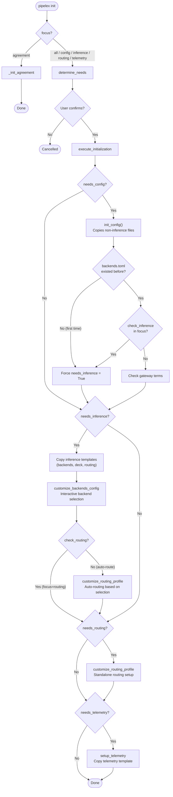

# Init CLI Flows

`pipelex init` sets up the `.pipelex/` configuration directory. It handles four independent concerns — config files, inference backends, routing profiles, and telemetry — through a focus-based dispatch system. Each concern owns its own file-copying and customization logic, so they can be run together or individually without interference.

---

## Why This Design

The `.pipelex/` directory contains two categories of files with different lifecycles:

1. **Config files** (`pipelex.toml`, `plxt.toml`, `mthds_schema.json`) — static templates, copied once, rarely touched by the user.
2. **Inference files** (`inference/backends.toml`, `inference/routing_profiles.toml`, `inference/backends/*.toml`, `inference/deck/*.toml`) — interactive setup, customized per-project based on which AI backends the user selects.

These two categories are managed by separate steps. `init_config()` copies only config files (skipping the `inference/` directory entirely). The inference step handles its own template copying and then runs interactive backend selection and routing customization. Each file is owned by exactly one step — `init_config()` explicitly skips the `inference/` directory via `INIT_SKIP_DIRS`, and skips `telemetry.toml` and `pipelex_service.toml` via `INIT_SKIP_FILES`. This separation ensures that re-running `pipelex init config` never overwrites a user's carefully tuned inference setup.

---

## Interfaces

### CLI Commands

| Command | Focus | What It Does |
|---------|-------|--------------|
| `pipelex init` | `all` | Full setup: config + inference + routing + telemetry |
| `pipelex init config` | `config` | Copy config templates, then trigger inference if first-time |
| `pipelex init inference` | `inference` | Interactive backend selection + routing |
| `pipelex init routing` | `routing` | Routing profile customization only |
| `pipelex init telemetry` | `telemetry` | Telemetry config template copy |
| `pipelex init agreement` | `agreement` | Gateway terms acceptance (no reset) |

All commands except `agreement` perform a **full reset** (overwrite existing files). Config updates are not yet supported.

### Inputs

- **`focus`** (`InitFocus` enum): Determines which steps run. Derived from the CLI subcommand.
- **`skip_confirmation`** (`bool`): When `True`, skips the interactive confirmation prompt. Used when called from `pipelex doctor --fix`.

### Outputs / Side Effects

| Artifact | Produced By | Path |
|----------|-------------|------|
| `pipelex.toml` | `init_config()` | `.pipelex/pipelex.toml` |
| `plxt.toml` | `init_config()` | `.pipelex/plxt.toml` |
| `mthds_schema.json` | `init_config()` | `.pipelex/mthds_schema.json` |
| `backends.toml` | Inference step | `.pipelex/inference/backends.toml` |
| `backends/*.toml` | Inference step | `.pipelex/inference/backends/` |
| `deck/*.toml` | Inference step | `.pipelex/inference/deck/` |
| `routing_profiles.toml` | Inference step | `.pipelex/inference/routing_profiles.toml` |
| `telemetry.toml` | Telemetry step | `.pipelex/telemetry.toml` |
| `pipelex_service.toml` | Gateway terms acceptance | `.pipelex/pipelex_service.toml` |

---

## Architecture

### Overall Flow



---

## Implementation

### Determine Needs

`determine_needs()` evaluates the current state of `.pipelex/` to decide which steps are required:

```python
nb_missing_config_files = init_config(reset=False, dry_run=True) if check_config else 0
needs_config = check_config and (nb_missing_config_files > 0 or reset)
needs_inference = check_inference and (not path_exists(backends_toml_path) or reset)
needs_routing = check_routing and (not path_exists(routing_profiles_toml_path) or reset)
needs_telemetry = check_telemetry and (not path_exists(telemetry_config_path) or reset)
```

The `check_*` flags are derived from the `focus` parameter:

| Focus | `check_config` | `check_inference` | `check_routing` | `check_telemetry` |
|-------|:-:|:-:|:-:|:-:|
| `all` | Yes | Yes | No | Yes |
| `config` | Yes | No | No | No |
| `inference` | No | Yes | No | No |
| `routing` | No | No | Yes | No |
| `telemetry` | No | No | No | Yes |

!!! info "Routing is separate from inference"
    `check_routing` is only `True` for `focus=routing`. When `focus=all`, routing is handled automatically as part of the inference step (Step 2), not as a standalone step.

### Step 1: Config Step — `init_config()`

Copies the config template tree from `kit/configs/` to `.pipelex/`, with two skip mechanisms:

```python
INIT_SKIP_FILES: frozenset[str] = GIT_IGNORED_CONFIG_FILES | {TELEMETRY_CONFIG_FILE_NAME, ".DS_Store"}
INIT_SKIP_DIRS: frozenset[str] = frozenset({"inference"})
```

The recursive `copy_directory_structure` function checks both sets before processing each entry:

```python
if item in INIT_SKIP_FILES:
    continue
if os.path.isdir(src_item):
    if item in INIT_SKIP_DIRS:
        continue
    # recurse...
```

### First-Time Inference Detection

After `init_config()` runs, `execute_initialization` decides whether inference setup is needed — even if inference was not in the original focus:

```python
backends_existed_before = path_exists(backends_toml_path)
init_config(reset=reset)
backends_exists_now = path_exists(backends_toml_path)

if not backends_existed_before or (check_inference and backends_exists_now):
    needs_inference = True
```

This handles two scenarios:

| Condition | Meaning | Action |
|-----------|---------|--------|
| `not backends_existed_before` | First-time setup (no inference yet) | Force inference step regardless of focus |
| `check_inference and backends_exists_now` | Inference in focus + existing config | Re-run inference (reset) |

When inference is **not** forced and backends already exist, gateway terms are still checked:

```python
if not needs_inference and backends_existed_before:
    _check_gateway_terms_if_needed(console, backends_toml_path)
```

### Step 2: Inference Step

When `needs_inference` is `True` and `reset` is `True`, the inference step copies its own template files independently:

1. `backends.toml` — main backend registry
2. `backends/*.toml` — per-backend configuration files
3. `deck/*.toml` — model deck configurations
4. `routing_profiles.toml` — routing profile definitions

Then runs interactive customization:

1. `customize_backends_config()` — prompts user to select backends, handles gateway terms
2. `customize_routing_profile()` — auto-configures routing based on selected backends (**only when `check_routing` is `False`**, i.e. when routing is not the specific focus)

When `focus=routing`, the inference step skips routing entirely because Step 3 handles it as a standalone operation.

### Step 3: Routing Step

If `needs_routing` is `True` (only for `focus=routing`), runs `customize_routing_profile()` as a standalone step.

### Step 4: Telemetry Step

Copies the `telemetry.toml` template and prints instructions. No interactive prompts.

---

## Scenario Matrix

| Scenario | Focus | Config Step | Inference Step | Routing Step | Gateway Terms | Telemetry Step |
|----------|-------|:-----------:|:--------------:|:------------:|:-------------:|:--------------:|
| Fresh project, full init | `all` | Copies config files | Copies templates + interactive selection | Auto (part of inference) | Via `customize_backends_config` | Copies template |
| Fresh project, config only | `config` | Copies config files | Forced (first-time detected) | Auto (part of inference) | Via `customize_backends_config` | Skipped |
| Existing project, full re-init | `all` | Overwrites config files | Resets templates + interactive selection | Auto (part of inference) | Via `customize_backends_config` | Overwrites template |
| Existing project, config only | `config` | Overwrites config files | Skipped (backends already exist) | Skipped | `_check_gateway_terms_if_needed` | Skipped |
| Existing project, inference only | `inference` | Skipped | Resets templates + interactive selection | Auto (part of inference) | Via `customize_backends_config` | Skipped |
| Existing project, routing only | `routing` | Skipped | Skipped | Resets template + interactive selection | Skipped | Skipped |
| Gateway terms only | `agreement` | Skipped | Skipped | Skipped | Direct acceptance | Skipped |

!!! warning "Config-Only on Existing Project"
    Running `pipelex init config` on a project that already has `inference/backends.toml` will overwrite config files (`pipelex.toml`, etc.) but will **not** touch the inference setup. Gateway terms are still checked via `_check_gateway_terms_if_needed`. The user's backend selection and routing are preserved.

---

## File Reference

### Template Directory (`kit/configs/`)

| File / Directory | Copied By | Purpose |
|-----------------|-----------|---------|
| `pipelex.toml` | `init_config()` | Main Pipelex configuration |
| `plxt.toml` | `init_config()` | PLXT tooling configuration |
| `mthds_schema.json` | `init_config()` | MTHDS JSON Schema for IDE support |
| `inference/` | Inference step | All inference configuration (see below) |
| `inference/backends.toml` | Inference step | Backend registry (enabled/disabled flags) |
| `inference/backends/*.toml` | Inference step | Per-backend settings (API keys, endpoints) |
| `inference/deck/*.toml` | Inference step | Model deck definitions |
| `inference/routing_profiles.toml` | Inference step | Routing profile definitions |
| `telemetry.toml` | Telemetry step | Telemetry export configuration |
| `pipelex_service.toml` | Agreement step | Gateway service terms tracking |

### Skip Lists

| Constant | Contents | Reason |
|----------|----------|--------|
| `INIT_SKIP_FILES` | All `GIT_IGNORED_CONFIG_FILES` (`pipelex_service.toml`, `pipelex_override.toml`, `telemetry_override.toml`, `pipelex_gateway_models.md`, `pipelex_gateway_models_plain.md`, `x_custom_llm_deck.toml`, `x_custom_extract_deck.toml`) plus `telemetry.toml` and `.DS_Store` | Git-ignored, auto-generated, or managed by other steps |
| `INIT_SKIP_DIRS` | `inference` | Managed independently by inference step |

### Source Modules

| Module | Purpose |
|--------|---------|
| `pipelex/cli/commands/init/command.py` | Orchestration: `init_cmd()`, `execute_initialization()`, `determine_needs()` |
| `pipelex/cli/commands/init/config_files.py` | Config file copying: `init_config()`, skip lists |
| `pipelex/cli/commands/init/backends.py` | Backend customization: `customize_backends_config()`, `get_selected_backend_keys()` |
| `pipelex/cli/commands/init/routing.py` | Routing customization: `customize_routing_profile()` |
| `pipelex/cli/commands/init/telemetry.py` | Telemetry setup: `setup_telemetry()` |
| `pipelex/cli/commands/init/ui/types.py` | `InitFocus` enum definition |

---

## Next Steps

- [:material-cog: Configuration Internals](../contribute/configuration-defaults-and-overrides.md){ .md-button }
- [:material-sitemap: Architecture Overview](./architecture-overview.md){ .md-button }
