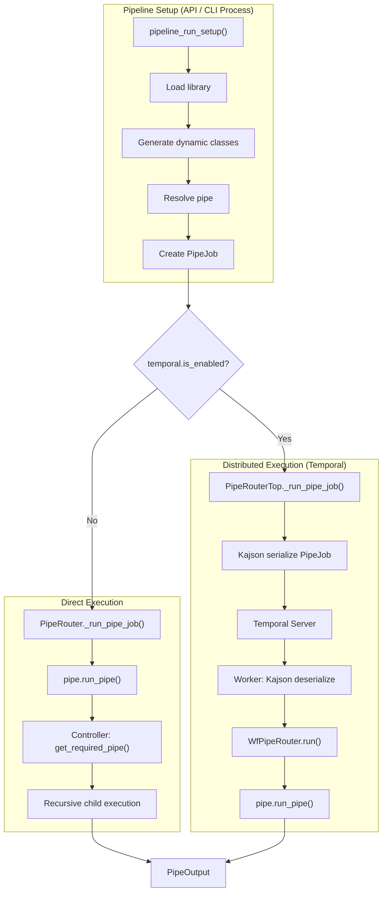

# Pipe Routing & Execution

Pipelex supports two execution modes for running pipes: **direct execution** (single-process) and **distributed execution** (via Temporal workers). Both modes share the same pipe definitions, library loading, and controller logic. The key difference is *where* the pipe runs and how the PipeJob travels to get there.

---

## Terminology

| Term | Meaning |
|------|---------|
| **Direct execution** | All pipes run in the same Python process. Library, class registry, and pipe resolution are shared in-memory. |
| **Distributed execution** | PipeJob is serialized and sent to a remote Temporal worker. The worker is a separate process (potentially on a different machine). |

---

## Design Principle

Every pipe execution — regardless of mode — follows the same pattern:

1. **Setup**: `pipeline_run_setup()` loads the library, resolves the pipe, initializes working memory, and creates a `PipeJob`
2. **Route**: A router (`PipeRouter` or `PipeRouterTop`) receives the PipeJob and dispatches it
3. **Execute**: The pipe's `run_pipe()` method runs, potentially resolving and executing child pipes

The `PipeJob` is the universal unit of execution. It carries everything needed to run a single pipe.

---

## The PipeJob Model

`PipeJob` encapsulates all information needed to execute a pipe.

| Field | Type | Purpose |
|-------|------|---------|
| `pipe` | `PipeAbstract` | The resolved pipe object (concrete operator or controller) |
| `working_memory` | `WorkingMemory` | Runtime data store — typed `Stuff` objects keyed by variable name |
| `pipe_run_params` | `PipeRunParams` | Execution config: run mode (LIVE/DRY), output multiplicity, pipe stack for cycle detection |
| `job_metadata` | `JobMetadata` | Pipeline run ID, user ID, OTel tracing context, graph tracing context |
| `output_name` | `str \| None` | Override for the output variable name |

`PipeJob` is created by `pipeline_run_setup()`, which handles library loading, pipe resolution, working memory initialization, and telemetry setup.

---

## Library Loading

Before a pipe can execute, the **library** must be loaded. The library contains:

- **Pipes** — all pipe definitions (operators and controllers), resolved by code via `get_required_pipe()`
- **Concepts** — semantic type definitions that determine what data a `Stuff` object holds
- **Domains** — namespaces that group related pipes and concepts

### Base vs Custom Libraries

- **Base libraries** are loaded from directories listed in `PIPELEXPATH`. They contain shared pipe/concept definitions available to all executions.
- **Custom bundles** are per-request `mthds_content` strings. Each API call can bring its own definitions.

### Dynamic Class Generation

When a `.mthds` file declares a concept like `RawText = "Raw input text..."`, the library loading process:

1. `ConceptFactory._handle_basic_blueprint()` detects the concept declaration
2. `StructureGenerator.generate_from_structure_blueprint()` dynamically creates a Python class (e.g., `RawText` inheriting from `TextContent`)
3. The class is registered with `KajsonManager.get_class_registry()` so it can be serialized/deserialized

These dynamically-generated classes become the `content` type of `Stuff` objects in `WorkingMemory`.

!!! info "Why Dynamic Classes Matter"
    When a PipeJob is serialized (e.g., for Temporal transport), Kajson embeds `__class__` and `__module__` metadata. The receiving process must have these classes registered in its class registry to deserialize the payload.

---

## Direct Execution

In direct execution, everything runs in a single Python process. This is the default mode when Temporal is not enabled.

### Flow

```
pipeline_run_setup()
  ├── Load library (library_manager singleton)
  ├── Generate dynamic concept classes
  ├── Register classes with Kajson
  ├── Resolve pipe via get_required_pipe(pipe_code)
  ├── Initialize WorkingMemory from inputs
  └── Return PipeJob

PipeRouter.run(pipe_job)
  ├── Notify observers (before)
  ├── _run_pipe_job(pipe_job)
  │   └── pipe_job.pipe.run_pipe(...)     ← delegates directly to the pipe
  │       ├── Concrete pipe: execute operator logic (LLM call, template, etc.)
  │       └── Controller: resolve child pipes via get_required_pipe(),
  │           then recursively call child.run_pipe()
  ├── Notify observers (after)
  └── Return PipeOutput
```

### Router Selection

The router is selected during `Pipelex.setup()`:

```python
if get_config().temporal.is_enabled:
    effective_pipe_router = make_tprl_pipe_router_top()   # Distributed
else:
    effective_pipe_router = PipeRouter(observer=...)       # Direct
```

### How PipeRouter Works

`PipeRouter` implements `PipeRouterProtocol` with a minimal `_run_pipe_job()`:

```python
async def _run_pipe_job(self, pipe_job, wfid=None):
    return await pipe_job.pipe.run_pipe(
        job_metadata=pipe_job.job_metadata,
        working_memory=pipe_job.working_memory,
        output_name=pipe_job.output_name,
        pipe_run_params=pipe_job.pipe_run_params,
    )
```

The router does not route by pipe type — it delegates to the pipe itself. Controllers handle their own orchestration internally.

---

## Pipe Controllers

Controllers are pipes that orchestrate the execution of other pipes. They resolve child pipes at runtime via `get_required_pipe()` from the library.

| Controller | Behavior |
|------------|----------|
| **PipeSequence** | Executes `sequential_sub_pipes` one after another. Each step receives working memory with outputs from previous steps. |
| **PipeBatch** | Iterates over a `ListContent` input. For each item, loads `branch_pipe` and executes it with a deep copy of working memory. Items run concurrently via asyncio. |
| **PipeCondition** | Evaluates a Jinja2 `expression` against working memory, maps the result via `outcome_map` to a pipe code, and executes that pipe. |
| **PipeParallel** | Loads multiple child pipes and executes them concurrently, each with its own working memory copy. |

All controllers follow the same pattern:

1. Call `get_required_pipe(child_pipe_code)` to resolve the child pipe from the library
2. Route through `get_pipe_router().run(PipeJob(...))` — the hub auto-selects the right router
3. Aggregate results into working memory or output

### Auto-Switching Router

The hub (`get_pipe_router()`) automatically returns the correct router based on context:

- **Direct execution**: Returns `PipeRouter` — child pipes run in-process
- **Distributed execution, outside workflow** (submitter side): Returns `PipeRouterTop` — submits a top-level Temporal workflow
- **Distributed execution, inside workflow** (worker side): Returns `PipeRouterChild` — creates a Temporal child workflow via `execute_child_workflow()`

This means each child pipe in a controller gets its own Temporal workflow boundary in distributed mode — enabling independent retries, separate worker assignment, and per-pipe visibility in the Temporal UI.

!!! note "Library Dependency"
    Controllers depend on the library being loaded in the current process. `get_required_pipe()` queries the `library_manager` singleton, which must have been populated by `pipeline_run_setup()` or equivalent. In distributed execution, the worker loads the base library from `PIPELEXPATH` at startup. Controllers also call `get_required_pipe()` inside Temporal workflow code — accessing a global mutable singleton, which is a side effect incompatible with Temporal's replay semantics. The current workaround is disabling the Temporal sandbox (`--is-not-sandboxed`, `workflow.unsafe.imports_passed_through()`).

---

## Distributed Execution

In distributed execution, the PipeJob is serialized and sent to a Temporal worker for execution.

### Flow

```
API / CLI Process                           Temporal Worker Process
─────────────────                           ──────────────────────
pipeline_run_setup()                        Worker startup:
  ├── Load library                            ├── Pipelex.make(temporal_enabled=True)
  ├── Generate dynamic classes                ├── Load base library from PIPELEXPATH
  ├── Resolve pipe                            └── Set PipeRouterChild as hub router
  └── Return PipeJob
         │
PipeRouterTop.run(pipe_job)
  ├── @with_conditional_worker
  ├── WorkflowExecutor.execute_workflow(
  │     WfPipeRouter, pipe_job)
  │         │
  │    Kajson serializes PipeJob ──────────►  Temporal deserializes PipeJob
  │    (embeds __class__/__module__)          (needs classes in registry)
  │                                                    │
  │                                          WfPipeRouter.run(pipe_job)
  │                                            └── pipe.run_pipe(...)
  │                                                ├── Concrete: Activity
  │                                                └── Controller:
  │                                                    ├── get_required_pipe()
  │                                                    └── get_pipe_router().run()
  │                                                        → PipeRouterChild
  │                                                        → child workflow
  │                                                    │
  │    ◄────────────────────────────────────  Return PipeOutput
  └── Return PipeOutput
```

### Key Components

**PipeRouterTop** (`pipelex/temporal/tprl_pipe/pipe_router_top.py`)

Implements `PipeRouterProtocol` like `PipeRouter`, but dispatches via Temporal instead of direct execution. Uses `WorkflowExecutor` to submit `WfPipeRouter` workflows.

**WfPipeRouter** (`pipelex/temporal/tprl_pipe/wf_pipe_router.py`)

The Temporal workflow that runs on the worker. Receives a deserialized `PipeJob` and calls `pipe.run_pipe()` — exactly like the direct router.

**Kajson Data Converter** (`pipelex/temporal/temporal_data_converter.py`)

Custom Temporal payload converter that uses Kajson for serializing/deserializing Pydantic models. Preserves subclass types during transport, which is critical because `PipeJob.pipe` is a `PipeAbstract` subclass and `WorkingMemory` contains `Stuff` objects with concept-specific content classes.

**Worker CLI** (`pipelex/temporal/worker_cli.py`)

Entry point for the worker process. Calls `Pipelex.make(temporal_enabled=True)` to initialize the framework, then starts the Temporal worker with registered workflows and activities.

### Content Generation Workflows

Concrete pipe operators (PipeLLM, PipeCompose, PipeExtract, PipeImgGen) use dedicated Temporal workflows and activities for their actual work:

| Workflow | Activity | Purpose |
|----------|----------|---------|
| `wf_make_llm_text` | `act_llm_gen_text` | LLM text generation |
| `wf_make_object` | `act_llm_gen_object` | LLM structured output |
| `wf_make_jinja2_text` | `act_jinja2_gen_text` | Jinja2 template rendering |
| `wf_make_extract` | `act_extract_generate` | Document extraction |
| `wf_make_images` | `act_img_gen_images` | Image generation |

### Worker Environment

The `@with_conditional_worker` decorator on `PipeRouterTop._run_pipe_job()` supports two environments:

- **EXTERNAL** (production) — assumes a worker is already running, submits the workflow directly
- **INTERNAL** (testing) — spins up an embedded worker for the duration of the execution

!!! note "Future Improvement: Per-Pipe Routing"
    Router selection is currently global and binary: either all pipes go through Temporal, or none do. A simple `PipeCompose` (microseconds of Jinja2 rendering) gets the same Temporal overhead as a `PipeLLM` (minutes of API call time). Per-pipe or per-type routing decisions could improve efficiency.

---

## Known Limitation: Deserialization of Dynamic Concept Classes in Distributed Execution

The worker now loads the base library from `PIPELEXPATH` at startup, which generates dynamic concept classes and registers them with Kajson's class registry. However, **deserialization still fails** because the Temporal workflow instance does not see these dynamically-registered classes during payload conversion.

The root cause: Kajson's decoder first tries `getattr(sys.modules[module_name], class_name)` — but dynamic classes have `__module__ = 'builtins'` and are not actually added to the `builtins` module. The fallback to the class registry also fails within the Temporal workflow context, suggesting the workflow instance uses a different class registry than the one populated during worker startup.

This blocks all pipe controllers in distributed execution. Concrete pipes (leaf-level operators like PipeLLM) work because their content generation happens in Activities with their own workflows that don't carry dynamic concept instances.

!!! warning "Active Issue"
    This limitation is documented in detail in the project's internal reference at `.claude/skills/temporal-diagnose/references/temporal-worker-problem.md`, which includes root cause analysis, expected error patterns, and proposed fix directions.

---

## Architecture Diagram



---

## File Reference

| Component | File |
|-----------|------|
| PipeJob model | `pipelex/pipe_run/pipe_job.py` |
| Pipeline setup | `pipelex/pipeline/pipeline_run_setup.py` |
| PipeRouter (direct) | `pipelex/pipe_run/pipe_router.py` |
| PipeRouterProtocol | `pipelex/pipe_run/pipe_router_protocol.py` |
| PipeRouterTop (distributed, outside workflow) | `pipelex/temporal/tprl_pipe/pipe_router_top.py` |
| PipeRouterChild (distributed, inside workflow) | `pipelex/temporal/tprl_pipe/pipe_router_child.py` |
| Auto-switch utility | `pipelex/temporal/temporal_workflow_utils.py` |
| WfPipeRouter workflow | `pipelex/temporal/tprl_pipe/wf_pipe_router.py` |
| Kajson data converter | `pipelex/temporal/temporal_data_converter.py` |
| Worker CLI | `pipelex/temporal/worker_cli.py` |
| Library manager | `pipelex/libraries/library_manager.py` |
| ConceptFactory | `pipelex/core/concepts/concept_factory.py` |
| StructureGenerator | `pipelex/core/concepts/structure_generation/generator.py` |
| Hub (get_required_pipe) | `pipelex/hub.py` |
| PipeSequence | `pipelex/pipe_controllers/sequence/pipe_sequence.py` |
| PipeCondition | `pipelex/pipe_controllers/condition/pipe_condition.py` |
| PipeBatch | `pipelex/pipe_controllers/batch/pipe_batch.py` |
| PipeParallel | `pipelex/pipe_controllers/parallel/pipe_parallel.py` |
| Router selection | `pipelex/pipelex.py` (in `Pipelex.setup()`) |
