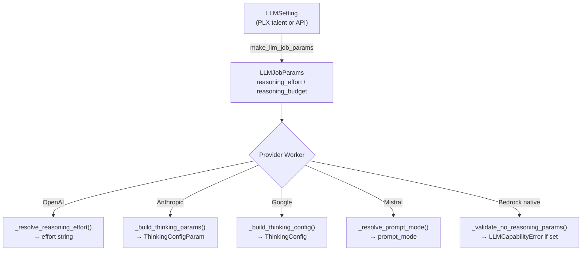

# Reasoning Controls

Pipelex provides a unified abstraction for controlling LLM reasoning (chain-of-thought / extended thinking) across providers. This page describes how reasoning parameters flow from user configuration through to provider-specific SDK calls.

---

## Core Concepts

### ReasoningEffort

The `ReasoningEffort` enum (`pipelex/cogt/llm/llm_job_components.py`) defines six levels:

| Level | Value | Description |
|-------|-------|-------------|
| `NONE` | `"none"` | Disable reasoning entirely |
| `MINIMAL` | `"minimal"` | Lowest reasoning effort |
| `LOW` | `"low"` | Light reasoning |
| `MEDIUM` | `"medium"` | Moderate reasoning |
| `HIGH` | `"high"` | Heavy reasoning |
| `MAX` | `"max"` | Maximum reasoning budget |

### ThinkingMode

The `ThinkingMode` enum (`pipelex/cogt/llm/thinking_mode.py`) defines how a model handles reasoning at the SDK level:

| Mode | Meaning |
|------|---------|
| `none` | Model does not support reasoning. Attempting to use reasoning params raises `LLMCapabilityError`. |
| `manual` | Pipelex translates effort to a provider-specific value (token budget, effort string, or prompt mode). |
| `adaptive` | The provider's SDK dynamically adjusts reasoning depth. Only Anthropic and Google support this. |

Each model spec in the backend TOML files declares a `thinking_mode`. Models without reasoning capabilities set `thinking_mode = "none"` (or inherit it from `[defaults]`).

### Mutual Exclusivity

`reasoning_effort` and `reasoning_budget` are mutually exclusive. Both `LLMSetting` and `LLMJobParams` enforce this via a `model_validator`:

- **`reasoning_effort`** — A symbolic level (`NONE` through `MAX`). Pipelex resolves it to the provider-specific format.
- **`reasoning_budget`** — A raw token count passed directly to providers that accept it (Anthropic, Google). OpenAI and Mistral reject this with `LLMCapabilityError`.

---

## Data Flow



---

## Provider Mappings

### OpenAI (Completions & Responses)

OpenAI models use `thinking_mode = "manual"` and map `ReasoningEffort` to the `reasoning_effort` parameter:

| ReasoningEffort | OpenAI value |
|-----------------|-------------|
| `NONE` | `"none"` |
| `MINIMAL` | `"minimal"` |
| `LOW` | `"low"` |
| `MEDIUM` | `"medium"` |
| `HIGH` | `"high"` |
| `MAX` | `"xhigh"` |

OpenAI does not support `reasoning_budget` or `thinking_mode = "adaptive"`. Both raise `LLMCapabilityError`.

When reasoning is active, `temperature` is omitted from the SDK call (OpenAI requires this).

### Anthropic

Anthropic supports both `manual` and `adaptive` thinking modes.

**Effort mapping** (`ReasoningEffort` to Anthropic effort level):

| ReasoningEffort | Anthropic level |
|-----------------|----------------|
| `NONE` | `None` (thinking disabled) |
| `MINIMAL` | `"low"` |
| `LOW` | `"low"` |
| `MEDIUM` | `"medium"` |
| `HIGH` | `"high"` |
| `MAX` | `"max"` |

**ADAPTIVE mode** uses `{"type": "adaptive"}` with an `OutputConfigParam(effort=...)`.

**MANUAL mode** resolves effort to a token budget via the `effort_to_budget_maps` config, then sends `{"type": "enabled", "budget_tokens": N}`.

**`reasoning_budget`** (explicit) always uses `{"type": "enabled", "budget_tokens": N}` regardless of thinking mode.

When thinking is active, `temperature` is suppressed (Anthropic requires `temperature=1` or omission with thinking).

### Google Gemini

Google supports both `manual` and `adaptive` thinking modes.

**MANUAL mode** resolves effort to a `thinking_budget` (token count) via the `effort_to_budget_maps` config:

| ReasoningEffort | thinking_budget |
|-----------------|----------------|
| `NONE` | `0` |
| `MINIMAL` | `512` |
| `LOW` | `1024` |
| `MEDIUM` | `5000` |
| `HIGH` | `16384` |
| `MAX` | `65536` |

**ADAPTIVE mode** maps effort to a `ThinkingLevel` enum with `thinking_budget = -1` (auto):

| ReasoningEffort | ThinkingLevel |
|-----------------|--------------|
| `NONE` | budget=0 (disabled) |
| `MINIMAL` | `LOW` |
| `LOW` | `LOW` |
| `MEDIUM` | `MEDIUM` |
| `HIGH` | `HIGH` |
| `MAX` | `HIGH` |

**`reasoning_budget`** (explicit) passes through directly as `thinking_budget`.

### Mistral

Mistral models use `thinking_mode = "manual"`. The only reasoning control is `prompt_mode`:

| ReasoningEffort | Mistral behavior |
|-----------------|-----------------|
| `NONE` | `prompt_mode` omitted (no reasoning) |
| `MINIMAL` through `MAX` | `prompt_mode = "reasoning"` |

Mistral does not support `reasoning_budget` or `thinking_mode = "adaptive"`. Both raise `LLMCapabilityError`.

### Bedrock (native models)

Bedrock native models (non-Anthropic SDKs like `bedrock_aioboto3`) do not support reasoning parameters. Any `reasoning_effort` or `reasoning_budget` raises `LLMCapabilityError`.

!!! note
    Claude models accessed through Bedrock use the `bedrock_anthropic` SDK variant and go through the Anthropic worker, which does support reasoning.

---

## Effort-to-Budget Configuration

For providers that use token budgets (Anthropic MANUAL, Google MANUAL), `ReasoningEffort` is resolved to a token count via the `effort_to_budget_maps` in `pipelex.toml`:

```toml
[cogt.llm_config.effort_to_budget_maps.anthropic]
none = 0
minimal = 512
low = 1024
medium = 5000
high = 16384
max = 65536

[cogt.llm_config.effort_to_budget_maps.gemini]
none = 0
minimal = 512
low = 1024
medium = 5000
high = 16384
max = 65536
```

The map is keyed by `prompting_target` (from the model spec). A validated mapping must contain entries for all `ReasoningEffort` values.

The budget is resolved at runtime via `LLMConfig.get_reasoning_budget()` (`pipelex/cogt/config_cogt.py:90`).

---

## Backend TOML Configuration

Each model declares its reasoning capability via `thinking_mode` in the backend TOML:

```toml
# Model that supports reasoning
[claude-4-sonnet]
thinking_mode = "manual"

# Model with adaptive reasoning
["claude-4.6-opus"]
thinking_mode = "adaptive"

# Model without reasoning (or inherited from defaults)
[gpt-4o-mini]
thinking_mode = "none"
```

Backends that have no reasoning-capable models set a default:

```toml
[defaults]
thinking_mode = "none"
```

---

## Error Handling

All reasoning-related errors use `LLMCapabilityError` (`pipelex/cogt/exceptions.py`):

| Scenario | Error |
|----------|-------|
| `reasoning_effort` on a `thinking_mode = "none"` model | "does not support reasoning" |
| `reasoning_effort` on a model with no `thinking_mode` | "no thinking_mode configured" |
| `reasoning_budget` on a provider that doesn't support it | "does not support reasoning_budget" |
| `thinking_mode = "adaptive"` on OpenAI or Mistral | "adaptive ... not supported" |
| Any reasoning param on Bedrock native models | "does not support reasoning parameters" |
| Both `reasoning_effort` and `reasoning_budget` set | `ValidationError` (mutual exclusivity) |

---

## File Reference

| File | Purpose |
|------|---------|
| `pipelex/cogt/llm/llm_job_components.py` | `ReasoningEffort` enum, `LLMJobParams` with mutual exclusivity validator |
| `pipelex/cogt/llm/thinking_mode.py` | `ThinkingMode` enum |
| `pipelex/cogt/llm/llm_setting.py` | `LLMSetting` with reasoning fields and `make_llm_job_params()` |
| `pipelex/cogt/config_cogt.py` | `LLMConfig.get_reasoning_budget()` and effort map validation |
| `pipelex/cogt/model_backends/model_spec.py` | `InferenceModelSpec.thinking_mode` field |
| `pipelex/plugins/openai/openai_completions_llm_worker.py` | OpenAI Completions reasoning resolution |
| `pipelex/plugins/openai/openai_responses_llm_worker.py` | OpenAI Responses reasoning resolution |
| `pipelex/plugins/anthropic/anthropic_llm_worker.py` | Anthropic thinking params builder |
| `pipelex/plugins/google/google_llm_worker.py` | Google thinking config builder |
| `pipelex/plugins/mistral/mistral_llm_worker.py` | Mistral prompt mode resolution |
| `pipelex/plugins/bedrock/bedrock_llm_worker.py` | Bedrock reasoning validation |
| `pipelex/pipelex.toml` | Default effort-to-budget maps |

---

## Next Steps

- [Architecture Overview](./architecture-overview.md) — Understand the two-layer design
- [Test Profile Configuration](./test-profile-configuration.md) — Configure model sets for testing
