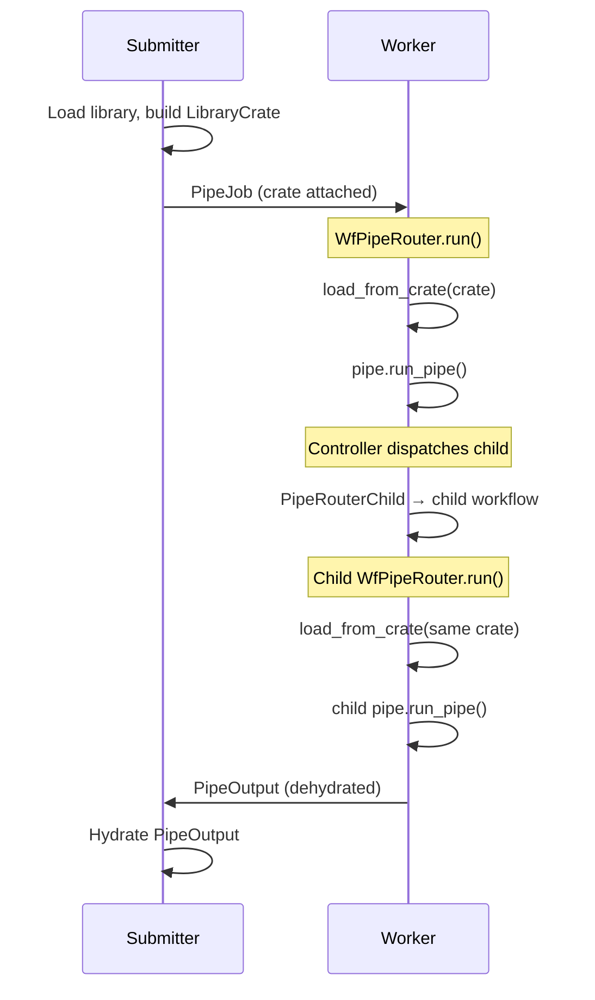

# Temporal Integration

This page covers the Temporal-specific mechanisms that enable distributed pipe execution. For the general pipe routing architecture (shared between direct and distributed modes), see [Pipe Routing & Execution](./pipe-routing-and-execution.md).

---

## The Three Challenges

Distributing pipe execution across separate worker processes introduces three challenges that don't exist in direct (single-process) mode:

1. **Pipe resolution** — Controllers call `get_required_pipe()` to resolve child pipes. The worker's library must contain those pipes.
2. **Dynamic class deserialization** — `.mthds` bundles generate Python classes at runtime (e.g., `RawText` inheriting from `TextContent`). The worker must have those classes registered before deserializing `WorkingMemory`.
3. **Concurrent isolation** — Multiple workflows running on the same worker may define conflicting class/pipe names. Each workflow needs its own scoped registry and library.

These are solved by three mechanisms: LibraryCrate propagation, deferred hydration, and per-workflow scoping.

---

## LibraryCrate

A `LibraryCrate` is a serializable snapshot of the library — two flat dicts of blueprints:

```python
class LibraryCrate(BaseModel):
    concepts: dict[str, ConceptBlueprint | str]  # concept_ref -> blueprint or description
    pipes: dict[str, PipeBlueprintUnion]          # pipe_ref -> blueprint
    domains: dict[str, DomainBlueprint]           # domain_code -> domain metadata
    source_map: dict[str, str]                    # ref -> source file (error traceability)
    fingerprint: str                              # SHA256 of serialized content
```

Domain is encoded in the dictionary keys (e.g., `scoring.WeightedScore`, `scoring.compute_score`), not in a structural container. `domains` carries per-domain metadata (description, system prompt). `source_map` enables error messages that trace back to origin files. The `fingerprint` enables idempotent loading — if a worker already loaded a crate with the same fingerprint, it skips the reload.

### How it propagates



Every child workflow receives the crate through its `PipeJob`. Each `WfPipeRouter` loads the crate into its own scoped library. This ensures every workflow — parent or child, on any worker — can resolve all pipes.

### Visibility

The `LibraryCrate` is a Pydantic model. Temporal serializes it as structured JSON in the workflow input, making it fully visible in the Temporal dashboard — not opaque bytes.

---

## Deferred Hydration

### The chicken-and-egg problem

Temporal's data converter deserializes payloads (workflow inputs and return values) using Kajson, which needs dynamic concept classes registered to reconstruct typed `WorkingMemory`. But those classes only get registered when the `LibraryCrate` is loaded inside the workflow. This creates two deserialization gaps:

1. **Input**: The `PipeJob` workflow input contains `WorkingMemory` with dynamic classes that don't exist yet on the worker.
2. **Output**: A child workflow's `PipeOutput` return value contains `WorkingMemory` with dynamic classes. The parent's data converter runs in the Temporal SDK's event processing context (outside the workflow coroutine's `ContextVar` scope), so it can't access the parent's per-workflow class registry.

### The solution

Both `PipeJob` and `PipeOutput` carry a `working_memory_raw` field for deferred hydration:

```python
class PipeJob(BaseModel):
    working_memory: WorkingMemory | None = None
    working_memory_raw: dict[str, Any] | None = None
    library_crate: LibraryCrate | None = None

class PipeOutput(PipeOutputAbstract[WorkingMemory]):
    working_memory: WorkingMemory = Field(default_factory=WorkingMemory)
    working_memory_raw: dict[str, Any] | None = None
```

**Input dehydration/hydration cycle:**

- Before dispatch, `PipeJob.prepare_for_temporal()` moves `working_memory` to `working_memory_raw` (a plain dict via `dump_for_temporal()`).
- After the worker loads the crate, `WfPipeRouter` hydrates the raw dict back to typed `WorkingMemory`.

**Output dehydration/hydration cycle:**

- Before returning from a workflow, `WfPipeRouter` calls `PipeOutput.prepare_for_temporal()` to dehydrate `WorkingMemory` to `working_memory_raw`.
- After receiving, `PipeRouterChild` (for child workflows) or `PipeRouterTop` (for top-level workflows) hydrates the raw dict using the scoped class registry.

The hydration function (`pipelex/temporal/tprl_pipe/hydration.py`) iterates the raw dict, uses `StuffContentFactory` to reconstruct typed content objects using the now-registered classes, and preserves aliases.

### Dashboard visibility

`working_memory_raw` is a plain JSON dict — fully readable in the Temporal dashboard without needing class resolution.

---

## Per-Workflow Scoping

### Why per-workflow isolation matters

A single Temporal worker may process multiple concurrent workflows. If two workflows define a concept named `Result` with different structures (e.g., `Result(score, label)` vs `Result(value, confidence, is_valid)`), they must not share the same `ClassRegistry` or `Library`. Without isolation, the second workflow's class registration would overwrite the first's, causing silent data corruption.

### How it works

Each `WfPipeRouter.run()` creates its own scoped state:

1. **ClassRegistry**: A new `ClassRegistry` pre-seeded from the global registry (which has base classes from `PIPELEXPATH`). Dynamic classes from the crate are registered here — not in the global registry.

2. **Library**: A new `Library` instance opened via `library_manager.open_library()`, with the `ClassRegistry` attached as a `PrivateAttr`. The library is set as the current library via the `_library_id` `ContextVar`.

3. **ClassRegistry lookup chain**: `hub.get_class_registry()` reads `_library_id` from the `ContextVar`, gets the library's attached `ClassRegistry`. Falls back to the global registry if no library is set.

4. **Cleanup**: `library_manager.teardown(library_id)` deletes the library and its `ClassRegistry`. The `ContextVar` is reset via `teardown_current_library()`. No manual GC needed — the `ClassRegistry` is garbage-collected with the `Library`.

### Kajson integration

The Temporal data converter passes the active `ClassRegistry` to `kajson.loads()`:

```python
pydantic_gizmo = kajson.loads(data, class_registry=get_class_registry())
```

Inside a workflow coroutine, `get_class_registry()` returns the per-workflow scoped registry (via `_library_id` ContextVar). However, the data converter is also called from the Temporal SDK's event processing context (e.g., when deserializing child workflow return values), where the ContextVar is not set. In that case, it falls back to the global registry. This is why PipeOutput uses deferred hydration — the `working_memory_raw` dict doesn't require class resolution during deserialization.

---

## Workflow Topology

A single pipe execution can create many Temporal workflows. Each level of nesting dispatches child workflows:

```
PipeSequence (3 steps)
  → 1 parent WfPipeRouter
  → 3 child WfPipeRouters (one per step)
  Each child step (if PipeLLM):
    → 1 child WfMakeLLMText + 1 ActLLMGenText activity

PipeParallel (2 branches, then summary)
  → 1 parent WfPipeRouter
  → 3 child WfPipeRouters (2 branches concurrent + 1 summary)

PipeBatch (3 items)
  → 1 parent WfPipeRouter
  → 1 child WfPipeRouter for the PipeBatch controller
  → 3 child WfPipeRouters (one per item)
```

Each `WfPipeRouter` loads the `LibraryCrate` (idempotent via fingerprint), so pipe resolution works at every level.

---

## Controller Dispatch Patterns on Temporal

Each controller type creates a different child workflow pattern:

| Controller | Dispatch pattern | Child workflows |
|------------|-----------------|----------------|
| **PipeSequence** | Sequential: each step via `SubPipe.run_pipe()` → `PipeRouterChild` | N children (one per step), executed sequentially |
| **PipeParallel** | Concurrent: all branches via `SubPipe.run_pipe()` + `asyncio.gather()` | N children (one per branch), executed concurrently |
| **PipeBatch** | Fan-out: each list item via `SubPipe.run_pipe()` | N children (one per item), executed concurrently |
| **PipeCondition** | Conditional: evaluates expression, dispatches selected outcome via `SubPipe.run_pipe()` | 1 child (the chosen outcome pipe), plus internal `WfMakeJinja2Text` for expression evaluation |

### Internal sub-workflows

Some controllers dispatch internal sub-workflows in addition to pipe routing:

- **PipeCondition**: `WfMakeJinja2Text` to evaluate the expression template against working memory
- **PipeCompose**: `WfMakeJinja2Text` to resolve construct field references (e.g., `{ from = "title_text.text" }`)

These internal workflows carry working memory contents through the Temporal data converter, which creates a serialization dependency on working memory content types.

---

## Known Limitation: StuffArtefact Serialization in Dry-Run

In dry-run mode, PipeLLM produces `StuffArtefact` debug objects as working memory content. When controllers dispatch internal sub-workflows that carry working memory contents through the Temporal data converter, Kajson fails with `TypeError: Type <class 'StuffArtefact'> is not JSON serializable`.

`StuffArtefact` is not a Pydantic model — it's a plain object used for dry-run tracing that was never designed for cross-process serialization.

**Confirmed affected**:

- **PipeCondition**: expression evaluation dispatches `WfMakeJinja2Text`, which serializes working memory to evaluate the Jinja2 expression. Fails with `StuffArtefact` TypeError.
- **PipeCompose**: construct field resolution dispatches `WfMakeJinja2Text` similarly.

**Likely affected** (hangs in testing, root cause not fully diagnosed):

- **PipeBatch**: fan-out creates child PipeJobs with copies of working memory. The hang may be caused by `StuffArtefact` in the serialized child PipeJob, or by a different serialization issue in the list content extraction.

**Not affected**:

- **PipeSequence**: no internal sub-workflows — child pipes are dispatched via `SubPipe.run_pipe()` → `PipeRouterChild`, which creates clean child PipeJobs.
- **PipeParallel**: same dispatch pattern as PipeSequence — branches go through `SubPipe.run_pipe()` without internal templating workflows.
- **All controllers in live mode**: `StuffArtefact` is only produced in dry-run. Live execution uses real content objects that serialize correctly.

**Fix direction**: Either make `StuffArtefact` serializable (implement `__json__` or convert to Pydantic), or strip non-serializable objects from working memory before passing to internal sub-workflows.

---

## File Reference

| Component | File |
|-----------|------|
| LibraryCrate model | `pipelex/libraries/library_crate.py` |
| LibraryCrate factory | `pipelex/libraries/library_crate_factory.py` |
| PipeJob (crate + raw WM fields) | `pipelex/pipe_run/pipe_job.py` |
| PipeOutput (raw WM for deferred hydration) | `pipelex/core/pipes/pipe_output.py` |
| PipeRouterTop (submitter-side dispatch) | `pipelex/temporal/tprl_pipe/pipe_router_top.py` |
| PipeRouterChild (worker-side child dispatch) | `pipelex/temporal/tprl_pipe/pipe_router_child.py` |
| WfPipeRouter (workflow entry point) | `pipelex/temporal/tprl_pipe/wf_pipe_router.py` |
| Deferred hydration | `pipelex/temporal/tprl_pipe/hydration.py` |
| Kajson data converter | `pipelex/temporal/temporal_data_converter.py` |
| Hub (ClassRegistry + Library scoping) | `pipelex/hub.py` |
| Library (PrivateAttr ClassRegistry) | `pipelex/libraries/library.py` |
| Worker CLI | `pipelex/temporal/worker_cli.py` |
| Temporal task manager | `pipelex/temporal/temporal_task_manager.py` |
